# Ubiquitous Language Index — projecteuler (explaining solutions)

> Canonical dictionary of explanation methods. Format: `## [context::TermName]` · links are plain
> markdown links into this same file, `[context::Name](#anchor)` (not `[[wikilink]]` — GitHub does
> not render those as links in ordinary `.md`, only inside its own Wiki). One context: `method` —
> an explanation method (the idea and its picture in ONE block).
>
> **One method, one block.** The idea ("what it is, when you recognize it") and its picture ("how
> to show it") are not two parallel catalogs but FIELDS OF ONE RECORD: `Essence`/`Recognized by`/
> `General case`/`Source` describe the idea, `Picture`/`Sequence`/`Example` describe the drawing,
> and `Limits` covers both — each bullet marking whether the limit belongs to the idea or only to
> the drawing. A method has at most one picture; a method with no picture is legitimate when the
> idea has no established visual form.
>
> **Not a single mention of a specific problem lives here** — no statement, no solution, not even
> a "used in" backlink. These are the primitives themselves. The link runs ONE way: a problem
> (`euler{NNN}/README.md`) points at the block it needs by name (`[method::Name]` →
> `_terms.md#methodname`); there is no reverse pointer. A problem reusing an already-described
> method simply links to the existing block — this file does not change at all.
>
> Each method's picture is `visualizations/build/<slug>.png`, produced by
> `visualizations/build.sh` from `visualizations/skeleton.html` + `visualizations/examples/<slug>.*`;
> after any edit to `examples/`, rerun the build — pictures are never touched by hand.

## [method::SkipCounting]
Class: entity
Standard name: Skip counting
Essence: Move along the numbers in equal hops — wherever you land is a multiple of the hop length.
Recognized by: you need to see or show which numbers have the multiple-of property BEFORE any computation — to eyeball it, to check a hunch, to explain what "multiple" even means from scratch
General case: hops of length k mark exactly the multiples of k; several hop lengths give several groups, and the numbers that are multiples of more than one are those where the landings coincide
Picture: 
Sequence:
  1. Problem — numbers on the line with no marks; which ones have the property is unknown
  2. Transform ×2 — hops of 2 mark the multiples of 2
  3. Transform ×3 — hops of 3 mark the multiples of 3
  4. Solution — the combined line, each number colored by what it belongs to (2 / 3 / both)
Limits:
  - MUST NOT: be used as a literal by-hand counting method for large numbers (thousands and up) — a limit of PRACTICE, not of the idea: the idea holds for any numbers, but there you compute the same multiples with a formula instead of drawing hops
  - MUST NOT: be used for three or more conditions at once — a limit of the PICTURE: the number of colors on the line exceeds what one glance can separate
Source: [Wikipedia — Skip counting](https://en.wikipedia.org/wiki/Skip_counting) · [Wikipedia — Number line](https://en.wikipedia.org/wiki/Number_line) · teaching practice: [SplashLearn](https://www.splashlearn.com/blog/how-to-teach-skip-counting/) · [WeAreTeachers](https://www.weareteachers.com/skip-counting/)
Example: `visualizations/examples/skip-counting.{css,html,js}` → `visualizations/build/skip-counting.html`
Spec: [approaches](specs/approaches.md) · [visualizations](specs/visualizations.md)

## [method::InclusionExclusion]
Class: entity
Standard name: Inclusion–exclusion principle · picture — bar model / tape diagram (Singapore Math)
Essence: Count each part separately, then subtract whatever got counted twice.
Recognized by: the statement has an "or" between two or more properties of a number/object, and the exact count or sum matters ("a multiple of A OR a multiple of B")
General case: for k conditions — an alternating sum over all intersections (pairwise, triple, …); "A+B−AB" is only the k=2 case
Picture: 
Sequence:
  1. Problem — the two per-condition sums are added directly; the total is struck through (the shared part is double-counted)
  2. Transform − — the same two numbers shown overlapping; the twice-counted part is highlighted
  3. Solution — the bar split into three honest pieces (only 2, both, only 3); their sum is the right answer
Limits:
  - MUST NOT: be used for three or more conditions — a limit of the PICTURE: a bar can only show a row of non-overlapping pieces, and with three overlapping conditions the intersections do not line up honestly in one row. The idea itself works for any k (at the cost of the term count growing as 2^k)
Source: [Wikipedia — Inclusion–exclusion principle](https://en.wikipedia.org/wiki/Inclusion%E2%80%93exclusion_principle) · picture: [Wikipedia — Tape diagram](https://en.wikipedia.org/wiki/Tape_diagram) · [Maths — No Problem!](https://mathsnoproblem.com/en/approach/bar-modelling)
Example: `visualizations/examples/bar-model.{css,html}` (no js needed — the values are static) → `visualizations/build/bar-model.html`
Spec: [approaches](specs/approaches.md) · [visualizations](specs/visualizations.md)

## [method::VennDiagram]
Class: entity
Standard name: Venn diagram — John Venn, 1880 (the term was coined by C. I. Lewis, 1918)
Essence: Show how two (or three) conditions relate using circles — the shape of the overlap is visible before any numbers are.
Recognized by: what matters is whether the conditions overlap AT ALL and how the regions relate; the exact count in each is secondary
General case: each non-overlapping region corresponds to its own combination of conditions; the diagram still makes sense with no numbers written in it at all — it is about structure, not counting
Picture: 
Sequence:
  1. Problem — two separate circles; how the conditions relate is unclear
  2. Transform ∩ — the circles move together, a shared region appears with no number in it
  3. Solution — all three regions labeled with numbers
Limits:
  - MUST NOT: be used for four or more conditions with plain circles — here the limit of the idea and of the picture coincide (the idea is inherently visual): four circles are provably unable to show every possible intersection; for two or three it works without reservation
Source: [Wikipedia — Venn diagram](https://en.wikipedia.org/wiki/Venn_diagram) · [Britannica — John Venn](https://www.britannica.com/biography/John-Venn) · [ReadWriteThink](https://www.readwritethink.org/classroom-resources/lesson-plans/introducing-venn-diagram-kindergarten) · [Science Sparks](https://www.science-sparks.com/make-venn-diagram-hula-hoop/)
Example: `visualizations/examples/venn.{css,html,js}` → `visualizations/build/venn.html`
Note: closely related to [method::InclusionExclusion](#methodinclusionexclusion) and often used together with it, but a separate method by origin: the diagram was invented in 1880 to represent logical propositions, not to count.
Spec: [approaches](specs/approaches.md) · [visualizations](specs/visualizations.md)

## [method::ArithmeticProgressionSum]
Class: entity
Standard name: Sum of an arithmetic progression · picture — Gauss's trick, pairing from both ends
Essence: A run of evenly spaced numbers can be added with one multiplication instead of one term at a time.
Recognized by: you need the sum (not the count) of numbers spaced at a constant step — multiples of something over a range, any evenly spaced run
General case: the sum of the first m terms of a progression with step k is `k · m·(m+1)/2`, where m is how many such numbers fall in the range; any k, m, N
Picture: 
Sequence:
  1. Problem — the run stands in order joined by "+", the sum not computed
  2. Transform ↔ — the numbers are linked into pairs from both ends by arcs; each arc is labeled with the pair's sum
  3. Solution — the total (number of pairs × pair sum, plus the middle term when the count is odd)
Limits:
  - MUST NOT: be used when the step between numbers varies — a limit of the IDEA: pairs from both ends stop summing to the same value and the formula does not apply
  - MUST: every intermediate number in the example must be distinct (the example uses 4·8·12·16·20, pairs of 24, total 60) — a limit of the PICTURE: in an earlier version the rectangle area and the final answer were both 30, and the explanation read as circular
Source: [Wikipedia — Arithmetic progression](https://en.wikipedia.org/wiki/Arithmetic_progression) · [BetterExplained — Techniques for Adding the Numbers 1 to 100](https://betterexplained.com/articles/techniques-for-adding-the-numbers-1-to-100/) · picture: [NCTM — The Story of Gauss](https://www.nctm.org/Publications/TCM-blog/Blog/The-Story-of-Gauss/)
Example: `visualizations/examples/gauss-pairing.{css,html,js}` → `visualizations/build/gauss-pairing.html`
Spec: [approaches](specs/approaches.md) · [visualizations](specs/visualizations.md)

## [method::LookupTable]
Class: entity
Standard name: Lookup table (the mechanism is named direct addressing; index mapping when the key value is itself the index)
Essence: Lay the answers out in a table addressed by the very thing you would otherwise have had to decide on, so a chain of cases or a search collapses into reading one cell.
Recognized by: the statement fixes a small, closed set of cases whose answers are simply GIVEN rather than derivable — the English names of the numbers, the lengths of the months — or a set of keys known in advance that will be asked about many times over
General case: choose a key that determines the answer and can address a cell directly, fill every cell of the key's range once, and every later question becomes a single indexed read — constant time and, unlike a chain of tests, without branching at all. What bounds the method is the size of the key's RANGE, not the number of entries actually used: while the range is small enough to allocate, the key value IS the index; when the range is too large to store, or the keys are not integers, the same table is reached through a hash of the key instead, trading the guaranteed single read for an average one.
Picture: 
Sequence:
  1. Problem — the number 11 has to be spelled in English; the names below twenty are irregular, so deciding it means walking a chain of tests, one per case
  2. Transform tabulate — one row of twenty cells, indexed 0 to 19, each holding the name that belongs to its own index; the irregular cases and the regular ones now look identical
  3. Solution — 11 reads cell 11 and 17 reads cell 17, each in one step with no test taken; the chain of twenty tests is gone, and the row's length is exactly the range of the key, which is the whole cost
Limits:
  - MUST NOT: be used with a key whose full RANGE cannot be allocated, even if only a few keys are ever asked about — a limit of the IDEA: direct addressing pays for the range, not for the entries; past that point the table is reached by hashing the key and the single-read guarantee becomes an average
  - MUST NOT: be confused with selecting CODE by index (a branch or dispatch table) — a limit of the IDEA: those tabulate what to DO, this tabulates the answer itself
  - MUST: keep the build cost out of this record's account — it belongs to [method::Precomputation](#methodprecomputation), which this method uses and does not restate
Note: the citable visual tradition here is the printed table of precomputed values (Wikipedia's own article illustrates itself with a page from a 20th-century logarithm table, and the Mathematical table article carries Briggs' 1617 and Bernegger's 1619 tables). No encyclopedic source diagrams the SUBSTITUTION of a branch chain by one indexed read, so that framing is this catalog's own construction, as with [method::Precomputation].
Source: [Wikipedia — Lookup table](https://en.wikipedia.org/wiki/Lookup_table) · [Wikipedia — Index mapping](https://en.wikipedia.org/wiki/Index_mapping) (direct addressing; its own worked examples are the months and the days of a month) · [Wikipedia — Mathematical table](https://en.wikipedia.org/wiki/Mathematical_table) · neighbours, deliberately not synonyms: [Wikipedia — Branch table](https://en.wikipedia.org/wiki/Branch_table) · [Wikipedia — Dispatch table](https://en.wikipedia.org/wiki/Dispatch_table) · beyond the affordable range: [Wikipedia — Hash table](https://en.wikipedia.org/wiki/Hash_table) · [Wikipedia — Bit array](https://en.wikipedia.org/wiki/Bit_array) (the same table holding one bit per key, used as a set)
Example: `visualizations/examples/lookup-table.{css,html}` (no js needed — the values are static) → `visualizations/build/lookup-table.html`
Spec: [approaches](specs/approaches.md) · [visualizations](specs/visualizations.md)

## [method::Precomputation]
Class: entity
Standard name: Precomputation · picture — build-once fan-in/fan-out (this catalog's own construction, not an independently named historical device — see Picture note)
Essence: Build everything that does not depend on the individual query once, up front — each query then only reads the ready result instead of recomputing it.
Recognized by: the same structure (list, table, running sum) is used many times over with different queries and does not itself depend on the query; rebuilding it per query repeats identical work T times for nothing
General case: lift the construction of the shared structure out of the query loop — its cost is paid once instead of T times; HOW a query is then answered from the ready structure (search, indexing, range sum) is a separate method, not part of precomputation
Picture: 
Sequence:
  1. Problem — three queries: is 16 / 25 / 30 a perfect square? Nothing is built yet
  2. Transform prepare — before answering any query, the squares &le; 30 are computed once, in
     order (1&sup2;, 2&sup2;, ... 5&sup2;), into the set {1,4,9,16,25}
  3. Solution — each query navigates straight to its answer in that one ready set: 16 and 25 land
     on a matching cell (found), 30 is checked against every cell and matches none (not found)
Limits:
  - MUST NOT: be used when the structure depends on the query — then there is nothing to precompute
  - MUST: remember the build cost is always paid, even for a single query — with only one query there is no gain
Note: no encyclopedic source describes a named, standard PICTURE for this idea (checked: Wikipedia's Precomputation and Memoization articles contain zero diagrams; cp-algorithms has no page on it) — the idea itself is standard and sourced below, but the picture is this catalog's own construction, honestly not attributed to an established visual tradition the way the other pictures in this catalog are.
Source: [Wikipedia — Precomputation](https://en.wikipedia.org/wiki/Precomputation) · [Wikipedia — Lookup table](https://en.wikipedia.org/wiki/Lookup_table) · [GeeksforGeeks — Precomputation Techniques for Competitive Programming](https://www.geeksforgeeks.org/dsa/precomputation-techniques-for-competitive-programming/)
Example: `visualizations/examples/precomputation.{css,html}` (no js needed — the values are static) → `visualizations/build/precomputation.html`
Spec: [approaches](specs/approaches.md) · [visualizations](specs/visualizations.md)

## [method::OfflineAlgorithm]
Class: entity
Standard name: Offline algorithm (as opposed to an online algorithm)
Essence: When every question is handed over before any answer is due, the answers may be produced in whatever order is cheapest, and the whole batch may be read first to decide what to build.
Recognized by: the input format lists every query up front — a count, then that many lines — and nothing in the statement requires an answer to be printed before the next query is read: no interaction, no immediate response, no later query whose value depends on an earlier answer
General case: read the whole batch first, then take from the batch as a whole whatever no single query can tell you — the largest bound in it, a cheaper order to visit the queries in, a grouping by shared parameter — build against that, and only then emit the answers in their original order. What is then built, and how a query reads it, is a separate matter ([method::Precomputation](#methodprecomputation)); the offline permission is only what makes the batch's own facts available at all. An online algorithm provably cannot have them, and what they are worth is measured as the competitive ratio between the two
Picture: 
Sequence:
  1. Problem — answers are due one at a time: the first query, bound 12, is answered on the spot, while the two still to come are unread, so the largest bound in the batch is unknown at the moment it would be useful
  2. Transform read all — all three queries are read before any answer leaves (bounds 12, 30, 7), the answers are held, and the largest bound, 30, becomes visible
  3. Solution — one structure reaching 30 serves all three: each query is answered at its own position inside it (7, 12, 30), and the answers still leave in the order they arrived
Limits:
  - MUST NOT: be used when a later query's value depends on an earlier answer, or when the statement demands an immediate response — a limit of the IDEA: the batch cannot be read ahead if reading it requires answering first
  - MUST: emit the answers in the ORIGINAL order of the queries, however they were processed — a limit of PRACTICE: the reordering is an internal freedom, and losing a query's original index while sorting is the standard bug of this technique
  - MUST NOT: be counted as a saving by itself — a limit of the IDEA: reading the batch first costs the memory to hold it and buys nothing at all until something is actually built from what the batch reveals
  - MUST: the picture shows three queries — a limit of the PICTURE: the saving grows with the size of the batch, and a batch of the size where it matters cannot be drawn
Note: this record carries only the permission to read everything before answering anything. What gets built from the batch's largest bound, and why building it once beats rebuilding it, is [method::Precomputation](#methodprecomputation)'s — written any other way this record becomes a second copy of that one. No established picture exists: Wikipedia's Online algorithm article carries no figure whatsoever, `Offline algorithm` is a redirect to it rather than an article of its own, and cp-algorithms' treatment is text and code — so the two timelines are this catalog's own construction.
Source: [Wikipedia — Online algorithm](https://en.wikipedia.org/wiki/Online_algorithm) ("an offline algorithm is given the whole problem data from the beginning and is required to output an answer which solves the problem at hand"; the article's own contrast is selection sort, which needs the entire input, against insertion sort, which takes one element per iteration) · [cp-algorithms — Sqrt Decomposition](https://cp-algorithms.com/data_structures/sqrt_decomposition.html) (Mo's algorithm: "since we change the order of answering the queries, this is only possible when we are allowed to answer the queries in offline mode")
Example: `visualizations/examples/offline-algorithm.{css,html}` (no js needed — the values are static) → `visualizations/build/offline-algorithm.html`
Spec: [approaches](specs/approaches.md) · [visualizations](specs/visualizations.md)

## [method::LazyInitialization]
Class: entity
Standard name: Lazy initialization (a special case of lazy evaluation)
Essence: The expensive table is built on the first question that actually needs it, and if no such question ever arrives it is never built at all.
Recognized by: the constraints admit inputs for which the expensive structure is worthless — the number of queries can be one, the bounds can be far below what the structure is sized for, a whole branch of the statement may never be exercised — while its build cost is fixed by the worst case allowed and paid in full regardless
General case: put the structure behind a gate holding one flag: on every request, if the flag is set, return what is stored; otherwise build it, set the flag, and return it. The build runs at most once and its cost does not change; what changes is WHEN it is paid — spread into the run instead of concentrated before the first answer, and skipped entirely on an input that never asks. On an input that does ask, the total is the eager total plus the flag checks
Picture: 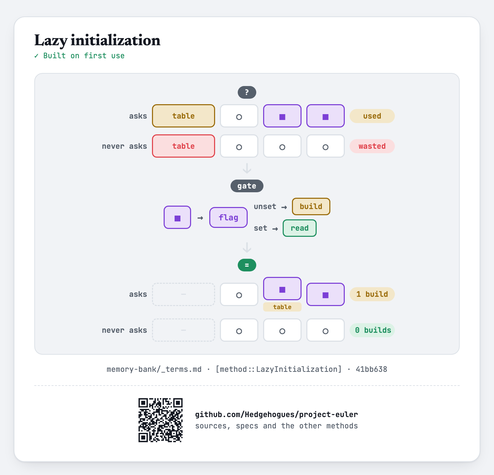
Sequence:
  1. Problem — the table is built before the first query in both runs: in the run whose queries do ask for it the cost is earned, and in the run whose queries never touch it the very same cost is wasted
  2. Transform gate — one flag stands in front of the table: an asking query finds the flag unset and builds, every later one finds it set and only reads
  3. Solution — the asking run builds the table once, at the query that first needed it; the run that never asks builds nothing at all
Limits:
  - MUST NOT: be used when the deferred build would land inside the most tightly timed part of the run — a limit of PRACTICE: deferral does not reduce the cost, it moves it, and moving it onto the first asking query makes that one query pay for the whole build
  - MUST NOT: be used where every possible input needs the structure — a limit of the IDEA: the flag is then checked forever and never once saves a build
  - MUST: build under the gate exactly once and never rebuild — a limit of PRACTICE: a flag set anywhere but immediately beside the build turns the deferral into a rebuild on every query, which is far worse than building eagerly
  - MUST: the picture shows two runs of three queries each — a limit of the PICTURE: whether a real input ever asks is a property of the constraints, which this record's Recognized by carries and no drawing can
Note: this record carries only the deferral to first use. WHAT is built, and why it is worth building once, is [method::Precomputation](#methodprecomputation)'s — this is that record's timing, the same build behind a different trigger; and the "check whether it is already there" gate applied per argument instead of to one whole structure is [method::Memoization](#methodmemoization). No established picture exists (checked: Wikipedia's Lazy initialization and Lazy evaluation articles illustrate the idea with code in several languages and carry no diagram; cp-algorithms has no page on it), so the two lanes are this catalog's own construction.
Source: [Wikipedia — Lazy initialization](https://en.wikipedia.org/wiki/Lazy_initialization) ("the tactic of delaying the creation of an object, the calculation of a value, or some other expensive process until the first time it is needed", accomplished by "augmenting an accessor method to check whether a private member, acting as a cache, has already been initialized"; on the cost: the impact "is spread in time ('amortized') rather than concentrated in the startup phase") · [Wikipedia — Lazy evaluation](https://en.wikipedia.org/wiki/Lazy_evaluation) (the general evaluation strategy this one specializes)
Example: `visualizations/examples/lazy-initialization.{css,html}` (no js needed — the values are static) → `visualizations/build/lazy-initialization.html`
Spec: [approaches](specs/approaches.md) · [visualizations](specs/visualizations.md)

## [method::BinarySearch]
Class: entity
Standard name: Binary search
Essence: Find where a value sits in an already sorted list by repeatedly discarding the half that cannot contain it.
Recognized by: you need to find an element or a position in a list that is already sorted (or grows in order by construction)
General case: compare the target against the middle of the remaining stretch and drop the half where the answer cannot be — O(log m) comparisons instead of scanning all m elements
Picture: 
Sequence:
  1. Problem — a list of numbers and a target; where it sits is unknown
  2. Transform ½ — the middle is compared with the target, the half that cannot contain it is discarded
  3. Transform ½ — the same repeats on what is left
  4. Solution — one element remains — that is the answer
Limits:
  - MUST NOT: be used on an unsorted list — a limit of the IDEA: halving stops guaranteeing anything
Source: [cp-algorithms — Binary Search](https://cp-algorithms.com/num_methods/binary_search.html) · [Wikipedia — Binary search algorithm](https://en.wikipedia.org/wiki/Binary_search_algorithm)
Example: `visualizations/examples/binary-search.{css,html}` (no js needed — the values are static) → `visualizations/build/binary-search.html`
Spec: [approaches](specs/approaches.md) · [visualizations](specs/visualizations.md)

## [method::TrialDivision]
Class: entity
Standard name: Trial division · picture — ladder method (division ladder), a.k.a. birthday cake method
Essence: Try the small numbers in turn, starting at 2 — see what divides — and peel off the prime factors that way.
Recognized by: you need to factor a number into primes or to find one particular (say, the largest) prime factor
General case: try divisors d from 2 while d·d ≤ what REMAINS of the number — a factorization into two parts both larger than the square root would multiply out to more than the number itself, so any composite must have a factor at or below its square root; at each divisor peel it out while it divides evenly — the remainder shrinks and the trial bound falls with it; if what is left after the loop exceeds 1, it is itself prime — every prime factor it still has is larger than every divisor already tried, hence larger than its own square root, and two such factors multiplied together would exceed it (and with divisors tried in increasing order, it is the largest factor)
Picture: 
Sequence:
  1. Problem — the number 30, not yet broken down
  2. Transform ÷2 — divide by 2, quotient 15 written below
  3. Transform ÷3 — divide 15 by 3, quotient 5 written below
  4. Solution — the leftover 5 is put through the loop's own condition rather than declared prime: 2 &times; 2 = 4 is still within 5 and 2 does not divide it, then 3 &times; 3 = 9 passes 5 and the loop ends — nothing at or below its square root divides it, so 5 can only be prime, and it is the largest factor
Limits:
  - MUST NOT: be used on large numbers with no small factors — a limit of the IDEA by cost: the loop runs to the square root, which is impractical for a semiprime of tens of digits (other factorization methods belong there)

  - MUST: the last rung shows the leftover's OWN trial bound running out, not merely a claim that it is prime — a limit of the PICTURE: the corollary is the one step of this method that a drawing can show and a caption can only assert, and the drawing asserted it for as long as the record did
  - MUST: in the picture, divide by primes starting from the smallest — a limit of the PICTURE: the ladder must mirror the loop's mechanics (all the 2s first, then odd divisors in increasing order), not an arbitrary split into any two factors as in a free-form factor tree
Source: [Wikipedia — Trial division](https://en.wikipedia.org/wiki/Trial_division) · picture: [Math = Love — Birthday Cake Method](https://mathequalslove.net/prime-factorization-using-birthday-cake-method/) · [Scaffolded Math and Science — Ladder Method](https://www.scaffoldedmath.com/2019/02/finding-gcf-and-lcm-with-upside-down-cake-method.html) · [cp-algorithms — Integer factorization](https://cp-algorithms.com/algebra/factorization.html) (the square-root bound and the cofactor corollary, stated in exactly this loop's idiom)
Example: `visualizations/examples/ladder-method.{css,html}` (no js needed — the values are static) → `visualizations/build/ladder-method.html`
Spec: [approaches](specs/approaches.md) · [visualizations](specs/visualizations.md)

## [method::SumOfSquares]
Class: entity
Standard name: Sum of squares formula · picture — square split into two triangular staircases (this catalog's own construction, verified but not independently sourced as a named device — see Picture note)
Essence: The sum of the first n squares has a closed-form cubic formula, computed directly instead of adding n terms one at a time.
Recognized by: you need 1² + 2² + ... + n² — the terms being added are themselves squares, not the plain numbers ([method::ArithmeticProgressionSum](#methodarithmeticprogressionsum) is for that, plain-number, case)
General case: sum of the first n squares = n(n+1)(2n+1) / 6, for any positive integer n
Picture: 
Sequence:
  1. Problem — a 4×4 square of unit cells, unlabeled; split it along the diagonal into two staircases?
  2. Transform ⊿ — the growing staircase (T(4)=10 cells) and the rest (T(3)=6 cells): every k² splits into T(k) + T(k−1), the triangular numbers on either side of k
  3. Solution — each of the four layers (k=1..4) split the same way; summing every blue staircase (1+3+6+10=20) and every red one (0+1+3+6=10) gives 30 = 1²+2²+3²+4²
Limits:
  - MUST NOT: be confused with the LINEAR sum 1+2+...+n — that is [method::ArithmeticProgressionSum](#methodarithmeticprogressionsum), a different, lower-degree closed form; the two are easy to conflate because both apply to "the first n numbers"
Note: no encyclopedic source gives a geometric derivation of the closed form n(n+1)(2n+1)/6 — Wikipedia's own Square pyramidal number article states it directly and says it "may be proved by mathematical induction" (an algebraic technique, not a picture). The picture therefore does NOT claim to derive the cubic closed form; what it DOES show, honestly and completely, is the real, checkable identity k² = T(k) + T(k−1) (T being the triangular number, already this catalog's own [method::ArithmeticProgressionSum](#methodarithmeticprogressionsum) at n=k) — summing that identity over k=1..n is a genuine, verifiable route to the same total, one level short of the final algebraic simplification into the cubic form. An earlier version of this picture stacked the four layers, counted each (16, 9, 4, 1), and then simply asserted "= 4·5·9/6" with no visible connection between the count and the formula — caught by the user asking directly what in the picture explains how the approach's result is obtained.
Source: [Wikipedia — Square pyramidal number](https://en.wikipedia.org/wiki/Square_pyramidal_number)
Example: `visualizations/examples/sum-of-squares.{css,html}` (no js needed — the values are static) → `visualizations/build/sum-of-squares.html`
Spec: [approaches](specs/approaches.md) · [visualizations](specs/visualizations.md)

## [method::EuclideanAlgorithm]
Class: entity
Standard name: Euclidean algorithm
Essence: To find the greatest common divisor of two numbers, keep replacing the larger one by the remainder of dividing it by the smaller — repeat until nothing is left over; what remains is the answer.
Recognized by: you need the greatest common divisor of two numbers, or need to reduce a fraction/ratio to lowest terms, or need to check whether two numbers share no common factor at all
General case: gcd(a, 0) = a; gcd(a, b) = gcd(b, a mod b) for b > 0 — holds for any two non-negative integers, and always terminates (the number of steps is at most about 5 times the number of decimal digits of the smaller number)
Picture: 
Sequence:
  1. Problem — a 35×15 rectangle; what size of square tiles it exactly is unknown
  2. Transform ÷15 — two 15×15 squares tile part of the rectangle, leaving a 5×15 strip over
  3. Solution — that strip is exactly covered by three 5×5 squares with nothing left over; 5 is the greatest common divisor
Limits:
  - MUST NOT: be applied to negative numbers without first taking absolute values — a limit of the IDEA: the remainder step assumes both numbers are non-negative
Source: [Wikipedia — Euclidean algorithm](https://en.wikipedia.org/wiki/Euclidean_algorithm) · [cp-algorithms — Euclidean algorithm for computing GCD](https://cp-algorithms.com/algebra/euclid-algorithm.html)
Example: `visualizations/examples/euclidean-algorithm.{css,html}` (no js needed — the values are static) → `visualizations/build/euclidean-algorithm.html`
Spec: [approaches](specs/approaches.md) · [visualizations](specs/visualizations.md)

## [method::LCMViaGCD]
Class: entity
Standard name: Least common multiple via GCD · picture — tile-count swap (this catalog's own construction, not an independently named historical device — see Picture note)
Essence: Build the smallest number divisible by a whole list of numbers, one at a time — each new number only ever contributes the part of itself not already covered by what came before.
Recognized by: you need the smallest number that every number in a set or range divides into evenly ("smallest number divisible by all of 1..N") — the smallest common MULTIPLE, not the greatest common divisor
General case: lcm(a, b) = a·b / gcd(a, b); for a list or range of more than two numbers, fold this pairwise across every element in turn — lcm(a, b, c, ...) = lcm(lcm(a, b), c, ...)
Picture: 
Sequence:
  1. Problem — 35 shown tiled by 7 units of 5 (their gcd), 15 shown tiled by 3 units of 5 — the same unit exactly fits both, a different number of times each
  2. Transform ⇄ — swap the counts: the 7 tiles counted inside 35 become how many times 15 repeats, and the 3 tiles counted inside 15 become how many times 35 repeats
  3. Solution — 3 × 35 = 7 × 15 = 105 = lcm(35, 15); both rows reach the exact same length, because that is precisely what the swap guarantees
Limits:
  - MUST NOT: be computed by just multiplying every number together — that overcounts factors the numbers already share; dividing by the gcd at each step is exactly what keeps the running result minimal
Note: a standard LCM picture exists for a DIFFERENT technique — a Venn diagram of each number's prime factors, shared primes in the overlap — but drawing it here would show the factoring approach this method exists specifically to avoid (factoring is expensive, gcd is cheap). The picture used instead is not independently famous by its own name: it is this catalog's own construction, deliberately drawn to differ from [method::EuclideanAlgorithm](#methodeuclideanalgorithm)'s square-tiling in both composition (linear tile-count-and-swap, not a shrinking rectangle) and in what it visibly derives (WHY the repeat counts 3 and 7 are what they are, shown by literally counting tiles, not asserted in a caption) — even though the same gcd, 5, anchors both pictures. This idea's entire mechanism runs through EuclideanAlgorithm — unlike Precomputation and BinarySearch (independently useful without each other), this one cannot even be stated without the gcd it depends on.
Source: [Wikipedia — Least common multiple](https://en.wikipedia.org/wiki/Least_common_multiple)
Example: `visualizations/examples/lcm-via-gcd.{css,html}` (no js needed — the values are static) → `visualizations/build/lcm-via-gcd.html`
Spec: [approaches](specs/approaches.md) · [visualizations](specs/visualizations.md)

## [method::SievingOverMultiples]
Class: family
Standard name: Sieving over multiples — no single established name covers the family: its composite-marking case is the Sieve of Eratosthenes and its smallest-prime-factor case in linear time is the linear sieve (Euler's sieve), while the divisor-count and divisor-sum cases have no established name in any encyclopedic source (see Note)
Essence: Walk the multiples of every divisor in turn and leave something behind in each cell you land on, so that one sweep fills in a fact about every number up to the limit at once.
Recognized by: the statement wants the SAME per-number fact — prime or not, the smallest prime that divides it, how many divisors it has, what its divisors sum to — about EVERY number up to a bound, and that fact is cheap to accumulate from the divisor's side while being expensive to work out one number at a time
General case: the sweep itself never changes — take a divisor d, step d, 2d, 3d, ... up to N, and write into every cell landed on; the only thing that varies is what the cell receives. The COST is decided by the range d runs over and never by what is written into the cell. Over EVERY d &le; N the landings total &lfloor;N/1&rfloor; + &lfloor;N/2&rfloor; + ... + &lfloor;N/N&rfloor; = N&middot;HN, and HN = ln N + &gamma; + o(1), so the sweep costs N ln N + O(N) — for a cell that counts divisors this landing total is exactly the divisor summatory function, N log N + (2&gamma;&minus;1)N + O(&radic;N) (Dirichlet, 1849), so the sweep's own price and the total it computes are the same quantity. Over the PRIMES p &le; N alone the landings total N &middot; &sum;p &le; N 1/p = N(log log N + M + O(1/log N)) by Mertens' second theorem — a whole logarithmic factor cheaper. So a cell whose value needs EVERY divisor of its number pays N log N, and a cell whose value needs only the primes pays N log log N; which of the two applies is settled by that range, not by the write
Axis: what the cell receives — a mark that the number is composite, the smallest prime that divides it, one more divisor counted, one more divisor added in
Specializations: [method::SieveOfEratosthenes](#methodsieveoferatosthenes) (the cell receives a mark, and the marks are what the answer is read from) · [method::LinearSieve](#methodlinearsieve) (the cell receives the smallest prime that divides its number, and keeps it)
Picture: — the axis is what a cell RECEIVES, and a mark, a stored prime and a running total look alike drawn as cells: one skeleton held fixed while the varying part changes would put four rows of near-identical cells side by side, and the difference between them lives in what the number in a cell MEANS, which a drawing cannot carry. Borrowing a child's picture is not allowed either — [method::SieveOfEratosthenes](#methodsieveoferatosthenes)'s grid and [method::LinearSieve](#methodlinearsieve)'s stored-factor row each show one specialization's mechanism, which is exactly what a family must not do
Limits:
  - MUST NOT: assume the cheaper prime-only cost for a cell whose value needs every divisor of its number — a limit of the IDEA: the divisor-count and divisor-sum sweeps are a full logarithmic factor dearer than the marking sweep, not the same sweep with a different write; the range of d, not the write, is what the cost reads
  - MUST NOT: be reached for the same fact about ONE given number — a limit of the IDEA: the whole table up to that number is built and thrown away to answer a single query ([method::TrialDivision](#methodtrialdivision) is for that case)
  - MUST NOT: carry the mechanism of any of its specializations — a limit of the RECORD: stopping at the square root belongs to the marking sieve and reaching each composite exactly once belongs to the linear sieve, and repeating either here would make this record a retelling of its children
Note: only the marking case has a settled encyclopedic name, and the O(N) smallest-prime-factor case has one (linear sieve, historically Euler's sieve). The divisor-count and divisor-sum cases are named only in competitive-programming blogs ("divisor sum sieve", Codeforces "Extensions of the Prime Sieve" — both of which answer 403 to a plain request and so are not cited below); the phrase "sieve for multiplicative functions" appears in no encyclopedic source at all, and cp-algorithms' Linear Sieve page never uses the word "multiplicative" (checked against its full page text, not its headings). The family's own name here is therefore descriptive, chosen for the axis, not looked up. The quantity the divisor-sum case computes does have a name of its own: the sum of the proper divisors is the aliquot sum.
Source: [cp-algorithms — Sieve of Eratosthenes](https://cp-algorithms.com/algebra/sieve-of-eratosthenes.html) (states the naive inner loop as "a harmonic sum like n(1/2 + 1/3 + 1/4 + ...), which is bounded by O(n log n)", and the prime-only sum as the O(n log log n) bound) · [Wikipedia — Sieve of Eratosthenes](https://en.wikipedia.org/wiki/Sieve_of_Eratosthenes) ("a direct consequence of the fact that the prime harmonic series asymptotically approaches log log n") · [Wikipedia — Harmonic number](https://en.wikipedia.org/wiki/Harmonic_number) · [Wikipedia — Mertens' theorems](https://en.wikipedia.org/wiki/Mertens%27_theorems) (second theorem) · [Wikipedia — Divisor summatory function](https://en.wikipedia.org/wiki/Divisor_summatory_function) (D(x) = &sum;k&le;x&lfloor;x/k&rfloor; and Dirichlet's asymptotic) · [Wikipedia — Aliquot sum](https://en.wikipedia.org/wiki/Aliquot_sum)
Spec: [approaches](specs/approaches.md)

## [method::SieveOfEratosthenes]
Class: entity
Family: [method::SievingOverMultiples](#methodsievingovermultiples) (this is its composite-marking specialization)
Standard name: Sieve of Eratosthenes
Essence: To list every prime up to a limit, start with all numbers unmarked, then repeatedly take the next unmarked number as a prime and cross out all of its multiples — whatever survives unmarked all the way through is exactly the primes.
Recognized by: you need ALL the primes up to some bound N at once, not a yes/no test or a factorization of one single given number ([method::TrialDivision](#methodtrialdivision) is for that, one-number case)
General case: for a limit N, it suffices to cross multiples of each prime p starting at p&sup2; and only for p &le; sqrt(N) — every composite below p&sup2; was already crossed by a smaller prime factor; runs in O(N log log N)
Picture: 
Sequence:
  1. Problem — numbers 2 to 19, none checked yet
  2. Transform ×2 — 2 is the first unmarked number, a prime; cross out every multiple of it (4, 6, 8, 10, 12, 14, 16, 18)
  3. Transform ×3 — 3 is the next unmarked number, a prime; cross out its multiples (6, 9, 12, 15, 18) — 9 and 15 are newly crossed, the rest were already gone
  4. Solution — nothing past 3 needs checking (the next candidate, 5, has 5&sup2;=25 &gt; 19); the 8 numbers never crossed out are exactly the primes below 20
Limits:
  - MUST NOT: be used to test or factor one single large number in isolation — a limit of the IDEA: building the whole array up to that number costs memory and time nobody needs for one query ([method::TrialDivision](#methodtrialdivision) is for that case)
  - MUST: the picture only crosses multiples of primes up to sqrt(limit) — a limit of the PICTURE: showing every divisor's hops instead of stopping at the square root would draw marks already covered by a smaller prime, obscuring why the sieve is allowed to stop early
Note: this is the composite-marking case of [method::SievingOverMultiples](#methodsievingovermultiples) — the same walk over the multiples of a divisor also fills in smallest prime factors, divisor counts and divisor sums, and the cost changes with the range the divisor runs over rather than with what is written into the cell.
Source: [Wikipedia — Sieve of Eratosthenes](https://en.wikipedia.org/wiki/Sieve_of_Eratosthenes) · [cp-algorithms — Sieve of Eratosthenes](https://cp-algorithms.com/algebra/sieve-of-eratosthenes.html)
Example: `visualizations/examples/sieve-of-eratosthenes.{css,html,js}` → `visualizations/build/sieve-of-eratosthenes.html`
Spec: [approaches](specs/approaches.md) · [visualizations](specs/visualizations.md)

## [method::LinearSieve]
Class: entity
Family: [method::SievingOverMultiples](#methodsievingovermultiples) (its specialization whose cell receives, and keeps, the smallest prime factor)
Standard name: Linear sieve (historically Euler's sieve; shown to run in linear time by Gries and Misra, 1978 — cited here through Wikipedia, the original paper being paywalled)
Essence: Reach each composite number exactly once, through the smallest prime that divides it, and keep that prime in its cell instead of a cross — so that afterwards any number in the range is taken apart by repeatedly reading its cell and dividing by what it holds.
Recognized by: you need the prime factorization of MANY numbers drawn from one bound, or the same number factored over and over, rather than a prime-or-not answer for each ([method::SieveOfEratosthenes](#methodsieveoferatosthenes) is for that case) or the factors of one single number ([method::TrialDivision](#methodtrialdivision) is for that one)
General case: hold an array of smallest prime factors, empty to start, and a list of the primes found so far; walk i upward from 2 — if i's cell is still empty then i is prime, so append it to the list and store i in its own cell — then run through the primes p already in the list in increasing order, stopping as soon as p exceeds the factor stored at i or i&middot;p exceeds the bound, and otherwise store p into the cell of i&middot;p. Every composite c is written EXACTLY ONCE, by the single pair (c divided by its smallest prime factor, that factor): the loop only ever writes a p that is at most the factor stored at i, so the p it writes really is the smallest prime factor of i&middot;p, and that pins the writing pair uniquely — one write per composite plus one step per number is O(N) total, with nothing visited twice. Reading the finished array factors any number in the range by repeated division — the cell gives a factor, dividing by it gives a smaller number, and its cell gives the next — and since every division removes a factor of at least 2, a number is fully taken apart in at most log&#8322;(number) steps, with its prime factors coming out in increasing order
Picture: 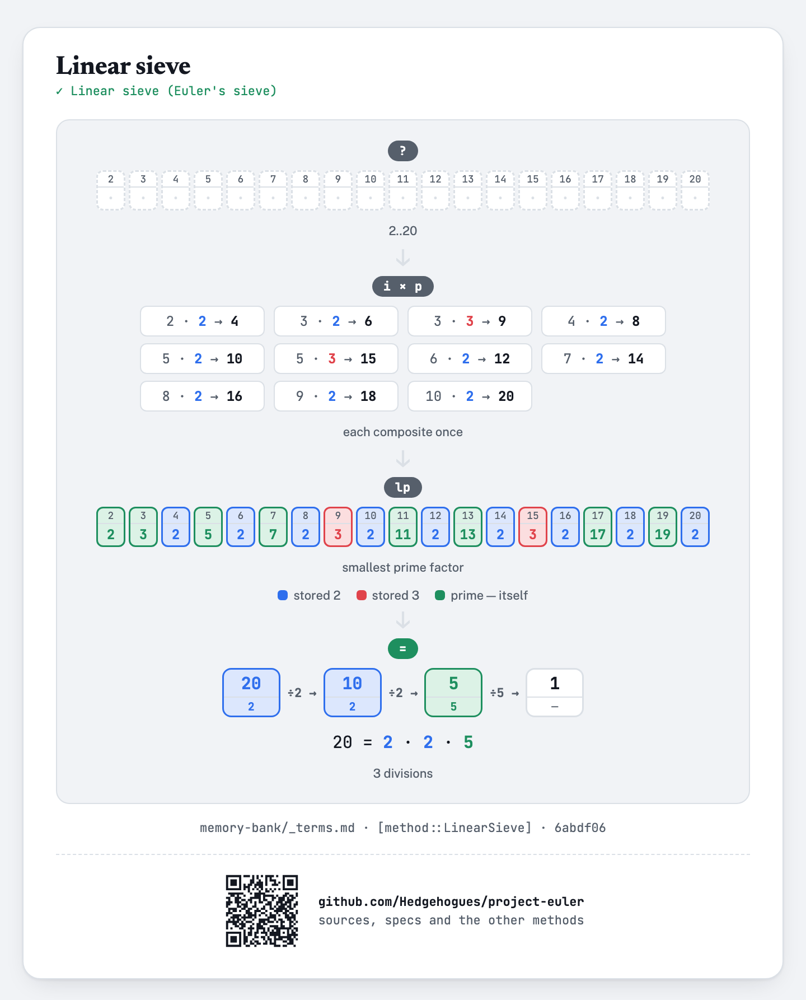
Sequence:
  1. Problem — the cells for 2 to 20, nineteen of them, each holding nothing yet
  2. Transform i &times; p — the eleven writes, one line each (2&middot;2&rarr;4, 3&middot;2&rarr;6, 3&middot;3&rarr;9, 4&middot;2&rarr;8, 5&middot;2&rarr;10, 5&middot;3&rarr;15, 6&middot;2&rarr;12, 7&middot;2&rarr;14, 8&middot;2&rarr;16, 9&middot;2&rarr;18, 10&middot;2&rarr;20), with the prime being written coloured; the right-hand side of the eleven lines names each of the eleven composites below 21 exactly once, and no number twice
  3. Transform lp — the same row now full: each composite holds the prime that was written into it (2 in nine of them, 3 in just 9 and 15), and each prime holds itself
  4. Solution — 20 taken apart by reading its own cell and nothing else: 20 holds 2, divide to get 10; 10 holds 2, divide to get 5; 5 holds 5, divide to get 1 — three divisions, and 20 = 2 &middot; 2 &middot; 5
Limits:
  - MUST: break the inner run of primes on the stored-factor condition, not only when the product passes the bound — a limit of the IDEA: without that break a composite is written through more than one of its prime factors, the once-each guarantee is gone, and the cost falls back to the prime-harmonic range its family names
  - MUST NOT: be preferred over the marking sieve for the asymptotics alone — a limit of PRACTICE: cp-algorithms says of the O(N) against O(N log log N) difference that "the difference between them is not so big", while this variant additionally needs the list of primes and a whole integer per cell instead of one bit, so it can lose on memory before it wins on time; what earns it is the stored factor, not the exponent
  - MUST: the picture stops at 20 so that every stored value is countable by eye — a limit of the PICTURE: at any realistic bound the row is millions of cells wide, and its two accent colours cover only a stored 2 and a stored 3, while a real range stores many more distinct primes than a legend can hold
  - MUST NOT: be read off the picture as an account of WHY each i stops writing where it does — a limit of the PICTURE: it shows the eleven writing pairs and that no composite appears in two of them, which is the once-each fact, but it does not draw the stop rule that produces them (the run of primes ending at the factor stored in i); that rule is stated in the General case above, deliberately kept off the picture so one drawing teaches one thing
Note: no encyclopedic source draws a picture for this. Checked: Wikipedia's Sieve of Eratosthenes article carries only the boolean marking grid and describes no variant that stores anything other than a composite flag; cp-algorithms' Linear Sieve page is code and prose with no figure; cp-algorithms' divisors page is formulas only; the lattice-points-under-a-hyperbola drawing on Wikipedia's Divisor summatory function illustrates the hyperbola method, a different idea. The picture is therefore this catalog's own construction, deliberately built to differ from [method::SieveOfEratosthenes](#methodsieveoferatosthenes)'s grid in composition as well as content: that one crosses cells out in two passes over the same row, this one writes eleven named pairs into a ledger and then reads one number back OUT of the finished row, which is the half of the idea a marking sieve has no counterpart for.
Source: [cp-algorithms — Linear Sieve](https://cp-algorithms.com/algebra/prime-sieve-linear.html) (the array is named lp and holds the "minimum prime factor"; "allows us to find factorization of any number in the segment [2; n] in the time of the size order of this factorization"; the O(n) claim against "O(n log log n) of the classic sieve") · [Wikipedia — Sieve of Eratosthenes](https://en.wikipedia.org/wiki/Sieve_of_Eratosthenes) (&sect; Euler's sieve: "eliminates each composite number exactly once", "rediscovered and observed to take linear time by Gries & Misra (1978)")
Example: `visualizations/examples/linear-sieve.{css,html}` (no js needed — the values are static) → `visualizations/build/linear-sieve.html`
Spec: [approaches](specs/approaches.md) · [visualizations](specs/visualizations.md)

## [method::WheelFactorization]
Class: entity
Standard name: Wheel factorization (basis and wheel) &middot; picture — the wheel diagram itself
Essence: Once the first few primes have been divided out separately, every number that could still be a divisor sits at one of a handful of fixed positions in a repeating cycle, so the search hops straight from one such position to the next and never looks at anything between them.
Recognized by: a scan over candidate divisors (or candidate primes) that would otherwise step through every integer in a range, in a situation where the smallest primes are already handled on their own and every multiple of them is therefore known in advance to be worthless
General case: choose a basis of the first few primes; their product is the wheel's circumference, and the wheel is the set of remainders below that product that share no factor with any basis prime. Divide out the basis primes explicitly, then advance through candidates by the fixed, repeating cycle of gaps between consecutive wheel remainders. The share of all integers that survives is the count of those remainders divided by the circumference: 1/2 for the basis 2, 1/3 once 3 is added, 8/30 once 5 is added, 48/210 once 7 is added. [method::TrialDivision](#methodtrialdivision) and [method::SieveOfEratosthenes](#methodsieveoferatosthenes) supply what HAPPENS at each step — peeling a factor out of one number, or striking a class of multiples off a whole range; the wheel supplies only the step pattern, and either of them can be driven by a wheel of any size
Picture: 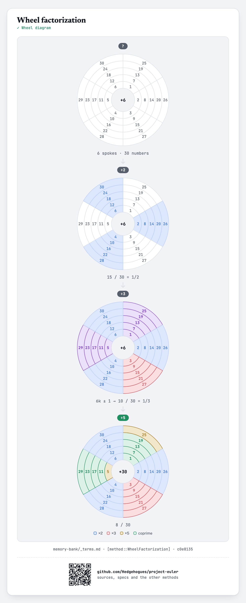
Sequence:
  1. Problem — a wheel of circumference 6: six spokes, five turns, the numbers 1 to 30 in their places, no class ruled out yet; one turn further out along a spoke adds 6
  2. Transform &divide;2 — the three even spokes are shaded out; 15 of the 30 are left, one half of them
  3. Transform &divide;3 — the spoke of the remaining multiples of 3 goes as well; the two spokes still standing are the remainders 1 and 5, holding 10 of the 30, one third of them
  4. Solution — one prime further out: the multiples of 5 that sit on those two spokes (5 and 25) are shaded too, leaving 8 of the 30 — and those 8 are NOT spokes of this wheel, which is exactly why the next wheel's circumference has to be 30 rather than 6
Limits:
  - MUST NOT: be read as "shaded means composite" — a limit of the IDEA: the basis primes themselves lie in the shaded classes and 1 lies in the wheel, so the basis primes have to be emitted or tested before the wheel starts turning, and 1 has to be excluded by hand
  - MUST NOT: be enlarged indefinitely — a limit of PRACTICE: every basis prime added cuts less than the one before it (1/2, then 1/3, then 8/30, then 48/210) while the gap table it needs grows as fast as the circumference, so the returns diminish against a table that does not
  - MUST: the picture stops at circumference 6 and shows the 30-wheel only as one further shading step — a limit of the PICTURE: a wheel drawn with its own 30 spokes needs 30 sectors in every turn, well past what a single glance can count
Source: [Wikipedia — Wheel factorization](https://en.wikipedia.org/wiki/Wheel_factorization) — basis and wheel: "one starts from a small list of numbers, called the *basis* (usually the first few primes); then, one generates the list, called the *wheel*, of the integers that are coprime with all the numbers in the basis"; the densities verbatim: "With the basis {2, 3}, the reduction is to 1/3 &lt; 34% of all the numbers. This means that fully 2/3 of all the candidate numbers are skipped over automatically&hellip; with basis {2, 3, 5} to 8/30 &lt; 27%, and with basis {2, 3, 5, 7} to 48/210 &lt; 23%". Unlike most pictures in this catalog, the drawing here follows an ESTABLISHED visual rather than being invented for it: that article carries the wheel diagram itself, committed as [File:Wheel factorization-n=6.svg](https://commons.wikimedia.org/wiki/File:Wheel_factorization-n%3D6.svg) and [File:Wheel factorization-n=30.svg](https://commons.wikimedia.org/wiki/File:Wheel_factorization-n%3D30.svg) ("No primes will occur in the yellow areas") — concentric turns, one spoke per remainder, the dead classes shaded — and this frame sequence is that same diagram redrawn at catalog scale &middot; [cp-algorithms — Integer factorization](https://cp-algorithms.com/algebra/factorization.html) (&sect; Wheel factorization: "Once we know that the number is not divisible by 2, we don't need to check other even numbers. This leaves us with only 50% of the numbers to check", then "We need to check all numbers with d mod 6 = 1 and d mod 6 = 5. So this leaves us with only 33.3% percent of the numbers to check", with the 30-wheel's gap table `{4, 2, 4, 2, 4, 6, 2, 6}`) &middot; [Wikipedia — Primality test](https://en.wikipedia.org/wiki/Primality_test) (the same 6-wheel derived independently and with its reason: "all primes greater than 5 are of the form 6k + i&hellip; Since 2 divides 6k, 6k + 2, and 6k + 4, and 3 divides 6k and 6k + 3, the only possible remainders mod 6 for a prime greater than 3 are 1 and 5&hellip; This is almost three times as fast as testing all numbers") &middot; [Wikipedia — Euler's totient function](https://en.wikipedia.org/wiki/Euler%27s_totient_function) (the surviving share is that function of the circumference, divided by the circumference) &middot; [PrimePages — wheel factorization](https://t5k.org/glossary/xpage/WheelFactorization.html) (a 2-and-3 wheel removes two thirds of the composites; removing 90% of them would need basis primes up to 251)
Example: `visualizations/examples/wheel-factorization.{css,html}` (no js needed — the values are static) → `visualizations/build/wheel-factorization.html`
Spec: [approaches](specs/approaches.md) · [visualizations](specs/visualizations.md)

## [method::NthPrimeBound]
Class: entity
Standard name: Upper bound on the nth prime (Rosser, 1941) · a named COMPOSITION of three catalogued ideas — see General case; picture — number-line walk (this catalog's own construction, see Note)
Essence: Before searching for the Nth prime, get an explicit numeric ceiling on how large it can possibly be from a proven inequality, instead of guessing a limit or growing the search open-endedly.
Recognized by: you are told only the INDEX N of a prime (not any bound on the prime's own size) and need to know in advance how far a search or a sieve must reach to be certain of finding it
General case: for n &ge; 6, the nth prime pn satisfies n(ln n + ln ln n &minus; 1) &lt; pn &lt; n(ln n + ln ln n) — the upper half alone is enough to size a sieve safely. The bound's SHAPE is a composition of three ideas, each recognizable on its own elsewhere: (1) [method::PrimeNumberTheorem](#methodprimenumbertheorem) — near x the primes are spaced about ln x apart, so n primes take about n &times; ln x of room; (2) [method::FixedPointIteration](#methodfixedpointiteration) — that room depends on where you end up (x &asymp; pn), so p &asymp; n &middot; ln p is an equation in its own answer: start from p0 = n ln n and take ONE pass, p1 = n &middot; ln(n ln n); (3) [method::LogarithmProductRule](#methodlogarithmproductrule) — ln(n &middot; ln n) = ln n + ln ln n, which is the whole reason a "log of a log" appears in the formula. Rosser's theorem is what turns this heuristic shape into a proven inequality
Picture: 
Sequence:
  1. Problem — find the 6th prime; the number line has no marked end, only a "?"
  2. Transform gaps ([method::PrimeNumberTheorem](#methodprimenumbertheorem)) — the real primes up to 20 on a number line, numbered 1st..8th (the 6th is 13, the target the next frames measure against); under it, on the same x-scale, the curve ln x with two bars reaching up to it — 1.8 at 6, 2.6 at 13. The spacing widens the way the curve rises: this is where the logarithm comes from, shown as a fit, not derived
  3. Transform guess — 6 numbered hops of the ruler measured at 6 (ln 6 &asymp; 1.792), walked out from 0: the 6th hop lands at 10.75, and a red dashed gap with a &#10007; runs from it to the 13 mark — short. No formula on the picture: six hops of one ruler IS 6 &times; ln 6
  4. Transform &#8635; ([method::FixedPointIteration](#methodfixedpointiteration), one pass) — the hop was measured in the wrong place: at 6, where primes are still dense, not near where the walk ends. Re-measure the ruler at the landing point, 10.75, and walk the same 6 hops again: the 6th now lands at 14.25, past 13, and &lceil;14.25&rceil; = 15 is the ceiling. The new ruler is drawn as the old one (1.8) plus a short extra piece (0.6), total 2.4 = ln 10.75 — that split is [method::LogarithmProductRule](#methodlogarithmproductrule): 10.75 is itself 6 &times; 1.8, so ln 10.75 = ln 6 + ln 1.8, and the extra piece, ln 1.8 = ln ln 6, is the whole "log of a log"
  5. Solution — a search range 0..15 with the primes it contains dotted in: the 6th dot, 13, sits safely inside the ceiling — this is what the bound buys, a sieve size known before any prime is found
Limits:
  - MUST NOT: be used for n &lt; 6 — a limit of the IDEA: the inequality is proven only from n=6 upward; smaller n are checked directly instead
  - MUST: pad the computed bound rather than use it exactly at the boundary — a limit of PRACTICE, not of the theorem: the inequality is proven exact, but floating-point evaluation of ln/ln ln can round down by a hair right at the boundary
  - MUST NOT: present the guess-then-refine picture as the actual 1941 proof — a limit of the PICTURE: it shows the standard HEURISTIC motivation for the formula's shape (self-consistent substitution: p&#8776;n&middot;ln(p), then ln(p)&asymp;ln(n&middot;ln n)), not Rosser's real analytic argument, which is more careful and is what actually makes the inequality a proven ceiling rather than just a plausible guess
Note: No encyclopedic source draws a picture for this inequality (checked: Wikipedia's Prime-counting function article states the bound as a formula only, no diagram; no published plot comparing p_n against the bound was found anywhere encyclopedic) — the idea itself is standard and sourced below; the picture is this catalog's own construction, honestly not attributed to an established visual tradition the way [method::SieveOfEratosthenes](#methodsieveoferatosthenes)'s grid is. Three earlier designs did not survive direct user feedback: a formula-in-a-box with no derivation at all ("doesn't answer how it's obtained, no geometry"), 6 tiles laid end to end each just labeled with the formula itself ("useless" — restates the arithmetic, explains nothing about where the formula comes from), and a version with the guess/refine formulas but no geometry at all ("how is the log of a log obtained — visualize this without text so the problem and the fix are both clear"). This version walks the SAME 6-hop step out on a number line twice, once per guess, both against the same fixed mark for the real 6th prime (13): the first walk's equal hops (size ln 6) visibly land short of 13; the second walk's bigger hops (size ln 6 + ln ln 6) visibly clear it — the correction is a comparison a reader counts by eye (hop spacing, landing position), not a formula they have to parse to believe. A fourth round ("where does the logarithm come from at all, and the log of a log?") split the record into a named composition: the logarithm's origin is [method::PrimeNumberTheorem](#methodprimenumbertheorem) (frame 2 now shows the ln x curve fitted to the real prime spacing), the refinement is one pass of [method::FixedPointIteration](#methodfixedpointiteration), and the ln ln term is [method::LogarithmProductRule](#methodlogarithmproductrule) — each of the latter two got its own record and picture, so this picture only has to show them meeting, not teach them.
Source: [Wikipedia — Prime-counting function](https://en.wikipedia.org/wiki/Prime-counting_function) (bounds section, upper bound attributed to Rosser, 1941)
Example: `visualizations/examples/nth-prime-bound.{css,html}` (no js needed — the values are static) → `visualizations/build/nth-prime-bound.html`
Spec: [approaches](specs/approaches.md) · [visualizations](specs/visualizations.md)

## [method::DigitalInvariantBound]
Class: entity
Standard name: Finiteness bound for perfect digital invariants (narcissistic / Armstrong numbers)
Essence: Before searching for numbers that equal a fixed total built from their own digits, settle how long such a number can be by weighing the largest total those digits could possibly reach against the smallest number of that length.
Recognized by: the statement asks for every number equal to some total assembled from its own digits, and gives no upper limit on the numbers themselves — so whether the search even terminates is an open question before anything is computed
General case: one digit contributes at most a fixed amount, so the largest total reachable with a given number of digits grows only in proportion to that count, while the smallest number of that length grows by a factor of the base with every digit added. The second overtakes the first, once, permanently — and that crossing is the bound. The two published forms:
  · FIXED POWER, independent of the digit count. Every candidate satisfies `n < b^(p+1)`, from the published argument: for a digit count `k >= p + 2`, `n >= b^(k-1) > b^p · k`, so `n` exceeds its own digit total from that length onward, and only the finitely many numbers below `b^(p+1)` remain to check. For base ten and fifth powers that is a search below one million; the same article gives a sharper `n <= (p-2)^p + p(b-1)^p` when the base exceeds the power.
  · POWER EQUAL TO THE DIGIT COUNT (narcissistic, Armstrong). Every candidate satisfies `b^(k-1) <= k(b-1)^k <= b^k`; since the left side grows exponentially against a linear right side, there is a largest `k` for which this can hold, and beyond it the digit total is always smaller than the number. In base ten this gives sixty digits as the ceiling — `60 · 9^60` still exceeds `10^59`, while `61 · 9^61` already falls below `10^60` — and the exhaustive search below it is complete: exactly 88 narcissistic numbers exist in base ten, the largest of them 39 digits long
  Where the argument stops applying: with BOTH the power and the digit count left free, no upper bound is known at all and finiteness is an open question — the published statement is explicit about this, and it marks the edge of the method rather than a gap in it
Picture: 
Sequence:
  1. Problem — one number that really does equal the total of the cubes of its digits, and a search range with no end marked, only a question mark
  2. Transform max — the ceiling side: a single digit contributes at most nine cubed, so a length of k digits can reach at most k times that; the column of ceilings grows by a fixed step per row
  3. Transform min — the floor side laid alongside it: the smallest number of each length, growing by a factor of ten per row instead of a fixed step. Four rows have room for a candidate; on the fifth the floor has overtaken the ceiling, and the step rules in the two column headings are why it never comes back
  4. Solution — the bound the crossing gives: four digits at most, so the whole search fits below ten thousand
Limits:
  - MUST NOT: be applied when the per-digit contribution has no maximum — a limit of the IDEA: the entire argument rests on one digit being worth at most a fixed amount, which is what keeps the reachable total growing merely in proportion to the digit count while the numbers themselves grow geometrically
  - MUST: check every length below the bound directly — a limit of PRACTICE: the bound establishes where candidates cannot be and says nothing whatever about which of the shorter numbers actually qualify; it converts an endless question into a finite one and does not answer it
  - MUST NOT: be expected to produce a bound when the power is left free alongside the digit count — a limit of the IDEA, and a published one: in that generality no upper bound is known and finiteness is not settled
  - MUST NOT: be read as the published inequality — a limit of the PICTURE: the drawing uses the exact largest reachable total, nine cubed per digit, whereas the published proof uses a slightly looser ceiling of ten cubed per digit. Both cross at the same length here and give the same bound, but only the looser one is what the cited statement asserts, and the tighter one is the picture's own arithmetic
Note: this is the catalog's second bound-shaped record, and it differs from [method::NthPrimeBound](#methodnthprimebound) in what supplies the ceiling. There the bound is an analytic inequality taken from the literature, and the picture can only show the HEURISTIC motivating its shape. Here the argument is elementary and complete on the page — two growth rates and where they cross — so the picture shows the proof itself rather than a motivation for it, and the honesty caveat is not "this is not the real proof" but the much narrower one in the Limits above about which ceiling the drawing uses. No encyclopedic source draws a picture for either published form (checked: both cited articles carry mathematical notation and data tables only, no diagrams); the drawing is this catalog's own construction, not attributed to an established visual tradition.
Source: [Wikipedia — Perfect digital invariant](https://en.wikipedia.org/wiki/Perfect_digital_invariant) (the fixed-power bound, verbatim: "if k >= p + 2, n >= b^(k-1) > b^p k, so any n will satisfy n > F(n) until n < b^(p+1)") · [Wikipedia — Narcissistic number](https://en.wikipedia.org/wiki/Narcissistic_number) (the digit-count-power bound, verbatim: "any narcissistic number must satisfy the inequality b^(k-1) <= k(b-1)^k <= b^k … the largest narcissistic number in base 10 must be less than 10^60"; the count of 88) · [MathWorld — Narcissistic Number](https://mathworld.wolfram.com/NarcissisticNumber.html) (the source Wikipedia cites for the base-ten ceiling) · [OEIS A005188](https://oeis.org/A005188) (the complete base-ten list)
Example: `visualizations/examples/digital-invariant-bound.{css,html}` (no js needed — the values are static) → `visualizations/build/digital-invariant-bound.html`
Spec: [approaches](specs/approaches.md) · [visualizations](specs/visualizations.md)

## [method::PrimeNumberTheorem]
Class: entity
Standard name: Prime number theorem
Essence: As numbers grow, the fraction of them that are prime keeps shrinking, in a way one explicit formula — a number divided by its own natural logarithm — predicts increasingly accurately.
Recognized by: you need to estimate how many primes lie below some bound, or how far apart primes typically run near a given size, without counting them one by one, and an approximate/asymptotic answer is acceptable
General case: pi(x), the count of primes up to x, satisfies pi(x) / (x &divide; ln x) &rarr; 1 as x &rarr; infinity; equivalently, near a number of size x, roughly one integer in every ln(x) is prime — [method::NthPrimeBound](#methodnthprimebound) is this same fact turned around (given the COUNT n, bound the SIZE of the nth prime) and sharpened into an explicit inequality that holds at every n, not just in the limit
Picture: 
Sequence:
  1. Problem — how many primes lie at or below 100? Below 10,000? Below 1,000,000? Unknown.
  2. Transform count vs x&divide;ln x — the real, counted totals (25, 1229, 78498) next to the formula's guess (21.7, 1086, 72382) at each of the three scales
  3. Solution — the guess undershoots by 15.1%, then 13.2%, then 8.4% — the relative gap shrinks as the numbers grow
Limits:
  - MUST NOT: be read as an exact formula, or as increasingly accurate at every individual scale without exception — a limit of the IDEA: it is a LIMIT statement (exact only as x &rarr; infinity); the true count is known to run persistently a little above the guess at accessible scales (Littlewood proved the sign of the gap even flips infinitely often much further out)
  - MUST: the three example scales are real, independently counted primes, not invented or interpolated — a limit of the PICTURE keeping it honest, not of the idea
Source: [Wikipedia — Prime number theorem](https://en.wikipedia.org/wiki/Prime_number_theorem) · [Wikipedia — Prime-counting function](https://en.wikipedia.org/wiki/Prime-counting_function) (the standard "ratio of &pi;(x) to x/log x and Li(x)" graph — this picture is this catalog's own discretized rendering of that same comparison at three concrete, verified scales, not a copy of the continuous plot)
Example: `visualizations/examples/prime-number-theorem.{css,html}` (no js needed — the values are static) → `visualizations/build/prime-number-theorem.html`
Spec: [approaches](specs/approaches.md) · [visualizations](specs/visualizations.md)

## [method::PrefixSum]
Class: entity
Standard name: Prefix sum (also cumulative sum, inclusive scan, or simply scan) over an associative operator; the general operation is Blelloch's all-prefix-sums · picture — running-total row plus subtraction (this catalog's own construction, the array/running-total idea sourced, the two-row picture not independently attributed — see Note)
Essence: Build a running-total array once — each cell holding everything added up to that point — so the sum of ANY range afterward is a single subtraction, not a re-added loop.
Recognized by: many queries each ask for the sum (or count) over a range of a fixed array, and re-adding the range from scratch every time would repeat the same work across overlapping queries
General case: prefix[i] = prefix[i-1] + value[i] (prefix[0] = 0); the sum of positions L..R is prefix[R] - prefix[L-1], for any L &le; R. The running total is only the case where the combining operator is addition: the same one-ascending-pass skeleton is valid for ANY associative operator — prefix[i] = prefix[i-1] &oplus; value[i] — with running maximum, running minimum, and a sum restricted to the elements passing a test all being instances of it (the last one contributing the operator's identity for elements that fail). Associativity is the whole requirement; an identity element is needed only for the exclusive form, which shifts every cell one position and seeds the first with it. Commutativity is never needed for a left-to-right pass. Carrying the POSITION of the best value alongside the value needs one extra commitment: with ties, "the argument of the maximum" is a set of positions, not a position, so the operator is not even a function until a tie-break is fixed. Fixing it — on a tie, keep the earlier position, or keep the later one — makes the operator a comparison on the pair (value, position) and restores associativity; in the pass itself, updating only on a strictly better value keeps the FIRST such position, while updating on an equal-or-better value keeps the LAST.
Picture: 
Sequence:
  1. Problem — 8 numbers in a row (3,1,4,5,9,2,6,8); the sum of the highlighted range (positions 3-6) is unknown
  2. Transform running total — a second row underneath, each cell the running total up to that position (3,4,8,13,22,24,30,38)
  3. Solution — the range sum is just two of those cells subtracted: 24 &minus; 4 = 20
Limits:
  - MUST NOT: be used when the underlying array changes between queries — a limit of the IDEA: every update would force rebuilding every prefix cell after it (a Fenwick/segment tree is the structure for that case, not covered here)
  - MUST: read the LOWER prefix cell one position before the range starts (prefix[L-1], not prefix[L]) — a limit of PRACTICE: off-by-one here is the single most common bug in this technique
  - MUST NOT: be used with a combining rule that is not associative — a limit of the IDEA: the running value can only absorb one element at a time if regrouping the combinations does not change the result
  - MUST: state the tie-break when the position of a best value is carried, not just its value — a limit of PRACTICE: first-wins and last-wins are different answers to the same question, and which one a loop produces is decided by whether it updates on "better" or on "at least as good"
  - MUST: for an answer table filled once per threshold in a single pass, check that the quantity really is monotone in the index — a limit of the IDEA: only then is the first index reaching each level non-decreasing, which is what allows one pass to serve every threshold
Note: Wikipedia's Prefix sum article does carry established diagrams, but every one of them pictures the PARALLEL circuit (Hillis–Steele, Blelloch's work-efficient scan, hypercube, pipelined binary tree) — a different algorithm from the one-ascending-pass sweep described here, which has no established visual. Named honestly: the threshold-answer-table and predicate-filtered cases have no established names either; the encyclopedic content is the scan over an associative operator, of which they are instances (the flag-array scan behind pack/split is the closest named relative, in Blelloch's report; Wikipedia has no "Stream compaction" article at all, verified 404).
Source: [Wikipedia — Prefix sum](https://en.wikipedia.org/wiki/Prefix_sum) (definition) · [GeeksforGeeks — Understanding Prefix Sums](https://www.geeksforgeeks.org/dsa/understanding-prefix-sums/) (the range-query-via-subtraction application) · [Blelloch — Prefix Sums and Their Applications](https://www.cs.cmu.edu/~guyb/papers/Ble93.pdf) (Carnegie Mellon School of Computer Science; "The all-prefix-sums operation takes a binary associative operator &oplus;, and an ordered set of n elements ... and returns the ordered set"; the exclusive form "takes a binary associative operator &oplus; with identity"; uses max-scan as an instance) · [Wikipedia — Arg max](https://en.wikipedia.org/wiki/Arg_max) ("in case the maximum is reached at many points, argmax needs to be considered a set of points" — the reason a tie-break has to be fixed before a position can be carried) · [Wikipedia — Monoid](https://en.wikipedia.org/wiki/Monoid) (the associativity and identity axioms the combining operator is checked against)
Example: `visualizations/examples/prefix-sum.{css,html,js}` → `visualizations/build/prefix-sum.html`
Spec: [approaches](specs/approaches.md) · [visualizations](specs/visualizations.md)

## [method::DivisorCountFormula]
Class: entity
Standard name: Divisor function &tau;(n) (also written d(n) or &sigma;0(n))
Essence: The number of divisors of n depends only on the EXPONENTS in its prime factorization — pick, independently for each prime, how many copies of it to include, and multiply the counts of choices together.
Recognized by: you need HOW MANY divisors a number has (not the divisors themselves, and not their sum) — often for many numbers, or for one number too large to just list divisors of directly
General case: if n = p1e1 &times; p2e2 &times; ... &times; pkek, then &tau;(n) = (e1+1)(e2+1)...(ek+1), for any number of distinct primes. Splitting a number into pieces that share no factor and multiplying the pieces' own counts is a separate idea — see [method::MultiplicativeFunction](#methodmultiplicativefunction)
Picture: 
Sequence:
  1. Problem — the number 20; how many divisors it has is unknown
  2. Transform factor — 20 = 2&sup2; &times; 5&sup1;; the exponent of 2 gives 3 independent choices (2&#8304;, 2&sup1;, 2&sup2;), the exponent of 5 gives 2 (5&#8304;, 5&sup1;)
  3. Solution — a 3&times;2 grid of every combination, each cell an actual divisor (1, 2, 4, 5, 10, 20) — 6 cells, so 6 divisors
Limits:
  - MUST NOT: be applied by picking exponents that are NOT independent — a limit of the IDEA: the formula relies on the Fundamental Theorem of Arithmetic giving a UNIQUE factorization, so every combination of exponent-choices names a genuinely different divisor exactly once
  - MUST: the grid's two axes must be genuinely independent prime factors — a limit of the PICTURE: with three or more distinct primes the grid becomes a cube or higher, no longer drawable flat (the formula itself keeps working for any number of factors; only the two-axis picture is limited to two)
Source: [Wikipedia — Divisor function](https://en.wikipedia.org/wiki/Divisor_function) · [cp-algorithms — Number of divisors / sum of divisors](https://cp-algorithms.com/algebra/divisors.html)
Example: `visualizations/examples/divisor-count-formula.{css,html}` (no js needed — the values are static) → `visualizations/build/divisor-count-formula.html`
Spec: [approaches](specs/approaches.md) · [visualizations](specs/visualizations.md)

## [method::MultiplicativeFunction]
Class: entity
Standard name: Multiplicative function (multiplicative arithmetic function)
Essence: Some counts about a whole number are settled by its parts independently, so when the number splits into two pieces sharing no common factor, the count for the whole is the counts of the two pieces multiplied together.
Recognized by: the statement asks for an arithmetic count about a number — how many divisors it has, what they sum to, how many smaller numbers share no factor with it — and the number arrives already WRITTEN as a product of two factors that share no prime, most often a product of consecutive numbers
General case: a function of a positive integer is multiplicative when it gives 1 at 1 and, for any two coprime m and n, satisfies f(m&middot;n) = f(m)&middot;f(n); the divisor count &tau;, the divisor sum &sigma;, Euler's totient &phi; and the M&ouml;bius function &mu; are all of this kind. The condition is genuinely COPRIMALITY and not merely being written as a product: a function satisfying f(m&middot;n) = f(m)&middot;f(n) for EVERY pair is a different and rarer thing (completely multiplicative), and none of the four named above is one. Two consecutive integers are always coprime — anything dividing both divides their difference, which is 1 — and halving whichever of the two is even preserves that, since a divisor of the half still divides the whole and so still divides both. So for a triangular number n(n+1)/2 the divisor count splits as &tau;(n/2)&middot;&tau;(n+1) when n is even and &tau;(n)&middot;&tau;((n+1)/2) when n is odd: each of the two small factors is handled on its own, and the large product is never factored at all
Picture: 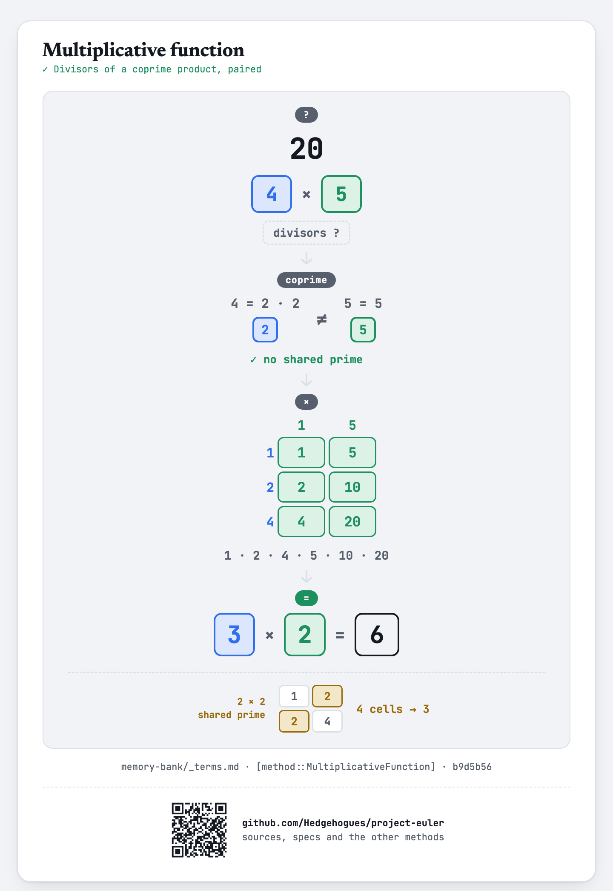
Sequence:
  1. Problem — 20, arriving already written as 4 times 5; how many divisors it has is unknown
  2. Transform coprime — the two factors are broken into primes, 4 into two 2s and 5 into itself; the two prime sets do not meet, which is the whole precondition
  3. Transform &times; — the divisors of 4 down the side and the divisors of 5 across the top, every cell their product: 1, 5, 2, 10, 4, 20 — six cells, no two alike, and together they are exactly the divisors of 20
  4. Solution — three down the side times two across the top is six, each number countable off the previous frame's own headings. Below it the guard: 2 paired with 2, which DO share a prime, gives four cells holding only three different values, so the count of cells stops being the count of divisors
Limits:
  - MUST NOT: be applied to two factors that share a factor — a limit of the IDEA: 2 &times; 2 = 4 has 3 divisors, not the 4 that multiplying the two pieces' counts would give, and the failure is silent
  - MUST NOT: be assumed to hold for ANY pair of factors just because it holds for coprime ones — a limit of the IDEA: that stronger property is a separate and rarer one, and the divisor count, the divisor sum and the totient all lack it
  - MUST: check the HALVED pair, not only the original pair, when a product of consecutive numbers is divided by two — a limit of PRACTICE: coprimality does survive the halving, but this is the one step where it is tempting to assume it instead of checking, and the whole split rests on it
  - MUST: the picture keeps both factors small enough for every cell to be read — a limit of the PICTURE: what it shows is six cells against four, and at any interesting size the grid stops being countable while the idea does not change
Note: no encyclopedic source states "two consecutive integers are coprime" in those words — checked against the full text of Wikipedia's Coprime integers and Greatest common divisor articles, neither of which contains the word "consecutive" in that role. The record therefore DERIVES it in one line rather than quoting it, from a characterization those articles do state: coprimality is equivalent to the existence of integers x and y with ax + by = 1, and for consecutive numbers x = 1 and y = &minus;1 witness it outright; the same fact also falls out of a single step of [method::EuclideanAlgorithm](#methodeuclideanalgorithm). Encyclopedia of Mathematics carries the identical definition of a multiplicative arithmetic function ("satisfying the condition f(mn) = f(m)f(n) for any pair of coprime integers m, n", with &tau;, &sigma;, &phi;, &mu; as its examples) but that site answered 200 once and then 502 on five consecutive retries including with a browser user-agent, so it is not cited below and nothing here rests on it. On the picture: no encyclopedic source draws the coprime-split property either (checked: the Multiplicative function, Divisor function and Coprime integers articles carry no figure for it, and cp-algorithms' divisors page is formulas and code only), so the drawing is this catalog's own construction. It deliberately does NOT reuse [method::DivisorCountFormula](#methoddivisorcountformula)'s grid, which is a different picture of a different thing: that one ranges over the EXPONENTS of one number's own factorization, while this one ranges over the two factors' DIVISOR LISTS and its whole claim is that the products filling the cells are all different — which is exactly what fails, visibly, when the two factors share a prime.
Source: [Wikipedia — Multiplicative function](https://en.wikipedia.org/wiki/Multiplicative_function) (definition; the completely-multiplicative distinction; &phi;, &mu;, &sigma;k as examples) · [Wikipedia — Divisor function](https://en.wikipedia.org/wiki/Divisor_function) ("A direct consequence of the formula is that the function n &rarr; &sigma;x(n) is multiplicative") · [cp-algorithms — Number of divisors / sum of divisors](https://cp-algorithms.com/algebra/divisors.html) ("A multiplicative function is a function f(x) which satisfies f(a&middot;b) = f(a)&middot;f(b) if a and b are coprime"; "Both d(n) and &sigma;(n) are multiplicative functions") · [Wikipedia — Coprime integers](https://en.wikipedia.org/wiki/Coprime_integers) (the B&eacute;zout characterization the consecutive-integer case is derived from) · [Wikipedia — Triangular number](https://en.wikipedia.org/wiki/Triangular_number) ("dividing either n or n+1 by 2 before the multiplication, whichever is even") · [Wikipedia — Euler's totient function](https://en.wikipedia.org/wiki/Euler%27s_totient_function)
Example: `visualizations/examples/multiplicative-function.{css,html}` (no js needed — the values are static) → `visualizations/build/multiplicative-function.html`
Spec: [approaches](specs/approaches.md) · [visualizations](specs/visualizations.md)

## [method::PositionalNotation]
Class: family
Standard name: Positional notation (place-value notation; a positional numeral system of a given base)
Essence: Once a base is chosen, a whole number is completely described by the sequence of its digits, so any question about those digits is answered by taking the number apart one place at a time instead of by its size.
Recognized by: the statement asks about a number's DIGITS rather than its magnitude — their sum, their count, their order, a reversal or rearrangement of them, a repeating block — or it names a base other than ten
General case: fix a base of two or more; every non-negative integer then has exactly one digit sequence in that base with every digit below the base and no leading zero, and the digit in a given place says how many copies of that place's weight the value contains. The digits come out one place at a time: the remainder on division by the base is the lowest place, the quotient carries everything above it, and the same rule still holds when each place is allowed its OWN base instead of a single fixed one
Axis: the base — one fixed base per place (ten for a written number, a large power of ten for speed) or a base that changes from place to place (a mixed radix, of which the factorial system is the one this catalog uses)
Specializations: [method::BigIntegerArithmetic](#methodbigintegerarithmetic) (one fixed base, chosen as large as a machine word allows) · [method::LehmerCode](#methodlehmercode) (a mixed radix: each place's base shrinks by one)
Picture: 
Sequence:
  1. Problem — twenty-nine loose counters in a row; what "the digits" of this quantity are is not yet a question with an answer, because no base has been chosen
  2. Transform base ten — the same counters gathered into two full groups of ten with nine left over, giving the digit strip 2 9
  3. Transform base two — the same counters regrouped, nothing added or removed: one sixteen, one eight, one four, no two, one single, giving the digit strip 1 1 1 0 1
  4. Solution — the dial's third setting, where the places no longer come from one repeated base: their weights are 24, 6, 2 and 1, and the counters group as one block of twenty-four, an empty six, two twos and a single, giving the digit strip 1 0 2 1. Below, the three strips of the one quantity side by side — 2 9, 1 1 1 0 1, 1 0 2 1, each totalling twenty-nine — because the counters never changed, only the size of the group did
Note on the picture: the mixed system's per-place BASES (five, four, three, two) are named in the Axis field but deliberately absent from the drawing — they are ceilings on each digit, not quantities anything on the page can be counted into, and putting them in the solution frame would print numbers with nothing earlier to check them against. The frame carries the place WEIGHTS instead, every one of them countable as a block or an empty slot, which is what shows that no single repeated base produces them.
Limits:
  - MUST NOT: be used as the record for an operation on the WRITTEN FORM that ignores place value entirely — slicing the decimal text into parts, rotating it cyclically, truncating it from an end, or comparing it with its reverse — a limit of the IDEA: those act on a sequence of characters and behave identically on letters, so nothing in them depends on the base; the family's axis would become unstatable if they were folded in
  - MUST: state which base is meant before any digit is called correct — a limit of PRACTICE: the same value has different digits in every base, and the family exists precisely because that choice is free
  - MUST NOT: carry the mechanism of any of its specializations — a limit of the RECORD: the column carry belongs to arbitrary-precision arithmetic and the shrinking factorial to the Lehmer code, and repeating either here would make this record a retelling of its children
Source: [Wikipedia — Positional notation](https://en.wikipedia.org/wiki/Positional_notation) · [Wikipedia — Radix](https://en.wikipedia.org/wiki/Radix) · [Wikipedia — Mixed radix](https://en.wikipedia.org/wiki/Mixed_radix) · picture tradition: [Wikipedia — Base ten blocks](https://en.wikipedia.org/wiki/Base_ten_blocks) (Dienes blocks; the multibase variant exists precisely to vary the base, which is this family's axis) · [Wikipedia — Abacus](https://en.wikipedia.org/wiki/Abacus)
Note: the uniqueness of the digit sequence is what makes "the digits" a well-defined object at all, and therefore what makes trimming leading zeros after arithmetic a restoration of the canonical form rather than tidying up. A place-value CHART is not an encyclopedic device (Wikipedia has no such article; only teaching sites carry it) — the citable visual tradition is the block, whose multibase form is this family's axis.
Example: `visualizations/examples/positional-notation.{css,html}` (no js needed — the values are static) → `visualizations/build/positional-notation.html`
Spec: [approaches](specs/approaches.md) · [visualizations](specs/visualizations.md)

## [method::BigIntegerArithmetic]
Class: entity
Family: [method::PositionalNotation](#methodpositionalnotation) (this is its one-fixed-base specialization)
Standard name: Arbitrary-precision arithmetic (big-integer / "long" arithmetic)
Essence: When a number has more digits than a native integer type can hold, store it as an array of digits and operate on it the same way a person does on paper — column by column, carrying the overflow into the next column.
Recognized by: a number in the problem is too large for any fixed-width integer type (dozens or hundreds of digits, or growing without any given bound), and only a small piece of the result is actually needed (its value, its first/last few digits, its digit sum)
General case: represent the number least-significant-digit-first in a fixed base (usually 10, or a larger power of 10 for speed); addition and multiplication-by-a-small-constant both propagate a carry left exactly like grade-school column arithmetic, just with the per-column operation swapped (add two digits, or multiply one digit by the constant) — the carry-propagation mechanism is identical either way
Picture: 
Sequence:
  1. Problem — 187 + 259 stacked, too many digits to add as one native number (illustrative only — the technique is for numbers with far more digits than this)
  2. Transform carry — right to left: 7+9=16, write 6 carry 1; 8+5+1=14, write 4 carry 1; 1+2+1=4
  3. Solution — 446, read off column by column, no native integer ever held the full sum until the very last digit was written
Limits:
  - MUST NOT: be reached for a number that already fits in a native 64-bit (or 128-bit) integer — a limit of the IDEA: the whole point is avoiding overflow that a native type would already handle
  - MUST: propagate a carry that can exceed a single digit when multiplying by a constant bigger than 9 — a limit of PRACTICE: unlike addition (carry always 0 or 1), multiplying a digit by a two-digit constant can carry a two-digit amount into the next column
Source: [Wikipedia — Arbitrary-precision arithmetic](https://en.wikipedia.org/wiki/Arbitrary-precision_arithmetic) · [cp-algorithms — Arbitrary-Precision Arithmetic](https://cp-algorithms.com/algebra/big-integer.html)
Example: `visualizations/examples/big-integer-arithmetic.{css,html}` (no js needed — the values are static) → `visualizations/build/big-integer-arithmetic.html`
Spec: [approaches](specs/approaches.md) · [visualizations](specs/visualizations.md)

## [method::IntegerOverflowAvoidance]
Class: entity
Standard name: Integer overflow (also "arithmetic overflow"), and its avoidance by restructuring the expression · picture — odometer wheels used as a capacity gauge (this catalog's own framing — see Note)
Essence: Work out ahead of time how large the biggest intermediate value can get, check that against what the chosen type can hold, and rearrange the expression so no step ever reaches past it.
Recognized by: an intermediate step — a product, a running total, the left side of a comparison — can be far larger than the final answer, while the answer itself fits the type comfortably; the constraints bound that intermediate, so the check is arithmetic done before any code runs, not a test at run time
General case: bound the largest value each step can reach from the constraints, and compare it against the type's range — a signed 64-bit word holds &minus;9,223,372,036,854,775,808 through 9,223,372,036,854,775,807, an unsigned one 0 through 18,446,744,073,709,551,615. When the bound does not fit, four restructurings satisfy that same check, chosen by which part of the expression overshoots. (1) DIVIDE BEFORE MULTIPLYING, when the divisor is known to divide one factor exactly: `a / g * b` equals `a * b / g` with no rounding whenever g divides a, while the peak drops from the whole product to the reduced one — exactness is the entire precondition, and without it the two orders stop agreeing. (2) REWRITE A PRODUCT COMPARISON AS A DIVISION COMPARISON, so the product is never formed at all: for positive integers `i * i <= N` and `i <= N / i` with integer division are EXACTLY equivalent, not an approximation (i &le; &lfloor;N/i&rfloor; iff i &le; N/i in the rationals iff i&sup2; &le; N, because i is a whole number). (3) WIDEN THE INTERMEDIATE ALONE: a 128-bit intermediate holds the product of ANY two 64-bit values with no residual side condition — (2&#8310;&#8308;&minus;1)&sup2; fits an unsigned 128-bit word, and the worst signed case 2&sup1;&sup2;&#8310; fits a signed one — which is what makes this the one restructuring with no arithmetic proviso of its own. (4) REDUCE BOTH FACTORS MODULO THE MODULUS BEFORE MULTIPLYING: with both factors already below m the product fits a signed 64-bit word for every m up to 3,037,000,500 (since 3,037,000,499&sup2; = 9,223,372,030,926,249,001 &le; 2&#8310;&sup3;&minus;1 while 3,037,000,500&sup2; exceeds it) and an unsigned one for every m up to 4,294,967,296; above that bound the fix is (3). Signed overflow is undefined behaviour, so every one of these checks must PRECEDE the operation — there is no defined result to examine afterwards
Picture: 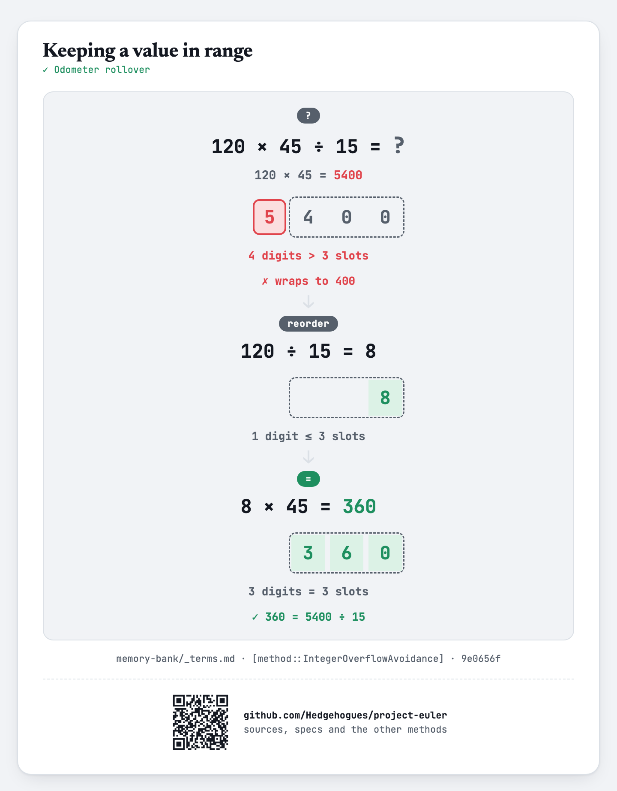
Sequence:
  1. Problem — 120 &times; 45 &divide; 15 is asked; taken in the written order it forms 5400, which needs a fourth digit slot that the three-slot container does not have, so the stored value wraps to 400 — wrong, and silently so
  2. Transform reorder — 15 divides 120 exactly, so divide first: 120 &divide; 15 = 8, one digit, far inside the same three slots
  3. Solution — 8 &times; 45 = 360 fills exactly three slots, and 360 is 5400 &divide; 15 — the very answer the overflowing route was after, reached without any step leaving the container
Limits:
  - MUST NOT: divide before multiplying when the divisor divides NEITHER factor exactly — a limit of the IDEA: the reordered expression then rounds at the division, and the two orders no longer give the same result
  - MUST NOT: rely on inspecting a signed result to discover that it overflowed — a limit of the IDEA: signed overflow is undefined behaviour, so there is no value defined to inspect (unsigned arithmetic wraps predictably instead, which is a different case, and the reason the two have separate rules)
  - MUST: widen the OPERATION, not merely the destination it is assigned or compared to — a limit of PRACTICE: the multiplication is carried out in its operands' own type and has already wrapped before a wider destination ever sees it; one operand has to be cast before the operation happens
  - MUST: the picture's container is three digit slots and its numbers are toy-sized — a limit of the PICTURE: the real ranges (nineteen digits for a 64-bit word) and the real modulus bound cannot be counted by eye, so the record's General case carries those numbers instead
Note: this is ONE record and not a family, deliberately: a family has to point at two or more records that ALREADY exist, and none of the four restructurings is catalogued on its own — a family here would have nothing to link and would have to retell its own children in order to exist. What holds the four together is not a shared mechanism but a shared CHECK (the largest reachable intermediate against the type's range); they differ only in which part of the expression is rewritten to pass it — operand order, the comparison, the type, or the factors. Should any of the four later earn a record of its own, this record converts cleanly into a family with exactly that as its axis. The fourth restructuring's LICENCE — that reducing the factors first cannot change the answer — belongs to [method::ModularArithmetic](#methodmodulararithmetic) and is not restated here; what belongs here is the bound. Picture: the odometer IS the established visual — Wikipedia's own lead image for integer overflow, six wheels rolling from 999999 to 000000 — but it pictures the FAILURE, the moment a value wraps. No established visual was found for the AVOIDANCE (checked: Wikipedia's own Avoidance section carries no diagram; all four SEI CERT integer pages are code listings; CWE-190 has no figure; cp-algorithms is code only). Turning the odometer's wheels into a CAPACITY GAUGE — counting a value's digits against the container's slots — is therefore this catalog's own construction, honestly not attributed to an established visual tradition, the same way [method::Precomputation](#methodprecomputation) says of its own picture.
Source: [Wikipedia — Integer overflow](https://en.wikipedia.org/wiki/Integer_overflow) ("an arithmetic operation on integers attempts to create a numeric value that is outside of the range that can be represented"; &sect; Avoidance names both widening the type and "carefully ordering operations and checking operands in advance"; the per-width range table) · [SEI CERT C — INT32-C. Ensure that operations on signed integers do not result in overflow](https://cmu-sei.github.io/secure-coding-standards/sei-cert-c-coding-standard/rules/integers-int/int32-c) ("Signed integer overflow is undefined behavior"; carries both the division pre-check `si_a > (INT_MAX / si_b)` and the wider-type compliant solution) · [SEI CERT C — INT18-C. Evaluate integer expressions in a larger size before comparing or assigning to that size](https://cmu-sei.github.io/secure-coding-standards/sei-cert-c-coding-standard/recommendations/integers-int/int18-c) · [cp-algorithms — Euclidean algorithm](https://cp-algorithms.com/algebra/euclid-algorithm.html) (the divide-before-multiply idiom: "cleverly avoids integer overflows by first dividing a with the GCD", `a / gcd(a, b) * b`) · [cp-algorithms — Montgomery Multiplication](https://cp-algorithms.com/algebra/montgomery_multiplication.html) (128-bit intermediate for a product of 64-bit values modulo a 64-bit modulus) · picture: [Wikimedia Commons — Odometer rollover.jpg](https://commons.wikimedia.org/wiki/File:Odometer_rollover.jpg) (the article's own lead image, wrapping rather than saturating)
Example: `visualizations/examples/integer-overflow-avoidance.{css,html}` (no js needed — the values are static) → `visualizations/build/integer-overflow-avoidance.html`
Spec: [approaches](specs/approaches.md) · [visualizations](specs/visualizations.md)

## [method::CrossMultiplication]
Class: entity
Standard name: Cross-multiplication · the exactness principle behind it — SEI CERT FLP02-C
Essence: Settle an exact question by staying inside the whole numbers — multiply across instead of dividing, and read a remainder instead of rounding.
Recognized by: the answer turns on an exact comparison or an exact whole-number test, and the obvious route to it runs through a division whose result could only ever be approximate
General case: two instances of one move — replace the operation that leaves the whole numbers with one that stays inside them.
  · To ORDER two fractions: multiply each numerator by the other's denominator and compare the two products. This is the common-denominator comparison with the common denominator never evaluated — it is not needed, because both converted numerators are already the two products.
  · To ask whether one quantity divides another EXACTLY: take the remainder of the division and ask whether it is zero, rather than dividing, rounding, multiplying back and comparing. Divisibility is defined by that remainder, so the test is the definition rather than a reconstruction of it.
  Both instances are the same principle, and the professional-body rule behind it is general: where a computation has to be precise, do not route it through a representation that cannot be
Picture: 
Sequence:
  1. Problem — two fractions with the relation between them unknown; by eye they are indistinguishable
  2. Transform ÷ ✗ — the direct route, dividing each one out: both quotients run on without terminating, so whatever gets compared is a rounded value and not the number; marked as rejected
  3. Transform × — the crossing instead: each numerator meets the other's denominator, giving two whole numbers and no division anywhere
  4. Solution — the two products decide it, and the verdict carries back to the two fractions
Limits:
  - MUST: make both denominators positive before comparing — a limit of the IDEA: the step multiplies both sides by the product of the denominators, and that preserves the direction of a comparison only while the product is positive. With exactly one negative denominator the comparison REVERSES; with a zero denominator it is NOT DEFINED at all. Normalizing the sign onto the numerator first removes the whole question, and is why the encyclopedic statement of the comparison is phrased for positive denominators
  - MUST NOT: be expected to make an approximate input exact — a limit of the IDEA: the test's exactness is inherited from the inputs, so applying it to values that were already rounded moves the rounding rather than removing it
  - MUST: watch the width of the two products — a limit of PRACTICE: each is larger than any of the four values that made it, so a fixed-width integer can overflow on a comparison that is mathematically beyond reproach
  - MUST NOT: be expected to show the remainder instance — a limit of the PICTURE: it draws the fraction comparison only. The remainder test has no established drawn form, and inventing one would have put two pictures on one record; the instance is carried in the General case in words instead (see Note)
Note: the load-bearing citation for the comparison is Wikipedia's FRACTION article, not its Cross-multiplication article — verbatim, "It is not necessary to determine the value of the common denominator to compare fractions – one can just compare ad and bc, without evaluating bd", and the same section is where the positive/negative denominator rule in the Limits above comes from. The Cross-multiplication article supplies the NAME and nothing more: it covers equations only ("given an equation between two fractions"), never inequalities, never the sign of the denominators, and carries no diagram at all — an honest gap, stated here rather than papered over. The remainder instance has no name of its own beyond the definition of divisibility; what it has is a professional body's rule for the principle, cited below.
Source: [Wikipedia — Fraction](https://en.wikipedia.org/wiki/Fraction) (§ Comparing fractions — the load-bearing citation, including the denominator-sign rule) · [Wikipedia — Cross-multiplication](https://en.wikipedia.org/wiki/Cross-multiplication) (the name; equations only — see Note) · [SEI CERT C Coding Standard — FLP02-C. Avoid using floating-point numbers when precise computation is needed](https://wiki.sei.cmu.edu/confluence/display/c/FLP02-C.+Avoid+using+floating-point+numbers+when+precise+computation+is+needed) (Carnegie Mellon SEI — the principle behind both instances) · [Wikipedia — Euclidean division](https://en.wikipedia.org/wiki/Euclidean_division) (divisibility is the remainder being zero)
Example: `visualizations/examples/cross-multiplication.{css,html}` (no js needed — the values are static) → `visualizations/build/cross-multiplication.html`
Spec: [approaches](specs/approaches.md) · [visualizations](specs/visualizations.md)

## [method::Memoization]
Class: entity
Standard name: Memoization
Essence: The first time a recursive call is answered, write the answer down; every later call asking the exact same question reads the answer back instead of doing the work again.
Recognized by: a recursive definition is called on the SAME input more than once across different branches of the recursion (overlapping subproblems), and computing it fresh each time would repeat identical work
General case: wrap the recursive function with a cache (array or hash map) keyed by its argument(s); on entry, return the cached value if present, otherwise compute normally and store the result before returning — the recursion's own structure is untouched, only entry/exit is intercepted
Picture: 
Sequence:
  1. Problem — computing fib(4) needs fib(3) and fib(2); fib(3) itself ALSO needs fib(2) — the same call twice
  2. Transform expand — the first fib(2) is computed fully (fib(1)+fib(0)=1+0=1) and stored; the second fib(2), needed directly by fib(4), just reads that stored 1 back instead of expanding again
  3. Solution — fib(4) = fib(3) + fib(2) = 2 + 1 = 3, with fib(2)'s work paid for only once
Limits:
  - MUST NOT: be used when a call's result depends on more than just its own arguments (e.g. it also reads or mutates outside state) — a limit of the IDEA: a cache keyed only by arguments would return a stale answer for a call whose true result has since changed
  - MUST: cache on the exact arguments that determine the result, no more and no fewer — a limit of PRACTICE: caching on too few argument bits collapses genuinely different calls onto one stored answer; caching on irrelevant extra bits never lets the cache hit at all
Note: a bounded table is a legitimate variant with no name of its own — values whose key falls outside the table's range are still COMPUTED, and only the ones inside it are stored, so the cache stays a fixed size while the answer stays correct. Named honestly because it was looked for and not found: the encyclopedic material on caches covers limits on cache SIZE with eviction, never a fixed key RANGE with out-of-range values computed and discarded (checked against the full text of Wikipedia's Memoization and Cache replacement policies articles, where even "cache admission policy" does not appear). It is a caveat on this record rather than a record of its own.
Source: [Wikipedia — Memoization](https://en.wikipedia.org/wiki/Memoization) · [Wikipedia — Overlapping subproblems](https://en.wikipedia.org/wiki/Overlapping_subproblems)
Example: `visualizations/examples/memoization.{css,html}` (no js needed — the values are static) → `visualizations/build/memoization.html`
Spec: [approaches](specs/approaches.md) · [visualizations](specs/visualizations.md)

## [method::ExplicitStackRecursion]
Class: entity
Standard name: Converting recursion to iteration with an explicit stack ("explicit call stack")
Essence: Walk down the chain by hand, recording each step into a stack you own, then walk that stack back up and fill in an answer at every step recorded on the way down.
Recognized by: the definition is naturally recursive, the chain of calls can run far deeper than a call stack will tolerate, and every step along the way needs its own answer rather than only the step that was asked about
General case: descend from the starting state, pushing each state visited, until reaching a state whose answer is already known; then pop in reverse order, computing each popped state's answer from the answer of the state below it. Recursion and iteration are equally expressive, so this transformation always exists: what the call stack used to hold implicitly — the return path and each frame's local state — is now chosen by hand and lives on the heap, so the depth ceiling becomes available memory instead of a fixed stack limit. The unwind pass is not overhead but the second half of the method: it answers every state on the recorded path for the price of answering the one that was asked
Picture: 
Sequence:
  1. Problem — a chain of four states, each pointing at the one it depends on; only the last has a known answer, the other three are question marks
  2. Transform push — the descent runs along the chain and drops each state it leaves into a stack, so the stack ends up holding the path in reverse; the descent stops at the state whose answer was already known
  3. Transform pop — the unwind: each state comes off the top, and its answer is one more than the answer directly below it — three pops, three answers
  4. Solution — the chain again with every state's answer filled in, the one originally asked for highlighted
Limits:
  - MUST NOT: be presented as the same thing as tail-call elimination — a limit of the IDEA: that transformation applies only when nothing remains to be done after the call returns, and a path that has to be unwound is precisely the case where something does remain; the two are not interchangeable and only the explicit stack covers this one
  - MUST: push everything the unwind will need, not just the state's name — a limit of PRACTICE: the call stack saved each frame's locals for free, and a hand-built stack saves exactly what was put into it and nothing else; this is where the transformation is normally got wrong
  - MUST NOT: be used when the descent can arrive back at a state already on the stack — a limit of the IDEA: the recorded path would never reach a known answer and the unwind would have no base to start from (marking states as visited during the descent turns this back into a legitimate case, but that is an addition, not part of the method)
  - MUST NOT: show a path of more than a handful of steps — a limit of the PICTURE: the stack and the chain are drawn side by side so the reversal between them can be seen, and that reading depends on both being short enough to hold in one glance
Note: the crisp single-word name "recursion elimination" is deliberately NOT used here. The encyclopedic source's own wording is "an explicit call stack" under the heading "Recursion versus iteration"; the only "-elimination" term the article carries is TAIL-CALL elimination, which is the narrower special case named in the Limits above. Naming this record after the narrower term would have been a real name attached to a foreign form.
Source: [Wikipedia — Recursion (computer science)](https://en.wikipedia.org/wiki/Recursion_(computer_science)) (§ Recursion versus iteration — "Every recursive function can be transformed into an iterative function by replacing recursive calls with iterative control constructs and simulating the call stack with a stack explicitly managed by the program") · [Wikipedia — Tail call](https://en.wikipedia.org/wiki/Tail_call) (the narrower special case — see Note) · [Wikipedia — Stack (abstract data type)](https://en.wikipedia.org/wiki/Stack_(abstract_data_type))
Example: `visualizations/examples/explicit-stack.{css,html}` (no js needed — the values are static) → `visualizations/build/explicit-stack.html`
Spec: [approaches](specs/approaches.md) · [visualizations](specs/visualizations.md)

## [method::SparseSet]
Class: entity
Standard name: Sparse set (sparse–dense pair) — Briggs and Torczon, 1993
Essence: Keep an explicit roster of the slots that were actually written, so emptying the container costs what was used rather than what was reserved.
Recognized by: one wide scratch area is filled and emptied over and over, and each round writes only a handful of its slots — the emptying, not the filling, is what the repetitions keep paying for
General case: two arrays over a universe of known maximum size, plus a count — a DENSE array listing the members in insertion order, and a SPARSE array giving, for each member, that member's position in the dense one. The pair is held together by one round-trip invariant: a value belongs to the set exactly when its sparse entry is below the count and the dense entry at that position points back at the value. Membership, insertion and removal are each a constant number of steps; iteration costs one step per member rather than one per slot of the universe; and emptying is a single assignment to the count — or, when the slots themselves carry data that must be reset, a walk of the dense roster, which visits only what was touched
Picture: 
Sequence:
  1. Problem — a reused buffer of 12 slots with 3 of them written; how many slots the next emptying has to visit is unknown
  2. Transform roster — a second, packed array appears underneath holding exactly the three written slot numbers, each linked up to the slot it names; each written slot holds, in return, its own position in that roster, so the link can be followed either way
  3. Transform clear — the emptying walks the roster instead of the buffer: three links, three slots reset, the remaining nine never looked at (drawn dashed and untouched)
  4. Solution — the two costs as tick rows to count by eye: 3 against 12
Limits:
  - MUST NOT: be used when the universe has no known upper bound — a limit of the IDEA: the sparse array is indexed by the member itself, so its length has to be fixed before the first insertion, and its memory is paid for in full whether one member is stored or all of them
  - MUST: read the sparse array only at positions the dense roster vouches for — a limit of PRACTICE: every other sparse entry is genuine uninitialized garbage, and a membership test that skips the round-trip check will report members that were never added (this is the whole reason the invariant is two-sided rather than one)
  - MUST NOT: hold the same member twice — a limit of the IDEA: it represents a set, and a repeated insertion would give one member two dense positions, after which the round-trip no longer holds
  - MUST NOT: show a universe of more than about a dozen slots — a limit of the PICTURE: past that the cells stop being countable at a glance, and the whole point of the last frame is that the two costs are counted, not read
Note: the marking principle behind this — track what changed so that unchanged things are never reprocessed — is itself standard and encyclopedic as the DIRTY BIT (sourced below), but a dirty bit is a per-block modified FLAG, not a list of touched positions: it justifies the principle and not the layout, so it is cited as a supplement and the sparse set is the name this record carries. A near relative worth knowing and deliberately NOT given a record here: the GENERATION COUNTER (versioned array), which empties in one step by bumping a version stamp instead of walking a roster, at the cost of storing a stamp per slot and of a wrap-around hazard when the stamp space runs out. No encyclopedic source for it was found (checked: Wikipedia's Lazy initialization, Cache and Memoization articles carry nothing on it), only blog-level write-ups — supplement material, not enough for a record of its own.
Source: [Briggs & Torczon — An Efficient Representation for Sparse Sets, ACM Letters on Programming Languages and Systems 2(1–4), 1993](https://www.dcs.gla.ac.uk/~pat/ads2/papers/sparseSets.pdf) (mirrored full text; the ACM DL landing page refuses non-browser requests) · [LLVM — ADT/SparseSet.h](https://llvm.org/doxygen/SparseSet_8h_source.html) (a production implementation, "constant-time fast clear()") · [Wikipedia — Dirty bit](https://en.wikipedia.org/wiki/Dirty_bit) (the marking principle only — see Note)
Example: `visualizations/examples/sparse-set.{css,html}` (no js needed — the values are static) → `visualizations/build/sparse-set.html`
Spec: [approaches](specs/approaches.md) · [visualizations](specs/visualizations.md)

## [method::FastExponentiation]
Class: entity
Standard name: Exponentiation by squaring (binary exponentiation, "square-and-multiply")
Essence: To raise a number to the power n, halve n and square the base at every step instead of multiplying by the base n times — the exponent shrinks by half each round, so the whole thing finishes in about log2(n) multiplications, not n.
Recognized by: you need base^exponent for a LARGE exponent (thousands, millions, or a variable up to some big bound), especially under a modulus, and multiplying one factor in at a time is too slow
General case: while exponent &gt; 0 — if the exponent is odd, multiply the running result by the current base; square the base; halve the exponent (integer division) — repeat; works identically under a modulus by reducing after every multiplication
Picture: 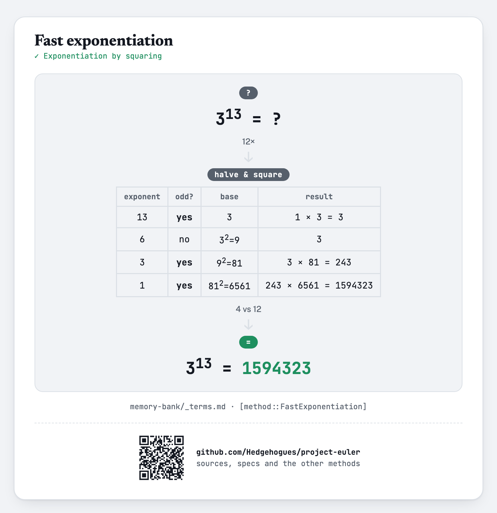
Sequence:
  1. Problem — 313; multiplying by 3 thirteen times is 12 multiplications
  2. Transform halve &amp; square — 4 rows, the exponent halving each time (13&rarr;6&rarr;3&rarr;1&rarr;0); the base squares every row, and the running result only picks up the base on the rows where the exponent is odd
  3. Solution — 313 = 1594323, reached in 4 rows instead of 12 multiplications
Limits:
  - MUST NOT: be applied to a non-associative operation — a limit of the IDEA: squaring the base and combining partial results relies on `(a&middot;a)&middot;a = a&middot;(a&middot;a)`, which fails for operations without that property
  - MUST: reduce modulo the modulus after EVERY multiplication when working modularly, not just at the end — a limit of PRACTICE: the base and result both grow every squaring step and overflow a fixed-width integer type within a handful of rounds otherwise
Source: [Wikipedia — Exponentiation by squaring](https://en.wikipedia.org/wiki/Exponentiation_by_squaring)
Example: `visualizations/examples/fast-exponentiation.{css,html}` (no js needed — the values are static) → `visualizations/build/fast-exponentiation.html`
Spec: [approaches](specs/approaches.md) · [visualizations](specs/visualizations.md)

## [method::ModularArithmetic]
Class: family
Standard name: Modular arithmetic (arithmetic of residue classes; the ring of integers modulo m, Z/mZ) · picture — the clock face, Wikipedia's own image for this idea (see Note)
Essence: When only the remainder after division by a fixed number matters, every quantity can be replaced by its own remainder from the very start and the arithmetic still comes out right — so nothing ever grows past that fixed number, however long the computation runs.
Recognized by: the answer is asked for as a remainder, or a quantity is only ever used through its remainder — a weekday, a position in a repeating cycle, a last digit, an answer wanted modulo a given number
General case: congruence modulo m is compatible with addition, subtraction and multiplication — replacing either operand by anything congruent to it leaves the result congruent — so the m remainder classes form a commutative ring, closed under those three operations, and any composition of them may be evaluated on representatives instead of on the original numbers. The representative of choice is the least non-negative residue, the unique one in 0..m&minus;1. Two consequences belong to the family directly rather than to any one specialization: (a) a quantity known to be PERIODIC may be evaluated at its argument reduced modulo the period, and when the quantity is built from parts of different periods, the least common multiple of those periods is a period of the whole ([method::LCMViaGCD](#methodlcmviagcd) computes it); (b) a language whose integer division truncates toward zero returns a NEGATIVE remainder for a negative dividend, so a representative obtained that way has to be normalized back into 0..m&minus;1 before it is used as a value or an index
Axis: which feature of the finite set of residues the method leans on — the choice of canonical representative, one of the three operations congruence respects, or the sheer number of residues
Specializations: [method::ModularInverseFermat](#methodmodularinversefermat) (division, the one operation congruence does NOT respect, recovered under a prime modulus) · [method::CycleDetectionViaRemainders](#methodcycledetectionviaremainders) (the size of the residue set, which forces a repeat)
Picture: 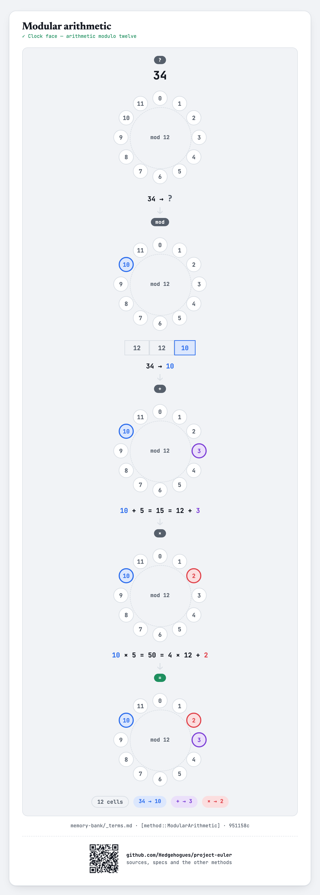
Sequence:
  1. Problem — the number 34 above a twelve-cell dial (the clock face, with 12 read as 0); which cell it belongs to is unmarked
  2. Transform mod — two whole turns of the dial and a short leftover piece (12 + 12 + 10 = 34) place 34 in cell 10; that cell lights up. The REPRESENTATIVE feature: any number, however large, is one of these twelve
  3. Transform + — the same dial, unchanged; 10 + 5 = 15 = 12 + 3 lands in cell 3, which lights up alongside cell 10. Addition never leaves the twelve cells
  4. Transform &times; — the same dial again; the same two numbers, 10 &times; 5 = 50 = 4 &times; 12 + 2, land in cell 2 instead. Multiplication also never leaves the twelve cells, and lands somewhere else than the sum did
  5. Solution — one dial, three cells lit (10 from the reduction, 3 from the sum, 2 from the product) and the count of cells itself: four features of ONE finite set of twelve, which is what separates the specializations from each other
Limits:
  - MUST NOT: be applied to a comparison of size, or to a division, as though reduction were free — a limit of the IDEA: congruence is compatible with addition, subtraction and multiplication only; order is destroyed by reduction (a smaller residue may come from a larger number), and division needs a construction of its own
  - MUST NOT: reduce an argument by a period that has not been PROVEN to be one — a limit of the IDEA: the least common multiple of the parts' periods is A period, not necessarily the least, and a length that merely looks periodic turns the reduction into a silently wrong answer
  - MUST: normalize a remainder into the least non-negative residue wherever the value it came from can be negative — a limit of PRACTICE: C and C++ truncate division toward zero, so the remainder carries the DIVIDEND's sign, and a negative representative used as a table index reads outside the table
  - MUST: the picture keeps ONE dial of twelve cells through every frame — a limit of the PICTURE: consecutive frames must differ only in which feature of the same ring is lit, since the axis is the subject being drawn; changing the modulus between frames would set the reader comparing dials instead of features
Note: [method::FastExponentiation](#methodfastexponentiation) is deliberately NOT a specialization, though a reader expects it here. That record is base-agnostic, and its own Limits say so: halve-and-square needs nothing but an associative way of combining, and a modulus is merely one setting where that holds — its parent is "an associative operation", not this family. What would belong here is modular exponentiation specifically, i.e. that idea USED inside the ring — the same relation [method::ModularInverseFermat](#methodmodularinversefermat) already has to it, using it without being a specialization of it. [method::CycleDetectionViaRemainders](#methodcycledetectionviaremainders) is the looser-fitting of the two children, included with that cost named: it leans on the residue set's SIZE (finitely many classes, so a repeat is forced) rather than on any of the three operations, which is exactly why the axis reads "which feature" and not "which operation". On the period statement in General case: the encyclopedic sources state the identity that a periodic function takes the same value at the argument shifted by any whole number of periods; "evaluate it at the argument reduced modulo the period" is that identity read right-to-left, one step of algebra away — not a separately named theorem, and no source was found that names it. The lcm half IS sourced, in applied form (bodies with different orbital periods realigning after the lcm of those periods). The picture's clock face is not this catalog's invention — it is Wikipedia's own lead image for modular arithmetic and the article's motivating example; what IS this catalog's own is holding that one dial fixed across five frames so the reader sees the AXIS change rather than any child's mechanism.
Source: [Wikipedia — Modular arithmetic](https://en.wikipedia.org/wiki/Modular_arithmetic) (compatibility with addition, subtraction and multiplication; "The set of all congruence classes modulo m is a ring called the ring of integers modulo m"; &sect; Residue systems: "The set of integers {0, 1, 2, ..., m &minus; 1} is called the least residue system modulo m") · [MathWorld — Common Residue](https://mathworld.wolfram.com/CommonResidue.html) ("taken to be nonnegative and smaller than m") · [Wikipedia — Periodic function](https://en.wikipedia.org/wiki/Periodic_function) ("f(x+P)=f(x) for all values of x in the domain"; "any integer multiple nP ... is also a period") · [MathWorld — Periodic Function](https://mathworld.wolfram.com/PeriodicFunction.html) · [Wikipedia — Least common multiple](https://en.wikipedia.org/wiki/Least_common_multiple) (&sect; Planetary alignment, the combined period of parts with different periods) · [Wikipedia — Modulo](https://en.wikipedia.org/wiki/Modulo) (truncated versus floored division; the remainder's sign; "C99 and C++11 languages define both of these as truncating") · [SEI CERT C — INT10-C. Do not assume a positive remainder when using the % operator](https://cmu-sei.github.io/secure-coding-standards/sei-cert-c-coding-standard/recommendations/integers-int/int10-c) · picture: [Wikimedia Commons — Clock group.svg](https://commons.wikimedia.org/wiki/File:Clock_group.svg) (the article's own two-dial image, "Time-keeping on this clock uses arithmetic modulo 12")
Example: `visualizations/examples/modular-arithmetic.{css,html}` (no js needed — the values are static) → `visualizations/build/modular-arithmetic.html`
Spec: [approaches](specs/approaches.md) · [visualizations](specs/visualizations.md)

## [method::ModularInverseFermat]
Class: entity
Family: [method::ModularArithmetic](#methodmodulararithmetic) — this record is its DIVISION case: the one operation congruence does not respect, recovered under a prime modulus
Standard name: Modular multiplicative inverse via Fermat's little theorem
Essence: There is no division in modular arithmetic, but under a PRIME modulus, dividing by a is the same as multiplying by a fixed power of a — ap&minus;2 — a proven fact, not a search.
Recognized by: you need to divide by a number modulo a prime (most often as part of a formula with a factorial or a binomial coefficient in the denominator, mod 10^9+7 or similar)
General case: for prime p and a not a multiple of p, ap&minus;1 &equiv; 1 (mod p) (Fermat's little theorem); multiplying both sides by a&minus;1 gives a&minus;1 &equiv; ap&minus;2 (mod p) — computed with [method::FastExponentiation](#methodfastexponentiation), never by searching for the inverse
Picture: 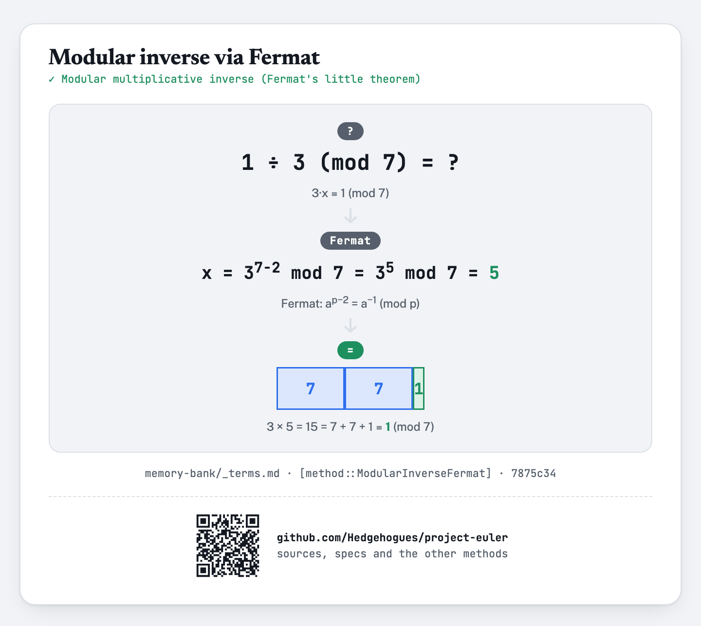
Sequence:
  1. Problem — 1 &divide; 3 (mod 7): no direct division exists
  2. Transform Fermat — x = 37&minus;2 mod 7 = 35 mod 7 = 5, by the proven theorem, not trial and error
  3. Solution — verify: 3 &times; 5 = 15 = 7 + 7 + 1 &equiv; 1 (mod 7); the division really does check out
Limits:
  - MUST NOT: be used when the modulus is not prime — a limit of the IDEA: Fermat's little theorem itself requires a prime modulus (Euler's theorem with &phi;(m) is the generalization for composite m, and needs m's factorization)
  - MUST NOT: be used when a is a multiple of p — a limit of the IDEA: a has no inverse at all mod p in that case (gcd(a,p)=p, not 1)
Source: [Wikipedia — Fermat's little theorem](https://en.wikipedia.org/wiki/Fermat's_little_theorem) · [cp-algorithms — Modular Inverse](https://cp-algorithms.com/algebra/module-inverse.html)
Example: `visualizations/examples/modular-inverse-fermat.{css,html}` (no js needed — the values are static) → `visualizations/build/modular-inverse-fermat.html`
Spec: [approaches](specs/approaches.md) · [visualizations](specs/visualizations.md)

## [method::BatchInversion]
Class: entity
Standard name: Batch inversion of modular inverses — Montgomery's trick (also called simultaneous inversion)
Essence: A whole list of numbers can be inverted under a prime modulus for the price of one inversion: invert their product once, then hand every number its own inverse back with a single multiplication.
Recognized by: the answer is a formula with factorials or products in the denominator, taken modulo a prime, and it is needed for many different arguments — so the inverses of EVERY factorial up to a bound are wanted, not the inverse of one of them
General case: inversion distributes over a product, so the inverse of any element of a list equals the product of everything before it, times the product of everything after it, times the single inverse of the whole product — one inversion plus about three multiplications per element, whatever the list. For factorials the prefix products ARE the factorials and are already in hand, which collapses the general trick further: invert the largest factorial once, then walk back down, each smaller inverse factorial being the previous one multiplied by the index just left behind. Every individual number's inverse falls out free on top, as its own inverse factorial times the previous factorial
Picture: 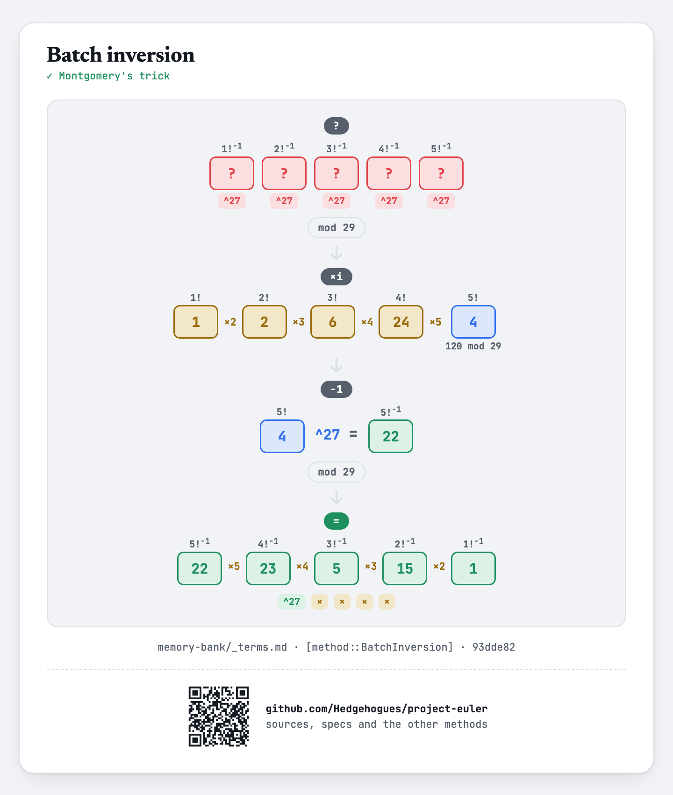
Sequence:
  1. Problem — the inverses of all five factorials are wanted modulo 29; done one at a time that is five separate exponentiations
  2. Transform &times;i — the factorials themselves come from one running product: 1, 2, 6, 24, and then 120, which is 4 modulo 29
  3. Transform &minus;1 — ONE exponentiation inverts the largest of them: 4 raised to the 27th power is 22 modulo 29
  4. Solution — walking back down, each smaller inverse factorial is the previous one times the index left behind (22, 23, 5, 15, 1) — five inverses for one exponentiation and four multiplications
Limits:
  - MUST NOT: be used when any element of the list fails to be invertible — a limit of the IDEA: a single non-invertible element makes the whole product non-invertible, and the one inversion at the heart of the trick then does not exist (for factorials this means the bound has to stay below the modulus)
  - MUST NOT: be started before the whole list is known — a limit of the IDEA: the product of everything has to be formed before any single inverse can be recovered, so every element must already be in hand ([method::OfflineAlgorithm](#methodofflinealgorithm) is what makes that true of a batch of queries)
  - MUST: walk the factorial chain DOWNWARD, from the largest inverse factorial to the smallest — a limit of PRACTICE: the same identity read upward also needs each index's own inverse, which is exactly the per-number work this method exists to avoid
  - MUST: the picture uses a modulus small enough for every product to be reduced by eye — a limit of the PICTURE: at a real modulus near a billion no single step is checkable by a reader, and nothing about the mechanism changes
Note: the one exponentiation is [method::ModularInverseFermat](#methodmodularinversefermat), carried out by [method::FastExponentiation](#methodfastexponentiation); this record states the opposite direction of the same fact — that n inverses do NOT cost n exponentiations. No established picture exists (cp-algorithms carries the identity and the code but no figure, and Wikipedia has no article under any of this method's three names — `Batch inversion`, `Montgomery's trick` and `Simultaneous inversion` are all missing titles), so the frames are this catalog's own construction: the chain of running products down and the chain of recovered inverses back up, which is the mechanism's real shape. The attribution is honest about its own limit too — the name points at Montgomery's 1987 paper, which the sources below cite for it, but that passage was not read first-hand for this record (the copy the publisher serves covers only the paper's first ten pages); cp-algorithms and the IACR paper are what actually carry the technique, its cost and its names.
Source: [cp-algorithms — Modular Inverse](https://cp-algorithms.com/algebra/module-inverse.html) (&sect; finding the modular inverse for an array of numbers: expand by the prefix and suffix products and "end up only computing a single inverse instead") · [cp-algorithms — Binomial coefficients](https://cp-algorithms.com/combinatorics/binomial-coefficients.html) (states the factorial congruence that the downward walk is a rearrangement of) · [Hierarchical Batch Inversion — IACR ePrint 2026/1191](https://eprint.iacr.org/2026/1191.pdf) (names the trick — "Montgomery's trick, which computes a batch of modular inverses using one modular inversion and multiplications" — states its cost as one inversion and three multiplications per element less three, and attributes it to Montgomery) · attribution only, passage not sighted: [Montgomery, *Speeding the Pollard and Elliptic Curve Methods of Factorization*, Mathematics of Computation 48(177), 243–264, 1987 (AMS)](https://www.ams.org/journals/mcom/1987-48-177/S0025-5718-1987-0866113-7/)
Example: `visualizations/examples/batch-inversion.{css,html}` (no js needed — the values are static) → `visualizations/build/batch-inversion.html`
Spec: [approaches](specs/approaches.md) · [visualizations](specs/visualizations.md)

## [method::LatticePaths]
Class: entity
Standard name: Lattice path counting (grid paths / binomial coefficient)
Essence: The number of shortest routes across a grid, moving only right or down, is a binomial coefficient — choosing WHICH steps are "right" (or equivalently which are "down") out of the whole sequence of moves.
Recognized by: you need to count routes/paths through a grid that only move in two fixed directions (right and down, or equivalently any two perpendicular directions), from one corner to another
General case: across an N&times;M grid of squares (an (N+1)&times;(M+1) grid of points), the number of shortest routes from one corner to the opposite one is C(N+M, N) — out of N+M total moves, choose which N of them are "right" (the rest are forced to be "down")
Picture: 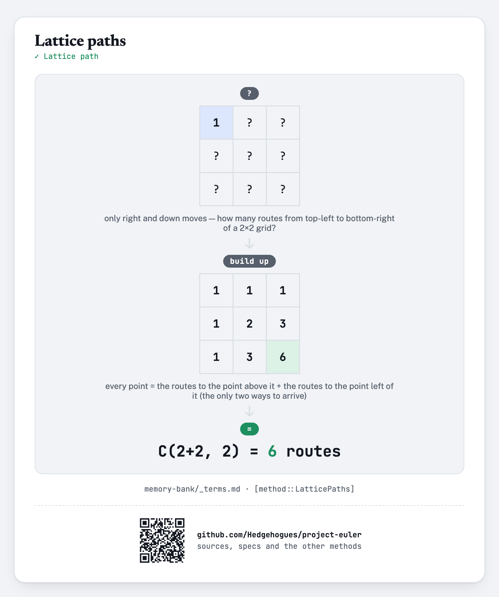
Sequence:
  1. Problem — a 2&times;2 grid of points to fill in; how many routes from top-left to bottom-right?
  2. Transform build up — each point's route count is the point above it plus the point to its left (the only two ways to arrive there); filling the grid this way reaches 6 in the bottom-right corner
  3. Solution — C(2+2, 2) = 6 routes, matching the filled-in grid exactly
Limits:
  - MUST NOT: be used when some cells are blocked/forbidden — a limit of the IDEA: the closed-form binomial coefficient counts EVERY monotone path; a grid with holes needs the cell-by-cell build-up (or inclusion-exclusion) instead, not the closed form
  - MUST: the grid pictured is deliberately tiny (2&times;2) — a limit of the PICTURE: for a real N&times;M grid the same build-up table would need (N+1)&times;(M+1) cells, impractical to draw much larger than this
Source: [Wikipedia — Lattice path](https://en.wikipedia.org/wiki/Lattice_path) · [Wikipedia — Binomial coefficient](https://en.wikipedia.org/wiki/Binomial_coefficient)
Example: `visualizations/examples/lattice-paths.{css,html}` (no js needed — the values are static) → `visualizations/build/lattice-paths.html`
Spec: [approaches](specs/approaches.md) · [visualizations](specs/visualizations.md)

## [method::DynamicProgramming]
Class: entity
Standard name: Dynamic programming (bottom-up / tabulation)
Essence: Build the optimal answer to the whole problem from the already-solved optimal answers to its smaller pieces, smallest first, instead of exploring every whole path from scratch.
Recognized by: the best choice at any point can be expressed using only the best answers to the smaller subproblems it leads to (optimal substructure), and those subproblems recur across many different larger problems (overlapping subproblems)
General case: order the subproblems from smallest/base case to largest; for each one, combine the already-computed answers of the subproblems it depends on (often via a min/max/sum) into its own answer, storing it as it is computed; the final answer is the entry for the whole problem, built without exploring any path twice
Picture: 
Sequence:
  1. Problem — a number triangle; moving only to an adjacent number below, which top-to-bottom path scores highest is unclear
  2. Transform bottom-up — the bottom row is already optimal (nowhere left to go); every row above adds itself to the BETTER of the two cells directly below it, e.g. 2 + max(8,5) = 10, all the way up
  3. Solution — the top cell, 23, IS the best total — no path was ever explored end to end
Limits:
  - MUST NOT: be used when the optimal choice at a point depends on more than just the optimal values of its subproblems (e.g. the actual path taken matters, not just its score) — a limit of the IDEA: optimal substructure can fail for constraints that couple choices non-locally
  - MUST: combine subproblems with the SAME combining rule the problem actually asks for (max here; it would be sum, count, or min for a different problem) — a limit of PRACTICE: reusing "the DP idea" without checking which combining rule applies is a common source of wrong answers
Source: [Wikipedia — Dynamic programming](https://en.wikipedia.org/wiki/Dynamic_programming) · [Wikipedia — Optimal substructure](https://en.wikipedia.org/wiki/Optimal_substructure)
Example: `visualizations/examples/dynamic-programming.{css,html}` (no js needed — the values are static) → `visualizations/build/dynamic-programming.html`
Spec: [approaches](specs/approaches.md) · [visualizations](specs/visualizations.md)

## [method::RestrictedPartitionCount]
Class: entity
Standard name: Partitions and compositions with restricted parts · picture — Young (Ferrers) diagram
Essence: Counting the ways to reach a total from a fixed set of allowed sizes has two different answers, and which one a table holds is decided by the order the two loops filling it are nested.
Recognized by: the question asks how many ways some total can be made from an unlimited supply of a few fixed sizes, and the statement either does or does not treat two arrangements of the same sizes as one way
General case: both counts come from the same table, seeded with one way to make the empty total, and the same single line of body — add the count of the total less one allowed size into the count of the total. Only the nesting differs, and it decides which object is counted:
  · ONE PASS PER ALLOWED SIZE, the inner sweep running over totals upward — each size's sweep settles how many copies of that size are used before the next size is ever considered, so each collection of sizes is reached once. The table then holds the number of PARTITIONS of the total with all parts in the allowed set; generating function, the product over the allowed sizes of one over one minus x raised to that size.
  · ONE PASS PER TOTAL, the inner sweep running over the allowed sizes — every size is offered at every total, so each ordering of the same collection arrives by its own route. The table then holds the number of COMPOSITIONS of the total with all parts in the allowed set; generating function, one over one minus the sum of x raised to each allowed size.
  The two agree only where no total admits two orderings at all; in general the second is the larger, by exactly the number of distinct rearrangements each collection has
Picture: 
Sequence:
  1. Problem — a bar of 4 cells to be filled from tiles of width 1 and width 2; how many ways is unknown
  2. Transform sizes outer — one pass per tile size: the three collections that reach the total, each drawn as a Young (Ferrers) diagram of 4 cells with its rows in decreasing length; count 3
  3. Transform totals outer — one pass per total: the same tiles laid along the bar in order, so the middle collection now appears three times, once per arrangement, each row carrying that one collection's own label; count 5
  4. Solution — the two counts side by side on the one total: 3 unordered against 5 ordered
Limits:
  - MUST NOT: be read as two different algorithms — a limit of the IDEA: it is one table, one seed and one body, and only the nesting order of the two loops separates the two answers; treating them as separate methods is what makes the mistake invisible when the wrong one is written
  - MUST: seed the empty total with one way, not zero — a limit of PRACTICE: it is the single entry every later entry is ultimately built from, and a zero there silently returns zero everywhere
  - MUST NOT: be used when the supply of some size is limited — a limit of the IDEA: both sweeps let a size be reused any number of times, which is exactly what the upward direction of the inner sweep buys; a limited supply is a different recurrence, not a tweak to this one
  - MUST NOT: be drawn for a total whose two counts do not both fit in one glance — a limit of the PICTURE: the whole argument of the last frame is that the reader counts the drawn objects on both sides and finds different numbers, which stops working as soon as either side has to be summarized instead of shown
Note: the loop-order rule itself has NO established encyclopedic name — searched: cp-algorithms (which states the sweep direction as a rule but never names it), Wikipedia's Change-making problem, Knapsack problem and List of knapsack problems; every phrasing found for the rule as such was tutorial or blog-level, which may supplement but cannot justify a record. What IS named, and is what this record is named after, are the two objects being counted — partitions and compositions with restricted parts — plus the recurrence itself, standard as the unbounded (complete) knapsack sweep. Do NOT cite the "coin problem" for any of this: under that name Wikipedia treats Frobenius' question — the largest total that CANNOT be made at all — which is a different question with a different answer.
Source: [Wikipedia — Partition (number theory)](https://en.wikipedia.org/wiki/Partition_(number_theory)) ("Two sums that differ only in the order of their summands are considered the same partition"; the restricted-parts generating function; Young and Ferrers diagrams as the standard visualization) · [Wikipedia — Composition (combinatorics)](https://en.wikipedia.org/wiki/Composition_(combinatorics)) (order matters; A-restricted compositions) · [cp-algorithms — Knapsack problem](https://cp-algorithms.com/dynamic_programming/knapsack.html) (the complete-knapsack sweep and why its inner direction runs upward) · [Wikipedia — Change-making problem](https://en.wikipedia.org/wiki/Change-making_problem) ("without considering the order of the coins")
Example: `visualizations/examples/restricted-partitions.{css,html}` (no js needed — the values are static) → `visualizations/build/restricted-partitions.html`
Spec: [approaches](specs/approaches.md) · [visualizations](specs/visualizations.md)

## [method::InPlaceAlgorithm]
Class: entity
Standard name: In-place algorithm
Essence: Once a value has produced the next one, nothing will ever ask for it again — so the next one is written straight over it instead of into fresh memory.
Recognized by: the statement asks only for the LAST member of a sequence, or for a small digest of it (its digit sum, its final row, its remainder), never for the history — while the sizes given make a second copy of the same size either not fit or not pay for itself
General case: if every step's output depends only on the last k values, keep exactly k slots and rotate through them (one slot for a value repeatedly transformed in place, one row for a table filled row by row); if the output has the same shape as the input and each input cell is dead the moment its own output is written, write the output over the input cell by cell. Space falls from proportional-to-length to proportional-to-k, with the arithmetic performed left completely untouched. The correctness condition is one of read and write ORDER: every cell must be read for the last time no later than the moment it is overwritten
Picture: 
Sequence:
  1. Problem — five slots, each holding one doubling of 7 in turn (7, 14, 28, 56, 112); only the last of them is ever asked for
  2. Transform &times;2 — each slot is crossed out the moment the next one exists: four of the five are dead, one is live, and they died in the order they were written
  3. Solution — one slot holds 112; five slots collapse to one, with the same four doublings performed
Limits:
  - MUST NOT: be applied when an earlier value is read again after the moment it would be overwritten — a limit of the IDEA: the read-and-write order is the entire correctness condition, and one later read of an overwritten cell silently returns a wrong number instead of failing
  - MUST NOT: be reached for as a speed-up — a limit of the IDEA: the operation count does not change at all, only the space does (the incidental gain is cache locality and the allocation avoided, never fewer operations)
  - MUST: overwrite a cell only after that cell's own contribution is fully consumed — a limit of PRACTICE: filling a table in the wrong direction (ascending where the rule reads ahead, descending where it reads behind) is the most common way this technique produces wrong answers
  - MUST: the picture keeps five slots and one running value — a limit of the PICTURE: the same claim about a table of millions of cells cannot be drawn, and the General case above carries that case instead
Note: this record carries only the SPACE claim. What the values in the slots mean, and why each follows from the one before, belongs elsewhere: a running total or running product is [method::PrefixSum](#methodprefixsum)'s, filling a table from smaller subproblems is [method::DynamicProgramming](#methoddynamicprogramming)'s, and holding a large number's digits in an array is [method::BigIntegerArithmetic](#methodbigintegerarithmetic)'s. No encyclopedic source draws a picture for this idea (checked: Wikipedia's In-place algorithm article carries no diagram at all, only pseudocode; Running total and Recurrence relation carry none; cp-algorithms has no page on it) — the picture is this catalog's own construction. Wikipedia's "Incremental computing" article, despite a name that fits this record's neighbourhood, describes a DIFFERENT subject — recomputing only the outputs that depend on changed inputs (spreadsheets, database view maintenance) — and is deliberately not cited below.
Source: [Wikipedia — In-place algorithm](https://en.wikipedia.org/wiki/In-place_algorithm) ("modifies the input in place, without creating a separate copy of the data structure"; the article's own worked example overwrites the array precisely because "we no longer need" it) · [Wikipedia — Recurrence relation](https://en.wikipedia.org/wiki/Recurrence_relation) (the ORDER of a relation — exactly how many earlier values have to be kept)
Example: `visualizations/examples/in-place-algorithm.{css,html}` (no js needed — the values are static) → `visualizations/build/in-place-algorithm.html`
Spec: [approaches](specs/approaches.md) · [visualizations](specs/visualizations.md)

## [method::DayOfWeekFormula]
Class: entity
Standard name: Determination of the day of the week (Sakamoto's algorithm)
Essence: The day of the week is a single sum of a few pieces (a leap-year correction, a fixed per-month offset, the day itself), taken modulo 7 — no calendar simulation needed.
Recognized by: you need the day of the week for a date, possibly a huge or far-future one, without stepping through the calendar day by day or month by month
General case: treating January and February as months 13 and 14 of the PREVIOUS year (so the leap-day correction only has to look at whole years), the weekday index is `(y + y/4 - y/100 + y/400 + t[m-1] + d) mod 7`, where `t = {0,3,2,5,0,3,5,1,4,6,2,4}` is a fixed per-month offset table and 0..6 maps Sunday..Saturday
Picture: 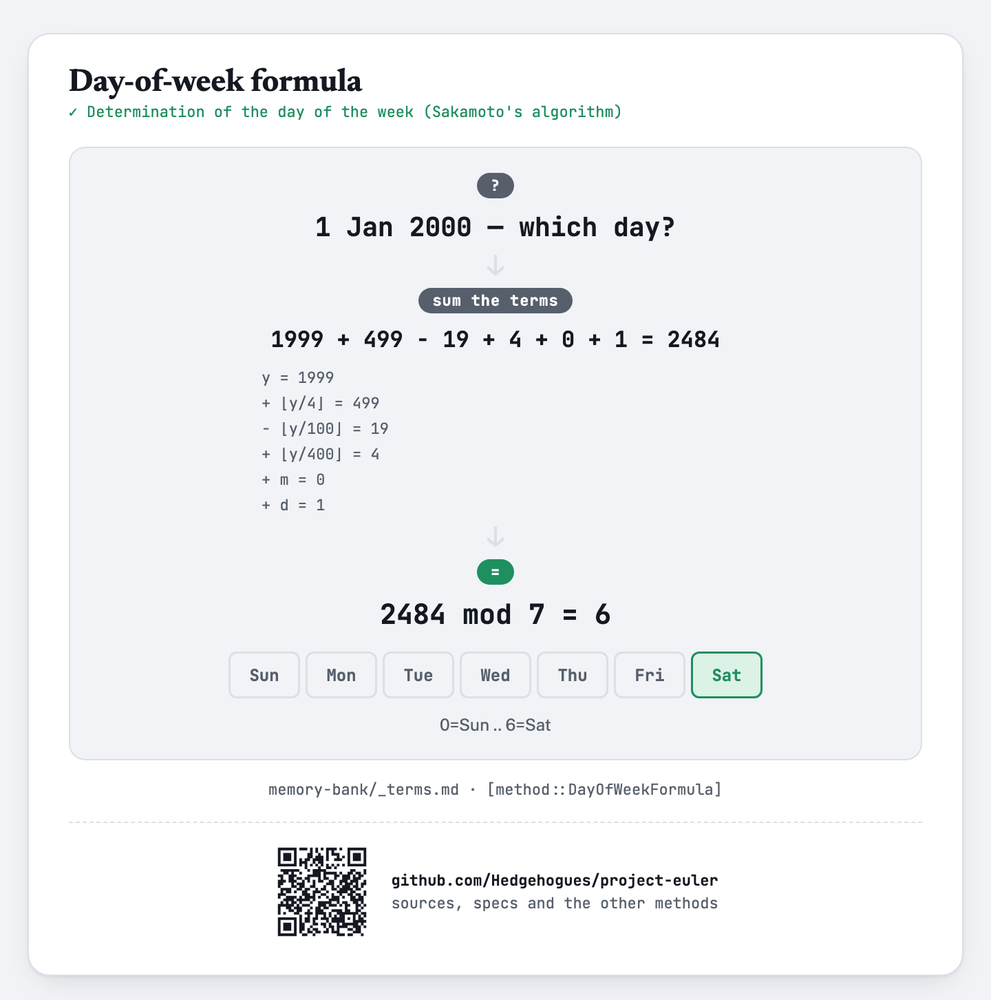
Sequence:
  1. Problem — 1 Jan 2000: which day of the week?
  2. Transform sum the terms — the adjusted year 1999, plus leap-year corrections (+499, &minus;19, +4), plus January's month offset (0), plus the day (1): total 2484
  3. Solution — 2484 mod 7 = 6 &rarr; Saturday, counted off on the 7-day strip; 1 Jan 2000 really was a Saturday
Limits:
  - MUST NOT: be used for dates before the Gregorian calendar's adoption (the formula assumes the modern leap-year rule throughout) — a limit of the IDEA: the Julian calendar's leap-year rule differs, and adoption dates vary by country
  - MUST: reduce the year modulo 400 first for very large years before evaluating the formula — a limit of PRACTICE: 400 Gregorian years hold 97 leap years and so 146,097 days, which is exactly 20,871 whole weeks (7 &times; 20,871 = 146,097), so the weekday pattern already repeats every 400 years and the seven-day week contributes no further factor; reducing first keeps every intermediate value small however large the input year is. A 2800-year period is not wrong, merely not the least — it is 7 &times; 400, the length that would be needed if 400 years had NOT come out to a whole number of weeks
  - MUST: reduce into a POSITIVE representative — the remainder plus one further cycle, not the bare 0..399 — a limit of PRACTICE: for January and February the formula shifts the year back by one, so a reduced year of 0 becomes &minus;1, and at that point two separate things bite in a language that truncates division toward zero: the leap-count terms come out different from their floored values, and the final step returns a negative index rather than 0..6 (see [method::ModularArithmetic](#methodmodulararithmetic) for the normalization)
Source: [Wikipedia — Determination of the day of the week](https://en.wikipedia.org/wiki/Determination_of_the_day_of_the_week) (Sakamoto's algorithm section) · [Wikipedia — Gregorian calendar](https://en.wikipedia.org/wiki/Gregorian_calendar) ("Calendar cycles ... repeat completely every 400 years, which equals 146,097 days"; "The cycle contains exactly 20,871 weeks (146,097 = 7 &times; 20,871)"; "97 are leap years")
Example: `visualizations/examples/day-of-week-formula.{css,html}` (no js needed — the values are static) → `visualizations/build/day-of-week-formula.html`
Spec: [approaches](specs/approaches.md) · [visualizations](specs/visualizations.md)

## [method::LehmerCode]
Class: entity
Family: [method::PositionalNotation](#methodpositionalnotation) (this is its mixed-radix specialization: each place carries its own base)
Standard name: Lehmer code (factorial number system)
Essence: The Nth permutation in lexicographic order can be built directly, one element at a time, by repeatedly dividing the (0-based) index by a shrinking factorial — no need to list any of the permutations before it.
Recognized by: you need the Nth permutation of a sequence directly (by index, possibly a huge one), not all permutations up to it, and not just "some" permutation
General case: with a pool of k remaining elements and a 0-based index, divide the index by (k&minus;1)! — the quotient selects which of the k remaining elements comes next (remove it from the pool), the remainder becomes the index for the next, one-smaller round; repeating until the pool is empty reconstructs the whole permutation
Picture: 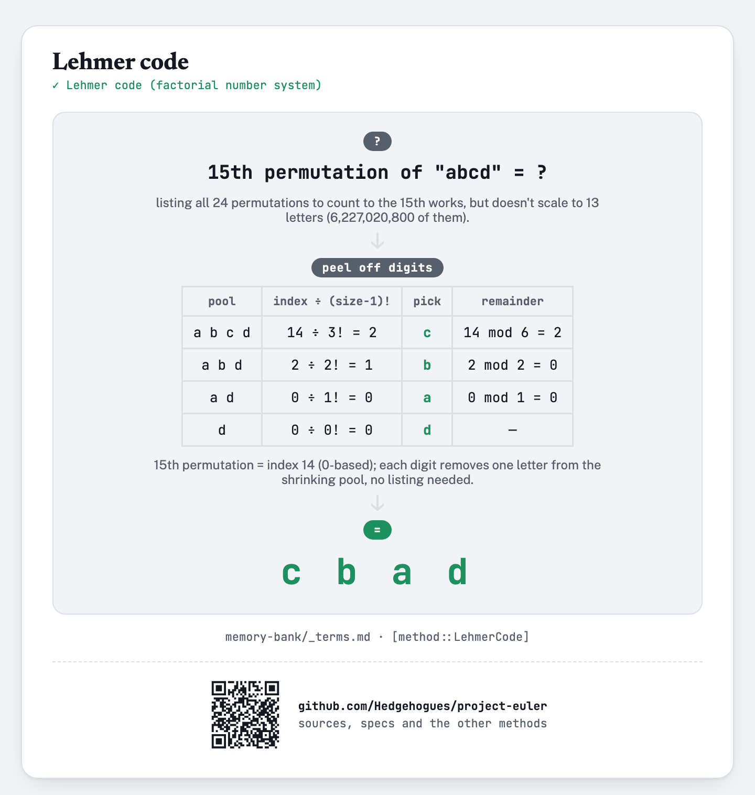
Sequence:
  1. Problem — the 15th permutation of "abcd"; listing all 24 to count to it doesn't scale (13 letters would mean 6,227,020,800 of them)
  2. Transform peel off digits — index 14, divided by shrinking factorials (3!, 2!, 1!, 0!), picks one letter from the shrinking pool each round: c, then b, then a, then d
  3. Solution — c b a d, built directly, without ever listing the 14 permutations that come before it
Limits:
  - MUST NOT: be used with a 1-based index without first converting it to 0-based — a limit of PRACTICE: "the Nth permutation" is usually asked 1-indexed, but the divide-by-factorial process itself is defined on the 0-based position in the lexicographic list
  - MUST: use the LARGEST leftover factorial first, walking it down by one element each round — a limit of the IDEA: choosing factorials out of order breaks the correspondence between the digit sequence and an actual base with each place's radix shrinking by one
Source: [Wikipedia — Lehmer code](https://en.wikipedia.org/wiki/Lehmer_code) · [Wikipedia — Factorial number system](https://en.wikipedia.org/wiki/Factorial_number_system)
Example: `visualizations/examples/lehmer-code.{css,html}` (no js needed — the values are static) → `visualizations/build/lehmer-code.html`
Spec: [approaches](specs/approaches.md) · [visualizations](specs/visualizations.md)

## [method::CycleDetectionViaRemainders]
Class: entity
Family: [method::ModularArithmetic](#methodmodulararithmetic) — this record is its SIZE case: it leans on there being only finitely many residues, not on any of the operations
Standard name: Cycle detection via remainder tracking (why decimal expansions repeat)
Essence: There are only finitely many possible remainders in a division — so stepping through it and remembering every remainder already seen is guaranteed to find a repeat, and exactly where it starts.
Recognized by: you need the length (or existence) of a repeating pattern produced by an iterated process with a fixed, small number of possible internal states — most directly, the repeating block of a fraction's decimal expansion
General case: run the process (here, long division: multiply the remainder by 10, divide by the denominator to get the next digit, keep the new remainder) while recording the step index at which each remainder first appeared; the moment a remainder repeats, the cycle length is the CURRENT step minus the step it was first recorded at — guaranteed to happen within (denominator) steps, since there are only that many possible remainders
Picture: 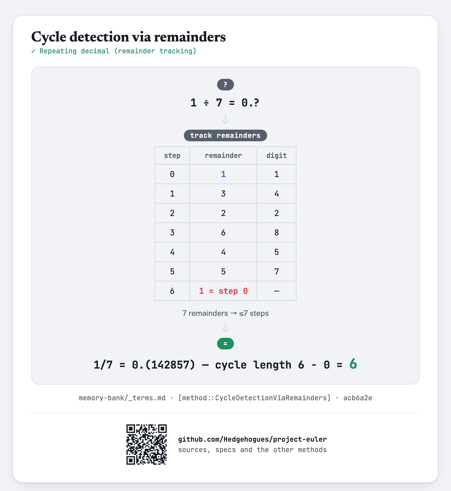
Sequence:
  1. Problem — 1/7 = 0.? ; how long is the repeating block?
  2. Transform track remainders — step by step, the remainder after each digit: 1, 3, 2, 6, 4, 5, then 1 again — already seen at step 0
  3. Solution — 1/7 = 0.(142857); cycle length = 6 &minus; 0 = 6
Limits:
  - MUST NOT: be used expecting a repeat to appear beyond (number of possible states) steps — a limit of the IDEA: the pigeonhole guarantee is exactly this bound, not an estimate
  - MUST: record the step at which EACH remainder first appears (not just the most recent one) — a limit of PRACTICE: without a per-remainder record, detecting that "this remainder happened before" is possible, but recovering exactly how long ago is not
Source: [Wikipedia — Repeating decimal](https://en.wikipedia.org/wiki/Repeating_decimal) (the remainder-tracking algorithm section)
Example: `visualizations/examples/cycle-detection-remainders.{css,html}` (no js needed — the values are static) → `visualizations/build/cycle-detection-remainders.html`
Spec: [approaches](specs/approaches.md) · [visualizations](specs/visualizations.md)

## [method::NextPermutation]
Class: entity
Standard name: Next permutation in lexicographic order (Narayana Pandita's algorithm)
Essence: To get from one permutation to the very next one in dictionary order, find the last place the sequence still climbs, swap in the smallest later value big enough to keep climbing there, then flip the now-falling tail back into its own smallest order.
Recognized by: you need to generate ALL permutations of a sequence, one at a time, in lexicographic order — not the Nth one directly, and not one arbitrary permutation
General case: scan from the right for the last index i with a[i] &lt; a[i+1] (the "pivot"; if none exists, the sequence is already the last permutation); scan from the right again for the last index j &gt; i with a[j] &gt; a[i]; swap a[i] and a[j]; reverse the whole suffix after position i (it was strictly falling, so reversing makes it the smallest possible ordering of those same values)
Picture: 
Sequence:
  1. Problem — 1 3 5 4 2; what permutation comes right after it?
  2. Transform find &amp; swap — 3 is the last climb (3&lt;5); scanning from the right, 4 is the last value still bigger than 3; swap them, giving 1 4 5 3 2
  3. Solution — everything after the swapped-in 4 (5, 3, 2) was falling; reversing it gives 2 3 5, so the answer is 1 4 2 3 5
Limits:
  - MUST NOT: be used to jump directly to a specific far-away Nth permutation — a limit of the IDEA: each call only advances by one step; reaching the Nth permutation this way costs O(N) steps ([method::LehmerCode](#methodlehmercode) reaches it directly instead)
  - MUST: reverse the suffix, never just re-sort it — a limit of PRACTICE: the suffix is already guaranteed strictly decreasing at that point, so reversing it is the same as sorting it ascending, but a general sort would hide (and needlessly cost more than) that guarantee
Source: [Wikipedia — Permutation](https://en.wikipedia.org/wiki/Permutation) (&sect; Generation in lexicographic order)
Example: `visualizations/examples/next-permutation.{css,html}` (no js needed — the values are static) → `visualizations/build/next-permutation.html`
Spec: [approaches](specs/approaches.md) · [visualizations](specs/visualizations.md)

## [method::BruteForceSearch]
Class: entity
Standard name: Brute-force search (exhaustive search, "generate and test")
Essence: Check every candidate the problem allows — but only after counting, from the given limits alone, that there are few enough of them to get through in the time available.
Recognized by: the constraints bound how many candidates exist, that count multiplied by the cost of checking one fits the time budget, and no structure in the problem is needed beyond testing each candidate against the definition
General case: multiply out the candidate count implied by the constraints (ranges times queries times per-candidate work); compare it against what the machine can do in the allowed time; if it fits, enumerate directly — the check itself is just the problem's own definition. The count is what decides, and it is computable before a line of code is written
Picture: 
Sequence:
  1. Problem — a 6&times;6 field of "?" cells: one of them is the answer, and nothing distinguishes it from the outside
  2. Transform &times; — the cells are counted without being opened (6 &times; 6 = 36) and set against a countable capacity of 100 empty slots: 36 &le; 100, so walking them all is affordable — decided before any cell is looked into
  3. Solution — the cells are opened in order, each getting a &#10003;, until the answer (&#9733;) turns up at the 23rd; the rest are never touched
Limits:
  - MUST NOT: be chosen because no better idea came to mind — a limit of the IDEA: without the count against the budget it is a guess, and the count is exactly what makes it a decision. At real scale the same comparison runs in real units: e.g. 1000 positions &times; 7 digits &times; 100 queries = 700,000 checks against a budget of roughly 100,000,000 simple steps per second — under 1% of it, so enumeration is safe
  - MUST NOT: be applied when the candidate count grows factorially or exponentially in the input size unless the input is tiny — a limit of PRACTICE: every ordering of just 20 items is already 20! &asymp; 2.4&times;1018, tens of billions of times past any per-second budget; counts of that shape pass any budget within a few steps of growth
  - MUST: the picture's 36 cells and 100 slots are deliberately toy-sized so both sides of the comparison stay literally countable — a limit of the PICTURE: real candidate counts and budgets (the 700,000 and 100,000,000 above) don't fit in a drawable grid, so the record's text carries them instead
Source: [Wikipedia — Brute-force search](https://en.wikipedia.org/wiki/Brute-force_search) ("systematically checking all possible candidates"; the article makes candidate count versus available resources the deciding factor) · [Wikipedia — Enumeration algorithm](https://en.wikipedia.org/wiki/Enumeration_algorithm)
Example: `visualizations/examples/brute-force-search.{css,html,js}` → `visualizations/build/brute-force-search.html`
Spec: [approaches](specs/approaches.md) · [visualizations](specs/visualizations.md)

## [method::VariableElimination]
Class: entity
Standard name: Elimination by substitution (solving a system of equations)
Essence: When the unknowns are tied together by an equation, one of them can be written in terms of the others and substituted away — the search then runs over one fewer unknown.
Recognized by: you are searching over two or more unknowns that must satisfy given equations, and at least one of those equations can be solved for one unknown in terms of the rest
General case: solve one constraint for one unknown; substitute that expression into the remaining constraints; the search space loses a whole dimension per unknown eliminated. Works for non-linear systems too, as long as the chosen unknown can actually be isolated — and each substituted value must still be checked for validity (a whole number, inside range, in the required order)
Picture: 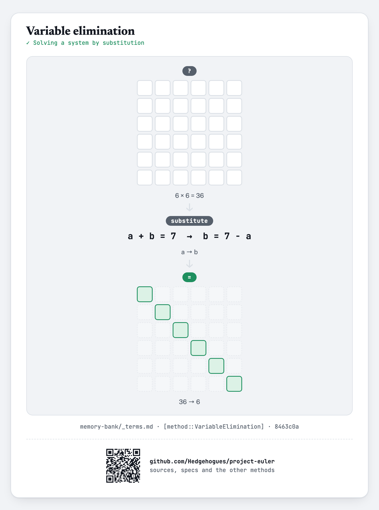
Sequence:
  1. Problem — two unknowns with 6 possible values each: 36 pairs to try
  2. Transform substitute — they are tied by a + b = 7, so b = 7 &minus; a; b stops being free
  3. Solution — 6 pairs left instead of 36, one per value of a; the square of candidates has collapsed to a line through it
Limits:
  - MUST NOT: be treated as removing the need to CHECK the substituted value — a limit of PRACTICE: the derived value can come out fractional, negative, or out of the required order, and each of those still has to be rejected explicitly
  - MUST: isolate an unknown that the constraint actually determines uniquely — a limit of the IDEA: if the constraint leaves two possible values (a square root, say), the substitution branches instead of eliminating, and the dimension does not drop
Source: [Wikipedia — System of equations](https://en.wikipedia.org/wiki/System_of_equations) · [Wikipedia — System of linear equations](https://en.wikipedia.org/wiki/System_of_linear_equations) (&sect; substitution: "solve the top equation for x in terms of y... substitute this expression... results in a single equation involving only the variable y" — stated there for a linear system; the same move is what eliminates an unknown in a non-linear one)
Example: `visualizations/examples/variable-elimination.{css,html,js}` → `visualizations/build/variable-elimination.html`
Spec: [approaches](specs/approaches.md) · [visualizations](specs/visualizations.md)

## [method::Canonicalization]
Class: entity
Standard name: Canonicalization (via a canonical/equivalence-class representative)
Essence: When several different starting points can produce overlapping results, pick exactly one canonical starting point per group that produces the same results, and only ever start from that one — every other member of the group is a known duplicate and is skipped outright, never processed.
Recognized by: distinct outputs are generated from a set of starting points (bases, seeds), and one starting point's whole output is provably a subset of another, smaller starting point's output — so processing both would recount the smaller one's results
General case: define which starting points are equivalent (one is expressible as a fixed transform of a smaller one); for each equivalence class pick the smallest/simplest member as the canonical representative; scan all starting points in order, and skip any that is not canonical the moment it is recognized as a transform of an already-seen smaller one — only representatives ever get processed
Picture: 
Sequence:
  1. Problem — 9 candidate bases, 2 through 10, nothing known about them yet
  2. Transform &#61; — 3 of them are a smaller base raised to a power already in the row (4&#61;2&sup2;, 8&#61;2&sup3;, 9&#61;3&sup2;) &mdash; marked as duplicates of that smaller base
  3. Solution — the 6 canonical bases (2, 3, 5, 6, 7, 10) get processed; the 3 duplicates are skipped, never touched again
Limits:
  - MUST NOT: be applied unless the "is-a-transform-of" relation between starting points is actually provable ahead of time — a limit of the IDEA: guessing at equivalence without proof can silently drop a starting point that was not really a duplicate
  - MUST: recognize a starting point as non-canonical BEFORE doing any of its own work — a limit of PRACTICE: checking after the fact defeats the purpose, since the duplicate work has already been paid for
  - MUST: the picture's 9 bases are deliberately small enough to read every relation by eye — a limit of the PICTURE: real equivalence classes (e.g. every power of 2 up to a large N) can have far more than 3 members, which a row this size cannot show without the reader losing count
Source: [Wikipedia — Canonicalization](https://en.wikipedia.org/wiki/Canonicalization) (lead section: canonicalization is used "to compare different representations for equivalence, to count the number of distinct data structures... and to make it possible to build efficient algorithms by regularizing... redundant information") · [Wikipedia — Equivalence class](https://en.wikipedia.org/wiki/Equivalence_class) (&sect; representative) · [Wikipedia — Canonical form](https://en.wikipedia.org/wiki/Canonical_form) ("for a class of objects on which an equivalence relation is defined, a canonical form consists in the choice of a specific object in each class")
Example: `visualizations/examples/canonicalization.{css,html,js}` → `visualizations/build/canonicalization.html`
Spec: [approaches](specs/approaches.md) · [visualizations](specs/visualizations.md)

## [method::SymmetryBreaking]
Class: entity
Standard name: Symmetry breaking (symmetry-breaking constraints, in constraint programming) &middot; the device itself is an ordering constraint on interchangeable variables &middot; picture — one group of equivalent candidates collapsed onto a single representative on a square board (this catalog's own construction, borrowing the square-board symmetry tradition — see Note)
Essence: When several candidates differ only by a relabelling the problem cannot tell apart, fix one order among the equal-standing parts and enumerate only in that order, so every other arrangement of those same parts is never produced at all.
Recognized by: the candidates the statement asks you to search come in groups that are one candidate rewritten — a pair listed both ways round, several unknowns of equal standing permuted among themselves, a line read from either end — and the condition being tested would return the identical verdict for every member of a group
General case: name the relabellings the problem is blind to (an operation counts as a symmetry when its result satisfies every constraint exactly when the original does), then impose an order on the parts those relabellings permute so that exactly one member of each group can satisfy it — non-decreasing order in general, strict order only when the parts are separately known to be all distinct. The work saved is the size of the group: two-fold for one swappable pair, six-fold for three interchangeable unknowns, two-fold for a line and its reverse. Where the imposed order meets another constraint of the problem it tightens the ranges themselves rather than merely filtering them — three parts in non-decreasing order adding up to a fixed total force the smallest of them below a third of that total — so the numeric bound is a consequence of the order, not a second idea
Picture: 
Sequence:
  1. Problem — a 4&times;4 board of ordered pairs, all 16 of them live; nothing is known about any of them
  2. Transform &#8644; — the board read against its own diagonal: each of the 6 cells below the diagonal carries the same two numbers as its mirror above it (marked &#61;), while each of the 4 cells on the diagonal is its own mirror and has no partner
  3. Solution — the inner index starts at the outer one, so only the 10 cells with the second index at or above the first are ever reached; the 6 below the diagonal stay blank — not crossed out, never generated
Limits:
  - MUST NOT: impose an order on parts the problem CAN tell apart — a limit of the IDEA: the relabelling is then not a symmetry of the problem, the discarded arrangement was a genuinely different candidate, and solutions are lost silently
  - MUST: use a non-strict order unless the parts are separately known to be all distinct — a limit of PRACTICE: a strict order also throws away every arrangement in which two parts are equal, and those are their own mirror, so no duplicate remains to stand in for them (the diagonal of the picture is exactly this set)
  - MUST: derive the numeric bound from the order TOGETHER WITH the problem's own constraint, never from the order alone — a limit of PRACTICE: the bound follows only from the two combined, and skipping it leaves the loop running over a stretch the order has already emptied
  - MUST: the picture's board is deliberately 4&times;4 so that every cell stays countable — a limit of the PICTURE: what it shows is 10 kept against 16, while on a large board the saving approaches one half, which no drawable grid makes visible
Note: two boundaries are worth stating, because each neighbour also shrinks a search space and both are easy to conflate with this one. Against [method::Canonicalization](#methodcanonicalization): canonicalization recognizes a duplicate AFTER it has been produced — every candidate is generated, and each non-representative is tested and then skipped — whereas symmetry breaking arranges for the duplicate never to be produced, because the order is built into the ranges the enumeration runs over, so a duplicate costs nothing at all instead of one recognition apiece. Against [method::VariableElimination](#methodvariableelimination): on three unknowns adding up to a fixed total BOTH apply, and they would otherwise be confused — elimination removes a whole dimension by using the equation (one unknown becomes an expression in the others), while symmetry breaking removes redundant regions of the same dimension by using an equivalence (of the six orders of three parts, one region survives). The drawing is this catalog's own construction: no encyclopedic source diagrams the technique at all — the Handbook chapter cited below draws the eight symmetries of a square board (its Figure 10.2) and search trees with symmetric branches pruned (Figures 10.10, 10.11), and the square board read against its diagonal is the one of those eight symmetries this picture uses.
Source: [Wikipedia — Symmetry-breaking constraints](https://en.wikipedia.org/wiki/Symmetry-breaking_constraints) — the encyclopedic anchor, and honestly a stub: a two-sentence lead ("the method of symmetry-breaking constraints can be used to take advantage of symmetries in many constraint satisfaction and optimization problems, by adding constraints that eliminate symmetries and reduce the search space size"), one example, one reference, no diagram &middot; textbook-grade: Gent, Petrie &amp; Puget, "Symmetry in Constraint Programming", chapter 10 of the [Handbook of Constraint Programming](https://www.dcs.gla.ac.uk/~pat/cpM/papers/CP_Handbook-20060315-final.pdf) (Rossi, van Beek &amp; Walsh, eds., Elsevier, 2006, pp. 329&ndash;376; linked as the authors' own full-text PDF because the publisher's page is paywalled) — "The goal of symmetry breaking is never to explore two search states which are symmetric to each other"; of its three named approaches this record is the second, "add symmetry breaking constraints before search starts, thereby making some symmetric solutions unacceptable while leaving at least one solution in each symmetric equivalence class"; and the General case above is its own worked statement, "suppose that we have 100 variables in an array X which are indistinguishable (so that they can be freely permuted). It is straightforward, and correct, to insist that the variables are in nondecreasing order&hellip; If we further know that all variables must be different, we can make this strictly increasing order" &middot; [catalogue record for the same chapter](https://research-portal.st-andrews.ac.uk/en/publications/chapter-10-symmetry-in-constraint-programming/) &middot; [Wikipedia — Constraint satisfaction problem](https://en.wikipedia.org/wiki/Constraint_satisfaction_problem) &middot; picture tradition: [Wikipedia — Dihedral group of order 8](https://en.wikipedia.org/wiki/Dihedral_group_of_order_8) (the eight symmetries of a square, drawn one labelled panel each)
Example: `visualizations/examples/symmetry-breaking.{css,html}` (no js needed — the values are static) → `visualizations/build/symmetry-breaking.html`
Spec: [approaches](specs/approaches.md) · [visualizations](specs/visualizations.md)

## [method::LogarithmProductRule]
Class: entity
Standard name: Product rule of logarithms · picture — slide rule (adding lengths on a logarithmic scale multiplies the numbers)
Essence: The logarithm of a product is the sum of the logarithms — so anything that multiplies becomes something that adds, and two lengths laid end to end stand for two numbers multiplied together.
Recognized by: a quantity is a product (or a power) too large or too awkward to multiply out, but only its size, digit count, or comparison against another product is needed; or a formula contains a logarithm of a product that would read more clearly as a sum of two named terms
General case: log(a &times; b) = log a + log b, for any base; as a consequence log(ak) = k &middot; log a. Taking logarithms of both sides of a product turns the multiplication into addition that is cheap, stays in range, and compares term by term
Picture: 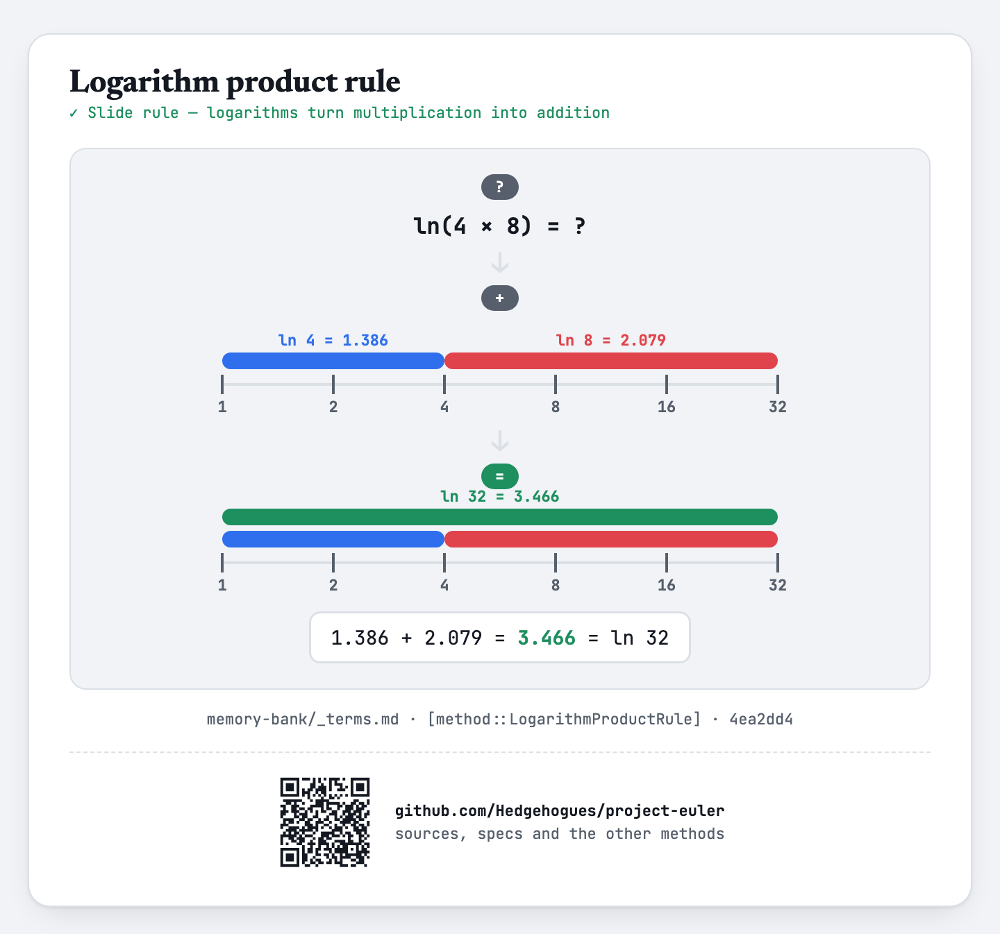
Sequence:
  1. Problem — ln(4 &times; 8) = ?
  2. Transform + — a ruler whose ticks 1, 2, 4, 8, 16, 32 are evenly spaced (a logarithmic scale): a bar of length ln 4 = 1.386 reaches the tick 4; a bar of length ln 8 = 2.079 laid end to end after it reaches the tick 32
  3. Solution — the two bars together are one bar of length 1.386 + 2.079 = 3.466, and 3.466 = ln 32; adding the lengths multiplied the numbers
Limits:
  - MUST NOT: be applied to a sum — a limit of the IDEA: ln(a + b) does not split into anything simpler; only products, quotients and powers turn into sums, differences and multiples
  - MUST: keep to one base throughout — a limit of PRACTICE: the rule holds in any base, but the two logarithms being added have to be in the same one
  - MUST: the ruler's ticks 1..32 are powers of 2 so that the picture stays countable — a limit of the PICTURE: on a real slide rule every number has its place, but a scale with every integer marked cannot be read at this size
Source: [Wikipedia — Logarithm](https://en.wikipedia.org/wiki/Logarithm) (&sect; Logarithmic identities: "log_b(xy) = log_b x + log_b y"; &sect; Slide rules: "sliding the upper scale appropriately amounts to mechanically adding logarithms") · [Wikipedia — Slide rule](https://en.wikipedia.org/wiki/Slide_rule)
Example: `visualizations/examples/logarithm-product-rule.{css,html}` (no js needed — the values are static) → `visualizations/build/logarithm-product-rule.html`
Spec: [approaches](specs/approaches.md) · [visualizations](specs/visualizations.md)

## [method::FixedPointIteration]
Class: entity
Standard name: Fixed-point iteration · picture — cobweb plot
Essence: When the unknown appears on both sides of its own equation, start from a rough guess, feed it into the right-hand side, and take what comes out as the next guess — each pass lands closer to the value that reproduces itself.
Recognized by: the quantity you want is defined in terms of itself (x = f(x)), a direct formula for it is unavailable or clumsy, but evaluating the right-hand side at any given number is easy
General case: choose x0; set xn+1 = f(xn); stop when successive values agree to the precision needed, or after a fixed number of passes when only an estimate is wanted. Converges when f is contracting near the fixed point (|f'| &lt; 1 there); one pass from a decent starting guess already improves it, which is often all a bound needs
Picture: 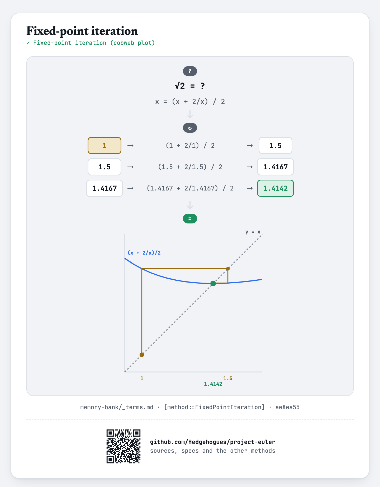
Sequence:
  1. Problem — &radic;2 = ?, written as an equation that mentions its own answer: x = (x + 2/x) / 2
  2. Transform &#8635; — start at 1; the right-hand side gives 1.5; feed 1.5 back in and get 1.4167; feed that back and get 1.4142 — the same recipe three times, each time on its own previous output
  3. Solution — on a graph of y = (x + 2/x)/2 against the diagonal y = x, the passes are a staircase: up from 1 to the curve, across to the diagonal, up to the curve again — the steps shrink onto the point 1.4142 where the curve crosses the diagonal, the value that reproduces itself
Limits:
  - MUST NOT: be assumed to converge — a limit of the IDEA: if the curve is steeper than the diagonal at the crossing (|f'| &gt; 1), the staircase runs away instead of closing in; the iteration then needs a different rearrangement of the same equation
  - MUST: say how many passes were taken when the result is used as an estimate — a limit of PRACTICE: one pass and ten passes are both "fixed-point iteration", with very different accuracy
  - MUST: the picture uses &radic;2 so the crossing is a familiar number — a limit of the PICTURE: it is the Babylonian square-root recipe, chosen for recognisability; the method is the staircase, not that particular curve
Source: [Wikipedia — Fixed-point iteration](https://en.wikipedia.org/wiki/Fixed-point_iteration) ("x_{n+1} = f(x_n), n = 0, 1, 2, ..."; the Babylonian method f(x) = (a/x + x)/2 for &radic;a is one of its worked examples) · [Wikipedia — Cobweb plot](https://en.wikipedia.org/wiki/Cobweb_plot) (the staircase drawing between the curve and the diagonal)
Example: `visualizations/examples/fixed-point-iteration.{css,html}` (no js needed — the values are static) → `visualizations/build/fixed-point-iteration.html`
Spec: [approaches](specs/approaches.md) · [visualizations](specs/visualizations.md)

## [method::Composition]
Class: entity
Standard name: Composition (combinatorics)
Essence: Write a total as an ORDERED sum of a fixed number of positive parts — equivalently, cut a row of that many units at a chosen set of the gaps between them, so enumerating every composition is the same act as enumerating every choice of where the cuts go.
Recognized by: the statement (or the code) needs every way to break a fixed-length whole — a number, a string, a sequence — into an exact number of non-empty, ordered, contiguous pieces, and two pieces swapped in order count as two different answers, not one
General case: a total of n split into exactly k ordered positive parts corresponds one-to-one with choosing k&minus;1 of the n&minus;1 gaps between n units to place a divider — so there are C(n&minus;1, k&minus;1) such compositions; summed over every k from 1 to n this gives 2^(n&minus;1), since each of the n&minus;1 gaps is independently a divider or not. The same correspondence reads a length-n sequence (not just a number): the k part LENGTHS are a composition of n, and the pieces themselves are exactly the sequence cut at the chosen dividers
Picture: 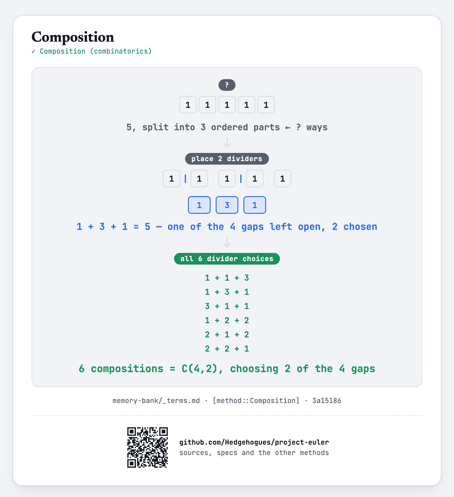
Sequence:
  1. Problem — 5 units in a row, to be split into 3 ordered parts; how many ways is unknown
  2. Transform place 2 dividers — 2 of the 4 gaps between the units are chosen (one gap stays open), cutting the row into parts 1, 3, 1 (1+3+1=5)
  3. Solution — all 6 divider choices listed as their part sequences; 6 = C(4,2), choosing 2 of the 4 gaps
Limits:
  - MUST NOT: be confused with a PARTITION of the same total — a limit of the IDEA: a partition treats reorderings of the same parts as one object (1+3+1 and 3+1+1 are the same partition but different compositions); [method::RestrictedPartitionCount](#methodrestrictedpartitioncount) counts both objects, but by a DP recurrence over an unlimited supply of an allowed-size SET, a different mechanism from directly enumerating divider positions and legitimate only when that DP's own preconditions hold
  - MUST NOT: be reached to COUNT how many compositions exist when only the count (not each one individually) is wanted and parts are restricted to an allowed set with unlimited supply — a limit of the IDEA: that count is [method::RestrictedPartitionCount](#methodrestrictedpartitioncount)'s "totals outer" table, filled once for every total at once, not by generating each composition
  - MUST: the picture stops at n=5 — a limit of the PICTURE: the full list already has 6 rows at this size, and the count doubles for every part added to the leftmost end while the parts add up to n and the part count k stays fixed at 3
Source: [Wikipedia — Composition (combinatorics)](https://en.wikipedia.org/wiki/Composition_(combinatorics)) ("a composition of an integer n is a way of writing n as the sum of a sequence of positive integers"; "each positive integer n has 2^(n&minus;1) distinct compositions") · [Encyclopedia of Mathematics — Composition (combinatorics)](https://encyclopediaofmath.org/wiki/Composition_(combinatorics)) ("a composition of n may be represented as a sequence of n dots separated by bars with no two bars adjacent")
Example: `visualizations/examples/composition.{css,html}` (no js needed — the values are static) → `visualizations/build/composition.html`
Spec: [approaches](specs/approaches.md) · [visualizations](specs/visualizations.md)

## [method::Sorting]
Class: entity
Standard name: Sorting algorithm
Essence: Rearrange the elements of a sequence into a fixed order (usually non-decreasing) by repeatedly comparing two elements and exchanging them when they are out of that order — almost always a preparatory step that some later technique depends on, not the final answer by itself.
Recognized by: something else in the solution needs the elements in order — reading names alphabetically, finding a range by binary search, scanning to break ties by position — and the input arrives in no particular order
General case: any output is a valid sort exactly when it satisfies two conditions at once: it is a PERMUTATION of the input (every original element present, none added or dropped) and it is in MONOTONIC order (each element no smaller — or no larger — than the one before it, by whatever comparison the problem needs, not necessarily numeric). Every comparison-based sorting algorithm reaches that output by some sequence of pairwise comparisons and exchanges; which pairs are compared, and in what order, is what tells one sorting algorithm apart from another, but the two conditions on the OUTPUT never change
Picture: 
Sequence:
  1. Problem — five bars, heights 3, 5, 1, 4, 2, in that order; what order they belong in is unclear
  2. Transform compare & exchange — 5 sits immediately before 1; the two are out of order by height, so they are exchanged
  3. Solution — every later pair is compared and exchanged the same way, until none is left out of order: 1, 2, 3, 4, 5
Limits:
  - MUST NOT: be assumed to be free — a limit of the IDEA: a comparison-based sort needs at least on the order of n&middot;log(n) comparisons in the worst case (proved by the decision-tree argument: n! possible orderings, each comparison at most halves how many remain consistent), so sorting a large sequence just to read its extremes wastes the sort's own cost when a single scan for the extreme would do
  - MUST: state which comparison decides the order when it is not the plain numeric one — a limit of PRACTICE: sorting strings alphabetically, records by one of several fields, or pairs by a derived key all need that comparison spelled out, not assumed
  - MUST NOT: be relied on for STABILITY (equal elements keeping their original relative order) unless the specific algorithm used is documented as stable — a limit of the IDEA: some comparison sorts (quicksort, heapsort) do not guarantee it, others (merge sort, insertion sort) do
Source: [Wikipedia — Sorting algorithm](https://en.wikipedia.org/wiki/Sorting_algorithm) ("puts elements of a list in a certain order"; the permutation-and-monotonic-order output condition; the n&middot;log(n) comparison lower bound for comparison sorts) · [Britannica — sorting algorithm](https://www.britannica.com/technology/sorting-algorithm)
Example: `visualizations/examples/sorting.{css,html}` (no js needed — the values are static) → `visualizations/build/sorting.html`
Spec: [approaches](specs/approaches.md) · [visualizations](specs/visualizations.md)
