# Ubiquitous Language Index — projecteuler (explaining solutions)

> Canonical dictionary of explanation methods. Format: `## [context::TermName]` · links are plain
> markdown links into this same file, `[context::Name](#anchor)` (not `[[wikilink]]` — GitHub does
> not render those as links in ordinary `.md`, only inside its own Wiki). One context: `method` —
> an explanation method (the idea and its picture in ONE block).
>
> **One method, one block.** The idea ("what it is, when you recognize it") and its picture ("how
> to show it") are not two parallel catalogs but FIELDS OF ONE RECORD: `Essence`/`Recognized by`/
> `General case`/`Source` describe the idea, `Picture`/`Sequence`/`Example` describe the drawing,
> and `Limits` covers both — each bullet marking whether the limit belongs to the idea or only to
> the drawing. A method has at most one picture; a method with no picture is legitimate when the
> idea has no established visual form.
>
> **Not a single mention of a specific problem lives here** — no statement, no solution, not even
> a "used in" backlink. These are the primitives themselves. The link runs ONE way: a problem
> (`euler{NNN}/README.md`) points at the block it needs by name (`[method::Name]` →
> `_terms.md#methodname`); there is no reverse pointer. A problem reusing an already-described
> method simply links to the existing block — this file does not change at all.
>
> Each method's picture is `visualizations/build/<slug>.png`, produced by
> `visualizations/build.sh` from `visualizations/skeleton.html` + `visualizations/examples/<slug>.*`;
> after any edit to `examples/`, rerun the build — pictures are never touched by hand.

## [method::SkipCounting]
Class: entity
Standard name: Skip counting
Essence: Move along the numbers in equal hops — wherever you land is a multiple of the hop length.
Recognized by: you need to see or show which numbers have the multiple-of property BEFORE any computation — to eyeball it, to check a hunch, to explain what "multiple" even means from scratch
General case: hops of length k mark exactly the multiples of k; several hop lengths give several groups, and the numbers that are multiples of more than one are those where the landings coincide
Picture: 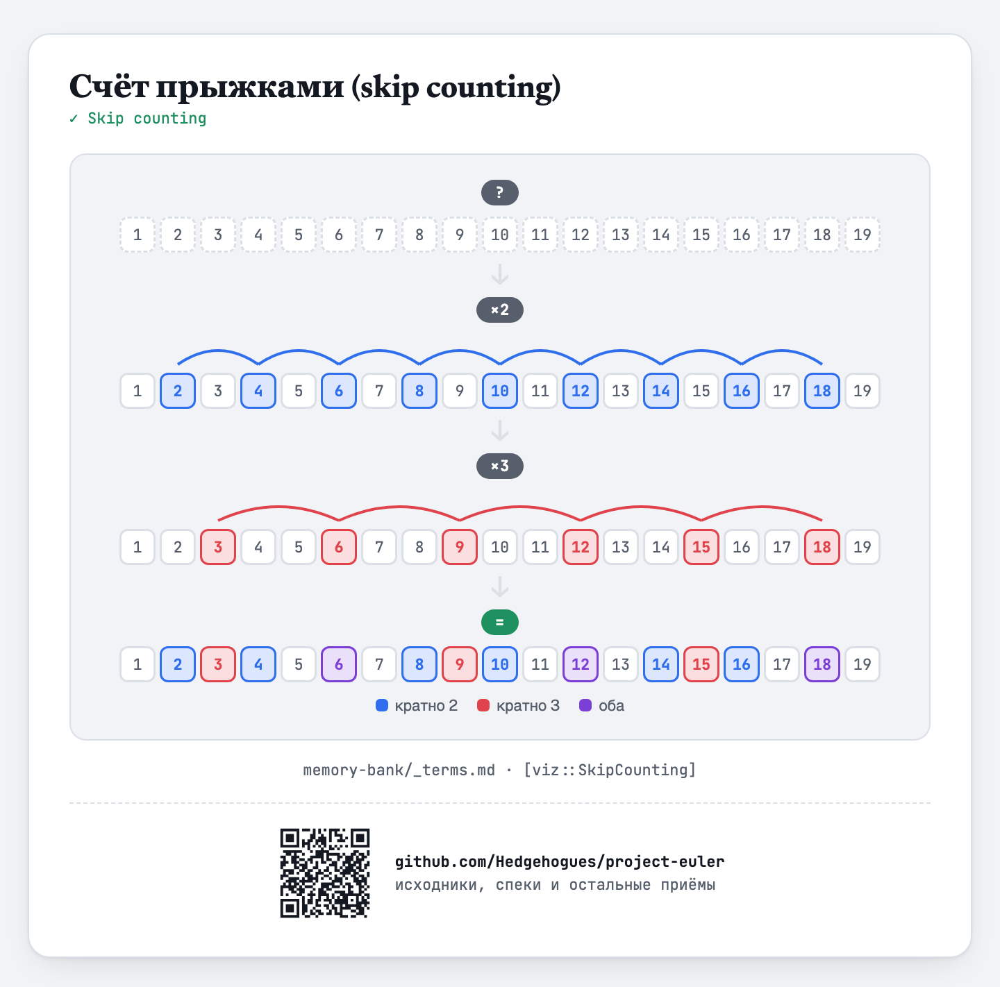
Sequence:
  1. Problem — numbers on the line with no marks; which ones have the property is unknown
  2. Transform ×2 — hops of 2 mark the multiples of 2
  3. Transform ×3 — hops of 3 mark the multiples of 3
  4. Solution — the combined line, each number colored by what it belongs to (2 / 3 / both)
Limits:
  - MUST NOT: be used as a literal by-hand counting method for large numbers (thousands and up) — a limit of PRACTICE, not of the idea: the idea holds for any numbers, but there you compute the same multiples with a formula instead of drawing hops
  - MUST NOT: be used for three or more conditions at once — a limit of the PICTURE: the number of colors on the line exceeds what one glance can separate
Source: [Wikipedia — Skip counting](https://en.wikipedia.org/wiki/Skip_counting) · [Wikipedia — Number line](https://en.wikipedia.org/wiki/Number_line) · teaching practice: [SplashLearn](https://www.splashlearn.com/blog/how-to-teach-skip-counting/) · [WeAreTeachers](https://www.weareteachers.com/skip-counting/)
Example: `visualizations/examples/skip-counting.{css,html,js}` → `visualizations/build/skip-counting.html`
Spec: [approaches](specs/approaches.md) · [visualizations](specs/visualizations.md)

## [method::InclusionExclusion]
Class: entity
Standard name: Inclusion–exclusion principle · picture — bar model / tape diagram (Singapore Math)
Essence: Count each part separately, then subtract whatever got counted twice.
Recognized by: the statement has an "or" between two or more properties of a number/object, and the exact count or sum matters ("a multiple of A OR a multiple of B")
General case: for k conditions — an alternating sum over all intersections (pairwise, triple, …); "A+B−AB" is only the k=2 case
Picture: 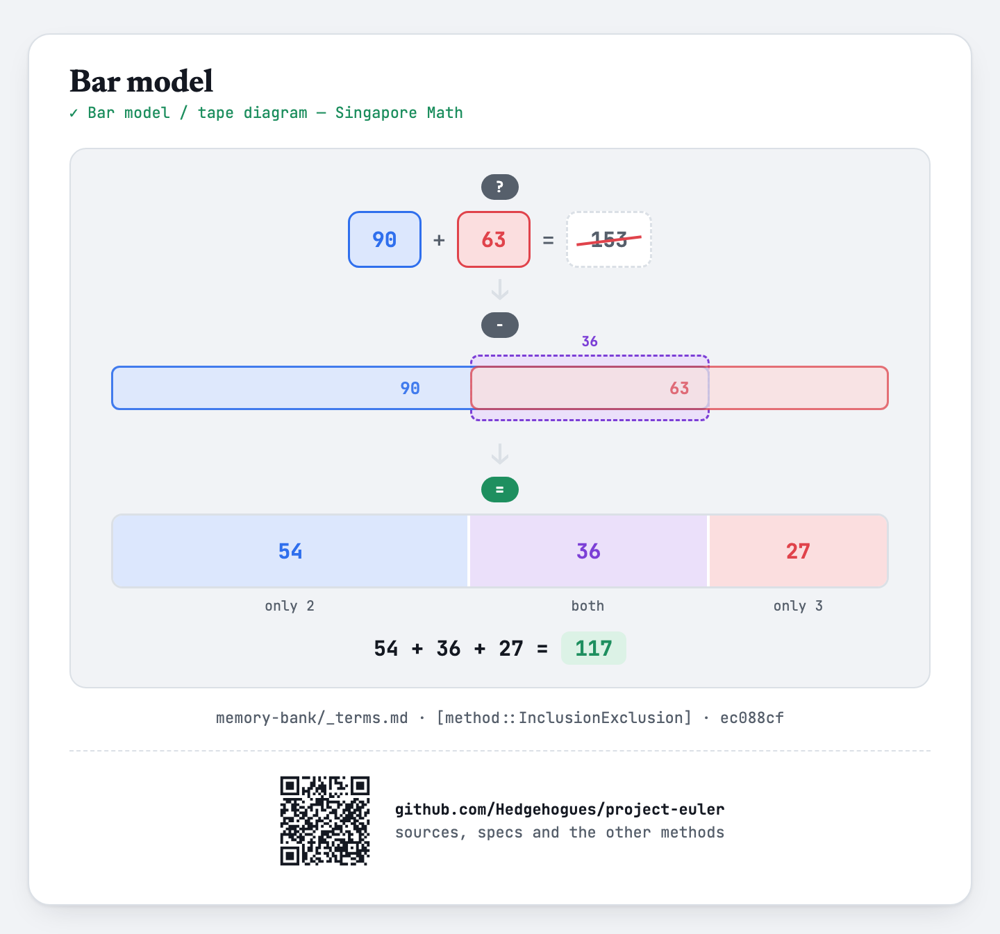
Sequence:
  1. Problem — the two per-condition sums are added directly; the total is struck through (the shared part is double-counted)
  2. Transform − — the same two numbers shown overlapping; the twice-counted part is highlighted
  3. Solution — the bar split into three honest pieces (only 2, both, only 3); their sum is the right answer
Limits:
  - MUST NOT: be used for three or more conditions — a limit of the PICTURE: a bar can only show a row of non-overlapping pieces, and with three overlapping conditions the intersections do not line up honestly in one row. The idea itself works for any k (at the cost of the term count growing as 2^k)
Source: [Wikipedia — Inclusion–exclusion principle](https://en.wikipedia.org/wiki/Inclusion%E2%80%93exclusion_principle) · picture: [Wikipedia — Tape diagram](https://en.wikipedia.org/wiki/Tape_diagram) · [Maths — No Problem!](https://mathsnoproblem.com/en/approach/bar-modelling)
Example: `visualizations/examples/bar-model.{css,html}` (no js needed — the values are static) → `visualizations/build/bar-model.html`
Spec: [approaches](specs/approaches.md) · [visualizations](specs/visualizations.md)

## [method::VennDiagram]
Class: entity
Standard name: Venn diagram — John Venn, 1880 (the term was coined by C. I. Lewis, 1918)
Essence: Show how two (or three) conditions relate using circles — the shape of the overlap is visible before any numbers are.
Recognized by: what matters is whether the conditions overlap AT ALL and how the regions relate; the exact count in each is secondary
General case: each non-overlapping region corresponds to its own combination of conditions; the diagram still makes sense with no numbers written in it at all — it is about structure, not counting
Picture: 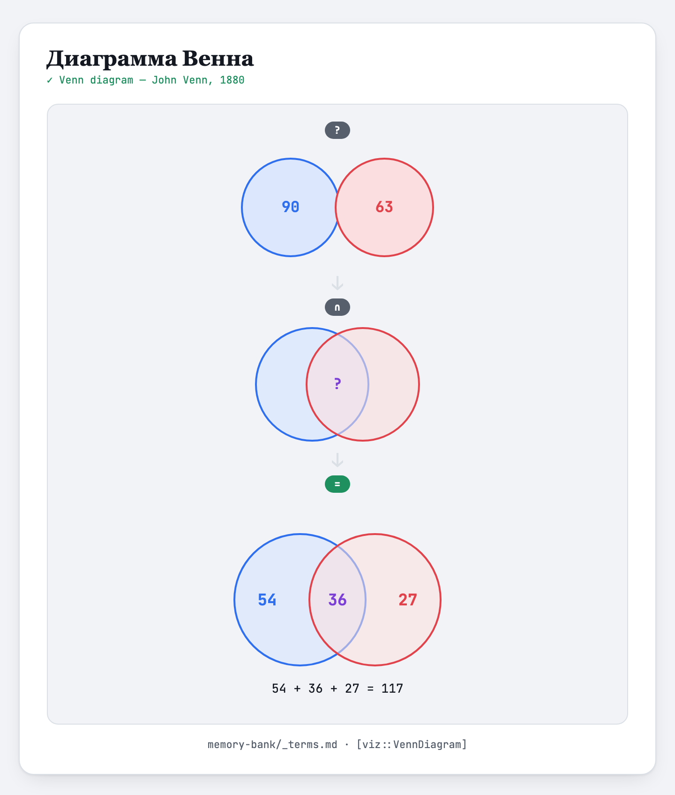
Sequence:
  1. Problem — two separate circles; how the conditions relate is unclear
  2. Transform ∩ — the circles move together, a shared region appears with no number in it
  3. Solution — all three regions labeled with numbers
Limits:
  - MUST NOT: be used for four or more conditions with plain circles — here the limit of the idea and of the picture coincide (the idea is inherently visual): four circles are provably unable to show every possible intersection; for two or three it works without reservation
Source: [Wikipedia — Venn diagram](https://en.wikipedia.org/wiki/Venn_diagram) · [Britannica — John Venn](https://www.britannica.com/biography/John-Venn) · [ReadWriteThink](https://www.readwritethink.org/classroom-resources/lesson-plans/introducing-venn-diagram-kindergarten) · [Science Sparks](https://www.science-sparks.com/make-venn-diagram-hula-hoop/)
Example: `visualizations/examples/venn.{css,html,js}` → `visualizations/build/venn.html`
Note: closely related to [method::InclusionExclusion](#methodinclusionexclusion) and often used together with it, but a separate method by origin: the diagram was invented in 1880 to represent logical propositions, not to count.
Spec: [approaches](specs/approaches.md) · [visualizations](specs/visualizations.md)

## [method::ArithmeticProgressionSum]
Class: entity
Standard name: Sum of an arithmetic progression · picture — Gauss's trick, pairing from both ends
Essence: A run of evenly spaced numbers can be added with one multiplication instead of one term at a time.
Recognized by: you need the sum (not the count) of numbers spaced at a constant step — multiples of something over a range, any evenly spaced run
General case: the sum of the first m terms of a progression with step k is `k · m·(m+1)/2`, where m is how many such numbers fall in the range; any k, m, N
Picture: 
Sequence:
  1. Problem — the run stands in order joined by "+", the sum not computed
  2. Transform ↔ — the numbers are linked into pairs from both ends by arcs; each arc is labeled with the pair's sum
  3. Solution — the total (number of pairs × pair sum, plus the middle term when the count is odd)
Limits:
  - MUST NOT: be used when the step between numbers varies — a limit of the IDEA: pairs from both ends stop summing to the same value and the formula does not apply
  - MUST: every intermediate number in the example must be distinct (the example uses 4·8·12·16·20, pairs of 24, total 60) — a limit of the PICTURE: in an earlier version the rectangle area and the final answer were both 30, and the explanation read as circular
Source: [Wikipedia — Arithmetic progression](https://en.wikipedia.org/wiki/Arithmetic_progression) · [BetterExplained — Techniques for Adding the Numbers 1 to 100](https://betterexplained.com/articles/techniques-for-adding-the-numbers-1-to-100/) · picture: [NCTM — The Story of Gauss](https://www.nctm.org/Publications/TCM-blog/Blog/The-Story-of-Gauss/)
Example: `visualizations/examples/gauss-pairing.{css,html,js}` → `visualizations/build/gauss-pairing.html`
Spec: [approaches](specs/approaches.md) · [visualizations](specs/visualizations.md)

## [method::Precomputation]
Class: entity
Standard name: Precomputation · picture — build-once fan-in/fan-out (this catalog's own construction, not an independently named historical device — see Picture note)
Essence: Build everything that does not depend on the individual query once, up front — each query then only reads the ready result instead of recomputing it.
Recognized by: the same structure (list, table, running sum) is used many times over with different queries and does not itself depend on the query; rebuilding it per query repeats identical work T times for nothing
General case: lift the construction of the shared structure out of the query loop — its cost is paid once instead of T times; HOW a query is then answered from the ready structure (search, indexing, range sum) is a separate method, not part of precomputation
Picture: 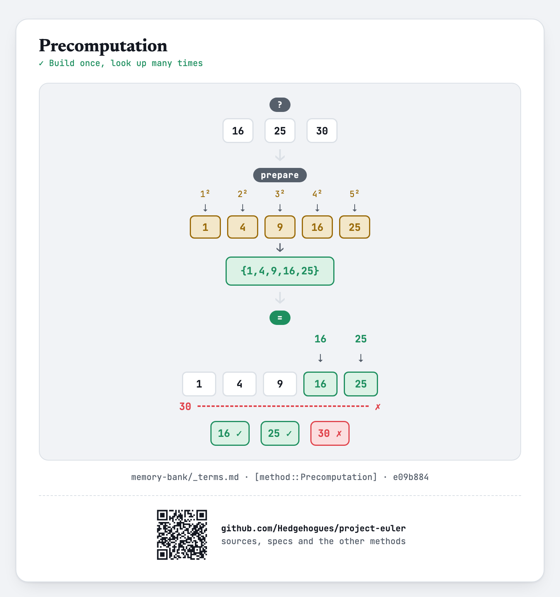
Sequence:
  1. Problem — three queries, each triggering its own separate build of the same list
  2. Transform → — the three separate builds merge into a single build, done before any query is answered
  3. Solution — the one built list is shared; every query becomes a fast lookup into it, not a rebuild
Limits:
  - MUST NOT: be used when the structure depends on the query — then there is nothing to precompute
  - MUST: remember the build cost is always paid, even for a single query — with only one query there is no gain
Note: no encyclopedic source describes a named, standard PICTURE for this idea (checked: Wikipedia's Precomputation and Memoization articles contain zero diagrams; cp-algorithms has no page on it) — the idea itself is standard and sourced below, but the picture is this catalog's own construction, honestly not attributed to an established visual tradition the way the other pictures in this catalog are.
Source: [Wikipedia — Precomputation](https://en.wikipedia.org/wiki/Precomputation) · [Wikipedia — Lookup table](https://en.wikipedia.org/wiki/Lookup_table) · [GeeksforGeeks — Precomputation Techniques for Competitive Programming](https://www.geeksforgeeks.org/dsa/precomputation-techniques-for-competitive-programming/)
Example: `visualizations/examples/precomputation.{css,html}` (no js needed — the values are static) → `visualizations/build/precomputation.html`
Spec: [approaches](specs/approaches.md) · [visualizations](specs/visualizations.md)

## [method::BinarySearch]
Class: entity
Standard name: Binary search
Essence: Find where a value sits in an already sorted list by repeatedly discarding the half that cannot contain it.
Recognized by: you need to find an element or a position in a list that is already sorted (or grows in order by construction)
General case: compare the target against the middle of the remaining stretch and drop the half where the answer cannot be — O(log m) comparisons instead of scanning all m elements
Picture: 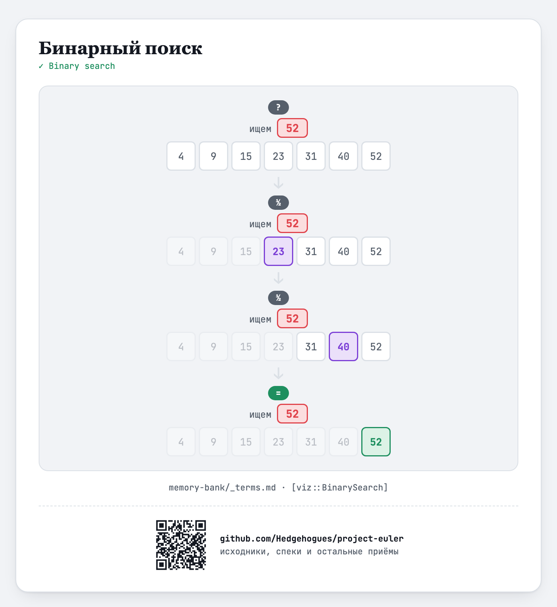
Sequence:
  1. Problem — a list of numbers and a target; where it sits is unknown
  2. Transform ½ — the middle is compared with the target, the half that cannot contain it is discarded
  3. Transform ½ — the same repeats on what is left
  4. Solution — one element remains — that is the answer
Limits:
  - MUST NOT: be used on an unsorted list — a limit of the IDEA: halving stops guaranteeing anything
Source: [cp-algorithms — Binary Search](https://cp-algorithms.com/num_methods/binary_search.html) · [Wikipedia — Binary search algorithm](https://en.wikipedia.org/wiki/Binary_search_algorithm)
Example: `visualizations/examples/binary-search.{css,html}` (no js needed — the values are static) → `visualizations/build/binary-search.html`
Spec: [approaches](specs/approaches.md) · [visualizations](specs/visualizations.md)

## [method::TrialDivision]
Class: entity
Standard name: Trial division · picture — ladder method (division ladder), a.k.a. birthday cake method
Essence: Try the small numbers in turn, starting at 2 — see what divides — and peel off the prime factors that way.
Recognized by: you need to factor a number into primes or to find one particular (say, the largest) prime factor
General case: try divisors d from 2 while d·d ≤ what REMAINS of the number; at each divisor peel it out while it divides evenly — the remainder shrinks and the trial bound falls with it; if what is left after the loop exceeds 1, it is itself prime (and with divisors tried in increasing order, it is the largest factor)
Picture: 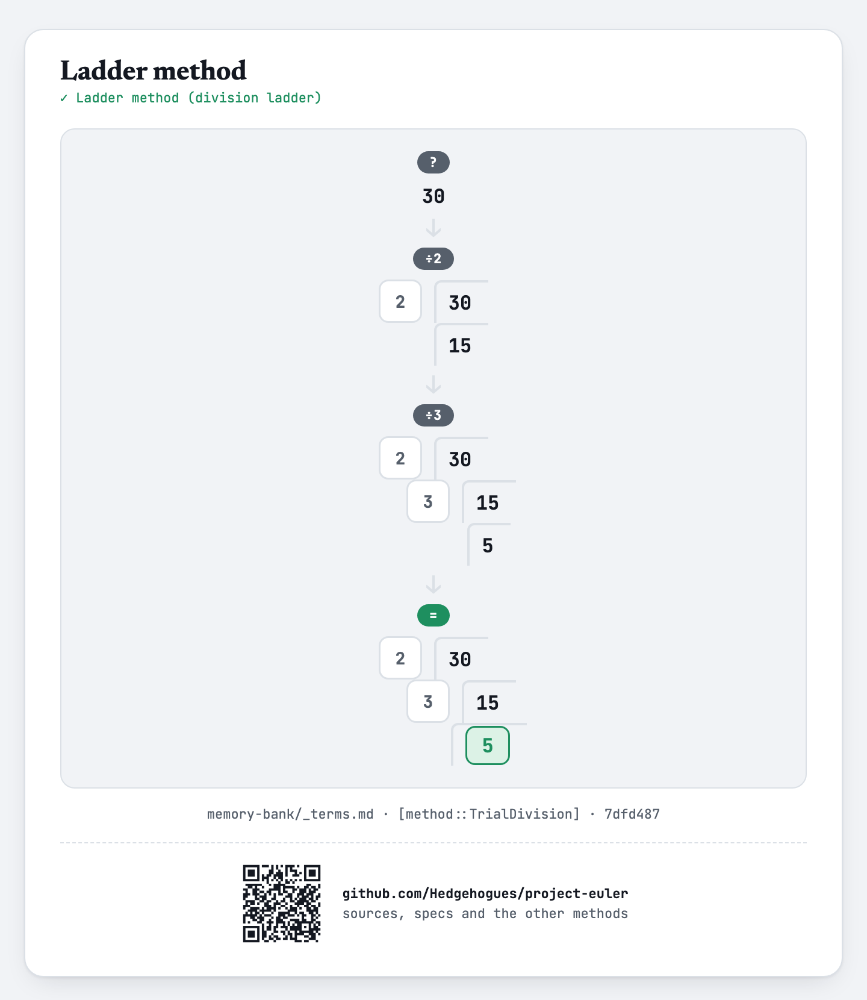
Sequence:
  1. Problem — the number 30, not yet broken down
  2. Transform ÷2 — divide by 2, quotient 15 written below
  3. Transform ÷3 — divide 15 by 3, quotient 5 written below
  4. Solution — 5 is already prime and divides no further — that is the largest prime factor
Limits:
  - MUST NOT: be used on large numbers with no small factors — a limit of the IDEA by cost: the loop runs to the square root, which is impractical for a semiprime of tens of digits (other factorization methods belong there)
  - MUST: in the picture, divide by primes starting from the smallest — a limit of the PICTURE: the ladder must mirror the loop's mechanics (all the 2s first, then odd divisors in increasing order), not an arbitrary split into any two factors as in a free-form factor tree
Source: [Wikipedia — Trial division](https://en.wikipedia.org/wiki/Trial_division) · picture: [Math = Love — Birthday Cake Method](https://mathequalslove.net/prime-factorization-using-birthday-cake-method/) · [Scaffolded Math and Science — Ladder Method](https://www.scaffoldedmath.com/2019/02/finding-gcf-and-lcm-with-upside-down-cake-method.html)
Example: `visualizations/examples/ladder-method.{css,html}` (no js needed — the values are static) → `visualizations/build/ladder-method.html`
Spec: [approaches](specs/approaches.md) · [visualizations](specs/visualizations.md)

## [method::SumOfSquares]
Class: entity
Standard name: Sum of squares formula · picture — square split into two triangular staircases (this catalog's own construction, verified but not independently sourced as a named device — see Picture note)
Essence: The sum of the first n squares has a closed-form cubic formula, computed directly instead of adding n terms one at a time.
Recognized by: you need 1² + 2² + ... + n² — the terms being added are themselves squares, not the plain numbers ([method::ArithmeticProgressionSum](#methodarithmeticprogressionsum) is for that, plain-number, case)
General case: sum of the first n squares = n(n+1)(2n+1) / 6, for any positive integer n
Picture: 
Sequence:
  1. Problem — a 4×4 square of unit cells, unlabeled; split it along the diagonal into two staircases?
  2. Transform ⊿ — the growing staircase (T(4)=10 cells) and the rest (T(3)=6 cells): every k² splits into T(k) + T(k−1), the triangular numbers on either side of k
  3. Solution — each of the four layers (k=1..4) split the same way; summing every blue staircase (1+3+6+10=20) and every red one (0+1+3+6=10) gives 30 = 1²+2²+3²+4²
Limits:
  - MUST NOT: be confused with the LINEAR sum 1+2+...+n — that is [method::ArithmeticProgressionSum](#methodarithmeticprogressionsum), a different, lower-degree closed form; the two are easy to conflate because both apply to "the first n numbers"
Note: no encyclopedic source gives a geometric derivation of the closed form n(n+1)(2n+1)/6 — Wikipedia's own Square pyramidal number article states it directly and says it "may be proved by mathematical induction" (an algebraic technique, not a picture). The picture therefore does NOT claim to derive the cubic closed form; what it DOES show, honestly and completely, is the real, checkable identity k² = T(k) + T(k−1) (T being the triangular number, already this catalog's own [method::ArithmeticProgressionSum](#methodarithmeticprogressionsum) at n=k) — summing that identity over k=1..n is a genuine, verifiable route to the same total, one level short of the final algebraic simplification into the cubic form. An earlier version of this picture stacked the four layers, counted each (16, 9, 4, 1), and then simply asserted "= 4·5·9/6" with no visible connection between the count and the formula — caught by the user asking directly what in the picture explains how the approach's result is obtained.
Source: [Wikipedia — Square pyramidal number](https://en.wikipedia.org/wiki/Square_pyramidal_number)
Example: `visualizations/examples/sum-of-squares.{css,html}` (no js needed — the values are static) → `visualizations/build/sum-of-squares.html`
Spec: [approaches](specs/approaches.md) · [visualizations](specs/visualizations.md)

## [method::EuclideanAlgorithm]
Class: entity
Standard name: Euclidean algorithm
Essence: To find the greatest common divisor of two numbers, keep replacing the larger one by the remainder of dividing it by the smaller — repeat until nothing is left over; what remains is the answer.
Recognized by: you need the greatest common divisor of two numbers, or need to reduce a fraction/ratio to lowest terms, or need to check whether two numbers share no common factor at all
General case: gcd(a, 0) = a; gcd(a, b) = gcd(b, a mod b) for b > 0 — holds for any two non-negative integers, and always terminates (the number of steps is at most about 5 times the number of decimal digits of the smaller number)
Picture: 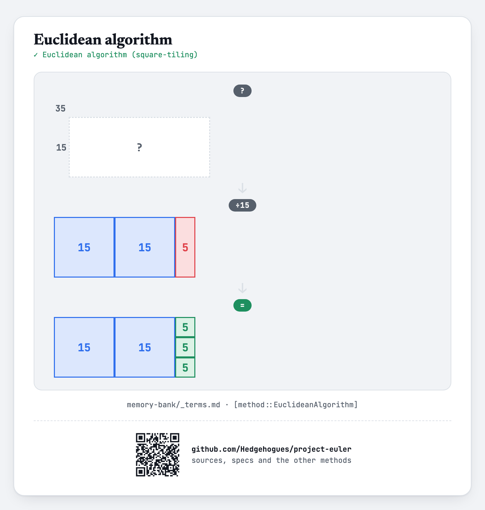
Sequence:
  1. Problem — a 35×15 rectangle; what size of square tiles it exactly is unknown
  2. Transform ÷15 — two 15×15 squares tile part of the rectangle, leaving a 5×15 strip over
  3. Solution — that strip is exactly covered by three 5×5 squares with nothing left over; 5 is the greatest common divisor
Limits:
  - MUST NOT: be applied to negative numbers without first taking absolute values — a limit of the IDEA: the remainder step assumes both numbers are non-negative
Source: [Wikipedia — Euclidean algorithm](https://en.wikipedia.org/wiki/Euclidean_algorithm) · [cp-algorithms — Euclidean algorithm for computing GCD](https://cp-algorithms.com/algebra/euclid-algorithm.html)
Example: `visualizations/examples/euclidean-algorithm.{css,html}` (no js needed — the values are static) → `visualizations/build/euclidean-algorithm.html`
Spec: [approaches](specs/approaches.md) · [visualizations](specs/visualizations.md)

## [method::LCMViaGCD]
Class: entity
Standard name: Least common multiple via GCD · picture — tile-count swap (this catalog's own construction, not an independently named historical device — see Picture note)
Essence: Build the smallest number divisible by a whole list of numbers, one at a time — each new number only ever contributes the part of itself not already covered by what came before.
Recognized by: you need the smallest number that every number in a set or range divides into evenly ("smallest number divisible by all of 1..N") — the smallest common MULTIPLE, not the greatest common divisor
General case: lcm(a, b) = a·b / gcd(a, b); for a list or range of more than two numbers, fold this pairwise across every element in turn — lcm(a, b, c, ...) = lcm(lcm(a, b), c, ...)
Picture: 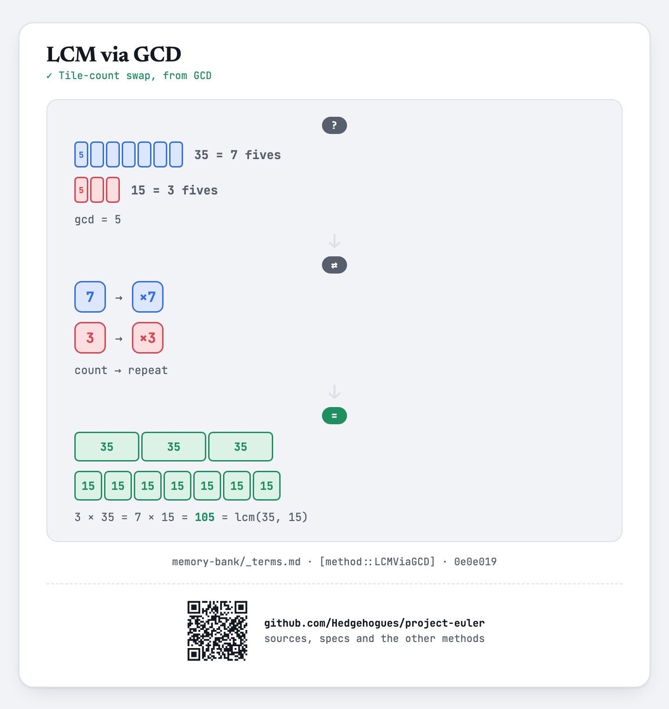
Sequence:
  1. Problem — 35 shown tiled by 7 units of 5 (their gcd), 15 shown tiled by 3 units of 5 — the same unit exactly fits both, a different number of times each
  2. Transform ⇄ — swap the counts: the 7 tiles counted inside 35 become how many times 15 repeats, and the 3 tiles counted inside 15 become how many times 35 repeats
  3. Solution — 3 × 35 = 7 × 15 = 105 = lcm(35, 15); both rows reach the exact same length, because that is precisely what the swap guarantees
Limits:
  - MUST NOT: be computed by just multiplying every number together — that overcounts factors the numbers already share; dividing by the gcd at each step is exactly what keeps the running result minimal
Note: a standard LCM picture exists for a DIFFERENT technique — a Venn diagram of each number's prime factors, shared primes in the overlap — but drawing it here would show the factoring approach this method exists specifically to avoid (factoring is expensive, gcd is cheap). The picture used instead is not independently famous by its own name: it is this catalog's own construction, deliberately drawn to differ from [method::EuclideanAlgorithm](#methodeuclideanalgorithm)'s square-tiling in both composition (linear tile-count-and-swap, not a shrinking rectangle) and in what it visibly derives (WHY the repeat counts 3 and 7 are what they are, shown by literally counting tiles, not asserted in a caption) — even though the same gcd, 5, anchors both pictures. This idea's entire mechanism runs through EuclideanAlgorithm — unlike Precomputation and BinarySearch (independently useful without each other), this one cannot even be stated without the gcd it depends on.
Source: [Wikipedia — Least common multiple](https://en.wikipedia.org/wiki/Least_common_multiple)
Example: `visualizations/examples/lcm-via-gcd.{css,html}` (no js needed — the values are static) → `visualizations/build/lcm-via-gcd.html`
Spec: [approaches](specs/approaches.md) · [visualizations](specs/visualizations.md)

## [method::SieveOfEratosthenes]
Class: entity
Standard name: Sieve of Eratosthenes
Essence: To list every prime up to a limit, start with all numbers unmarked, then repeatedly take the next unmarked number as a prime and cross out all of its multiples — whatever survives unmarked all the way through is exactly the primes.
Recognized by: you need ALL the primes up to some bound N at once, not a yes/no test or a factorization of one single given number ([method::TrialDivision](#methodtrialdivision) is for that, one-number case)
General case: for a limit N, it suffices to cross multiples of each prime p starting at p&sup2; and only for p &le; sqrt(N) — every composite below p&sup2; was already crossed by a smaller prime factor; runs in O(N log log N)
Picture: 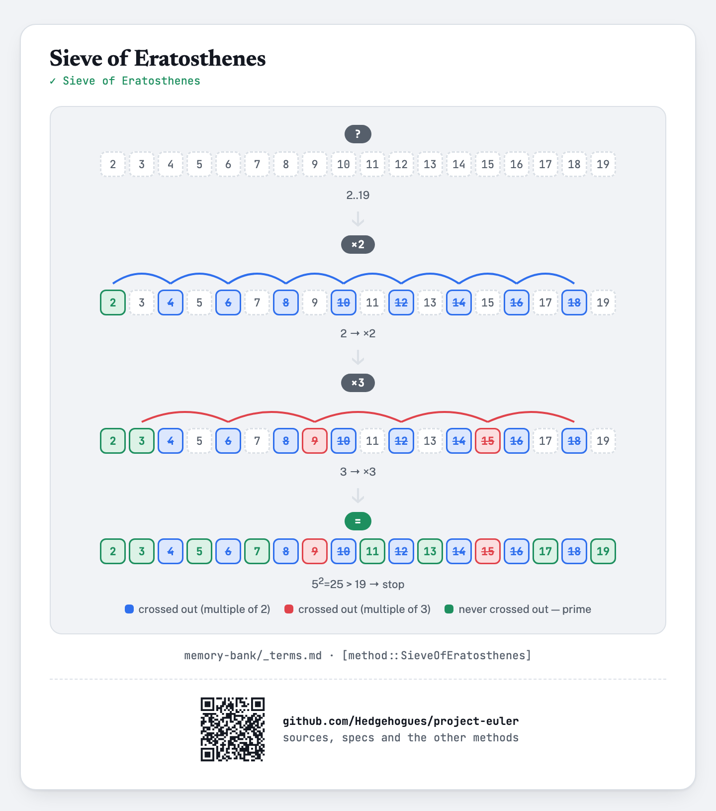
Sequence:
  1. Problem — numbers 2 to 19, none checked yet
  2. Transform ×2 — 2 is the first unmarked number, a prime; cross out every multiple of it (4, 6, 8, 10, 12, 14, 16, 18)
  3. Transform ×3 — 3 is the next unmarked number, a prime; cross out its multiples (6, 9, 12, 15, 18) — 9 and 15 are newly crossed, the rest were already gone
  4. Solution — nothing past 3 needs checking (the next candidate, 5, has 5&sup2;=25 &gt; 19); the 8 numbers never crossed out are exactly the primes below 20
Limits:
  - MUST NOT: be used to test or factor one single large number in isolation — a limit of the IDEA: building the whole array up to that number costs memory and time nobody needs for one query ([method::TrialDivision](#methodtrialdivision) is for that case)
  - MUST: the picture only crosses multiples of primes up to sqrt(limit) — a limit of the PICTURE: showing every divisor's hops instead of stopping at the square root would draw marks already covered by a smaller prime, obscuring why the sieve is allowed to stop early
Source: [Wikipedia — Sieve of Eratosthenes](https://en.wikipedia.org/wiki/Sieve_of_Eratosthenes) · [cp-algorithms — Sieve of Eratosthenes](https://cp-algorithms.com/algebra/sieve-of-eratosthenes.html)
Example: `visualizations/examples/sieve-of-eratosthenes.{css,html,js}` → `visualizations/build/sieve-of-eratosthenes.html`
Spec: [approaches](specs/approaches.md) · [visualizations](specs/visualizations.md)

## [method::NthPrimeBound]
Class: entity
Standard name: Upper bound on the nth prime · picture — number-line ceiling (this catalog's own construction, not an independently named historical device — see Picture note)
Essence: Before searching for the Nth prime, get an explicit numeric ceiling on how large it can possibly be from a proven inequality, instead of guessing a limit or growing the search open-endedly.
Recognized by: you are told only the INDEX N of a prime (not any bound on the prime's own size) and need to know in advance how far a search or a sieve must reach to be certain of finding it
General case: for n &ge; 6, the nth prime pn satisfies n(ln n + ln ln n &minus; 1) &lt; pn &lt; n(ln n + ln ln n) — the upper half alone is enough to size a sieve safely; this inequality is a sharpened, explicit-for-every-n form of [method::PrimeNumberTheorem](#methodprimenumbertheorem)'s limit statement
Picture: 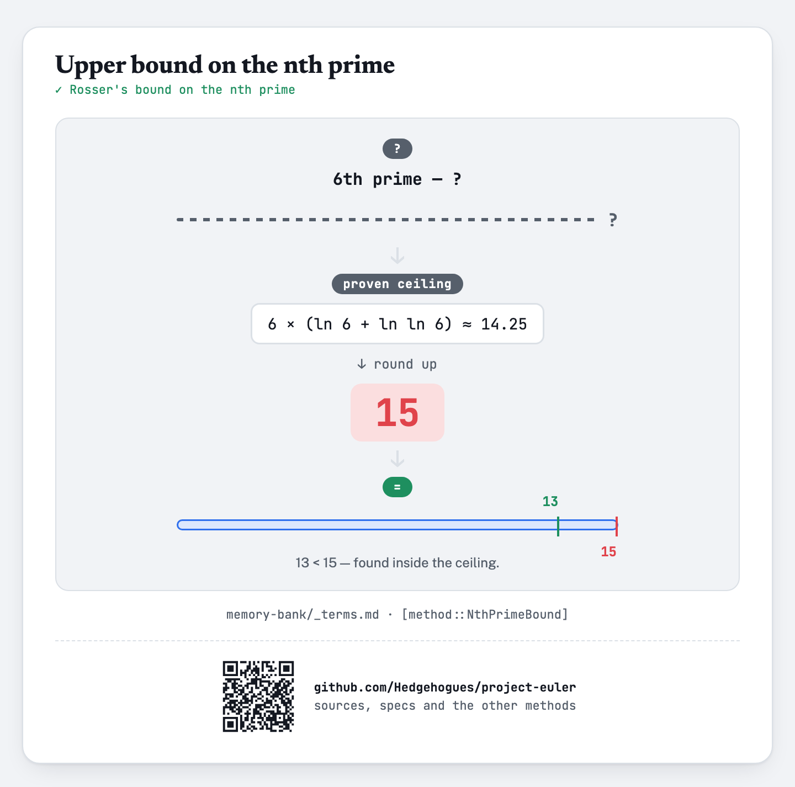
Sequence:
  1. Problem — find the 6th prime; the number line has no marked end, only a "?"
  2. Transform bound — the proven inequality evaluated at n=6: 6 &times; (ln 6 + ln ln 6) &asymp; 14.25, rounded up to a ceiling of 15
  3. Solution — the 6th prime, 13, lands safely inside that ceiling of 15
Limits:
  - MUST NOT: be used for n &lt; 6 — a limit of the IDEA: the inequality is proven only from n=6 upward; smaller n are checked directly instead
  - MUST: pad the computed bound rather than use it exactly at the boundary — a limit of PRACTICE, not of the theorem: the inequality is proven exact, but floating-point evaluation of ln/ln ln can round down by a hair right at the boundary
Note: No encyclopedic source draws a picture for this inequality (checked: Wikipedia's Prime-counting function article states the bound as a formula only, no diagram; no published plot comparing p_n against the bound was found anywhere encyclopedic) — the idea itself is standard and sourced below; the picture is this catalog's own construction, honestly not attributed to an established visual tradition the way [method::SieveOfEratosthenes](#methodsieveoferatosthenes)'s grid is. This picture deliberately does NOT attempt to show WHY one unit of the formula has length ln n + ln ln n — an earlier version tried to render that arithmetic as 6 tiles laid end to end, but a tile literally labeled with the formula itself explains nothing about where the formula comes from, only restates it geometrically (direct user feedback: "useless"). The real "why" — primes thinning out in a way this exact ratio predicts — is a separate, independently standard fact with its own real picture: [method::PrimeNumberTheorem](#methodprimenumbertheorem).
Source: [Wikipedia — Prime-counting function](https://en.wikipedia.org/wiki/Prime-counting_function) (bounds section, upper bound attributed to Rosser, 1941)
Example: `visualizations/examples/nth-prime-bound.{css,html}` (no js needed — the values are static) → `visualizations/build/nth-prime-bound.html`
Spec: [approaches](specs/approaches.md) · [visualizations](specs/visualizations.md)

## [method::PrimeNumberTheorem]
Class: entity
Standard name: Prime number theorem
Essence: As numbers grow, the fraction of them that are prime keeps shrinking, in a way one explicit formula — a number divided by its own natural logarithm — predicts increasingly accurately.
Recognized by: you need to estimate how many primes lie below some bound, or how far apart primes typically run near a given size, without counting them one by one, and an approximate/asymptotic answer is acceptable
General case: pi(x), the count of primes up to x, satisfies pi(x) / (x &divide; ln x) &rarr; 1 as x &rarr; infinity; equivalently, near a number of size x, roughly one integer in every ln(x) is prime — [method::NthPrimeBound](#methodnthprimebound) is this same fact turned around (given the COUNT n, bound the SIZE of the nth prime) and sharpened into an explicit inequality that holds at every n, not just in the limit
Picture: 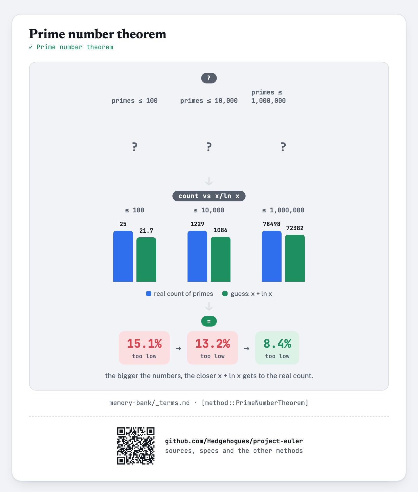
Sequence:
  1. Problem — how many primes lie at or below 100? Below 10,000? Below 1,000,000? Unknown.
  2. Transform count vs x&divide;ln x — the real, counted totals (25, 1229, 78498) next to the formula's guess (21.7, 1086, 72382) at each of the three scales
  3. Solution — the guess undershoots by 15.1%, then 13.2%, then 8.4% — the relative gap shrinks as the numbers grow
Limits:
  - MUST NOT: be read as an exact formula, or as increasingly accurate at every individual scale without exception — a limit of the IDEA: it is a LIMIT statement (exact only as x &rarr; infinity); the true count is known to run persistently a little above the guess at accessible scales (Littlewood proved the sign of the gap even flips infinitely often much further out)
  - MUST: the three example scales are real, independently counted primes, not invented or interpolated — a limit of the PICTURE keeping it honest, not of the idea
Source: [Wikipedia — Prime number theorem](https://en.wikipedia.org/wiki/Prime_number_theorem) · [Wikipedia — Prime-counting function](https://en.wikipedia.org/wiki/Prime-counting_function) (the standard "ratio of &pi;(x) to x/log x and Li(x)" graph — this picture is this catalog's own discretized rendering of that same comparison at three concrete, verified scales, not a copy of the continuous plot)
Example: `visualizations/examples/prime-number-theorem.{css,html}` (no js needed — the values are static) → `visualizations/build/prime-number-theorem.html`
Spec: [approaches](specs/approaches.md) · [visualizations](specs/visualizations.md)
