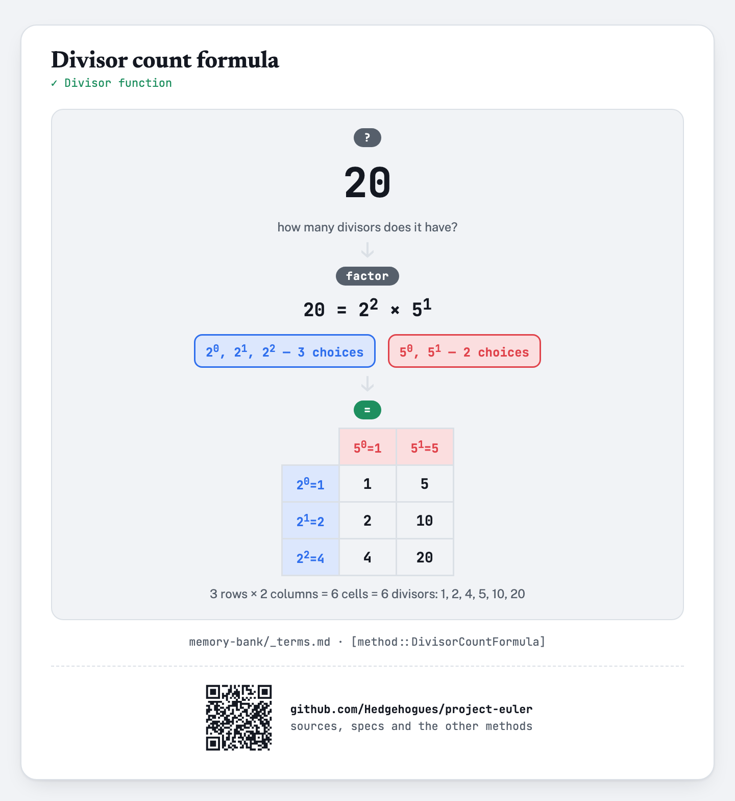

# euler012 — Highly divisible triangular number

For each of `T` given values of `N` (`1 ≤ N ≤ 10^3`), find the first triangular number to have
more than `N` divisors.

## Approach

- The `n`th triangular number is `T_n = n(n+1)/2` — an arithmetic-progression sum.
- `gcd(n, n+1) = 1`, so splitting `T_n` into its even half (`n/2` or `(n+1)/2`, whichever is a
  whole number) and the other, odd factor gives two COPRIME pieces — the divisor-count formula is
  multiplicative on coprime factors, so `d(T_n) = d(a) · d(b)` without ever factoring `T_n`
  itself, only the two smaller pieces.
- A smallest-prime-factor sieve (built once, up to a fixed bound covering every `a`/`b` that can
  appear for `n` up to 1000) turns each factorization into a fast walk of prime powers.
- Walk `n = 1, 2, 3, ...`, compute `d(T_n)` this way, and record the first triangular number that
  clears each threshold `1..1000` — since higher thresholds are cleared no earlier than lower
  ones, one pass fills every answer.

Status: **Accepted**, 100% on HackerRank (submission 1410851713, 2026-07-12). Re-verified live on
2026-09-01: matches the official sample (`N=1→3`, `N=2→6`, `N=3→6`, `N=4→28`) and an exhaustive
brute-force cross-check (independent trial-division divisor count) across the ENTIRE valid range
`N = 1..1000` — exact match on every value.

Full requirements and acceptance criteria: [spec.md](../../memory-bank/specs/tasks/euler012.md).

## The idea(s) behind it

**Sum of an arithmetic progression** — the triangular number formula `n(n+1)/2` is this general
formula's `k=1` special case.
[`[method::ArithmeticProgressionSum]`](../../memory-bank/_terms.md#methodarithmeticprogressionsum)

[](../../memory-bank/visualizations/build/gauss-pairing.html)

**Sieving over multiples** — the same mark-every-multiple mechanism as the Sieve of Eratosthenes,
but each cell keeps the smallest prime factor instead of a plain composite flag, so any number up
to the sieve's limit can be factored quickly afterward. This is the ordinary O(N log log N) sweep,
not the O(N) linear sieve (no list of found primes, no early-break condition).
[`[method::SievingOverMultiples]`](../../memory-bank/_terms.md#methodsievingovermultiples)

**Divisor count formula** — the number of divisors comes straight from the exponents in a prime
factorization, and multiplies across coprime factors — exactly what lets `T_n` be counted via its
two coprime halves instead of itself.
[`[method::DivisorCountFormula]`](../../memory-bank/_terms.md#methoddivisorcountformula)

[](../../memory-bank/visualizations/build/divisor-count-formula.html)

**Multiplicative function** — The triangular number splits into two factors sharing no prime, and their divisor counts multiply.
[`[method::MultiplicativeFunction]`](../../memory-bank/_terms.md#methodmultiplicativefunction)

**Offline algorithm** — The thresholds are all read first and answered in one ascending pass.
[`[method::OfflineAlgorithm]`](../../memory-bank/_terms.md#methodofflinealgorithm)

[](../../memory-bank/visualizations/build/offline-algorithm.html)

## Build & run

```
g++ -O2 -std=c++20 -o solution solution.cpp && ./solution < input.txt
```
