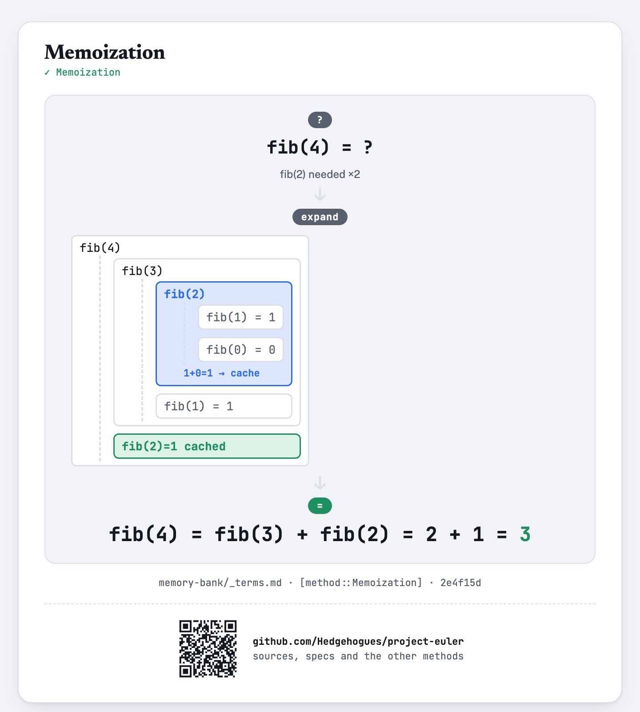
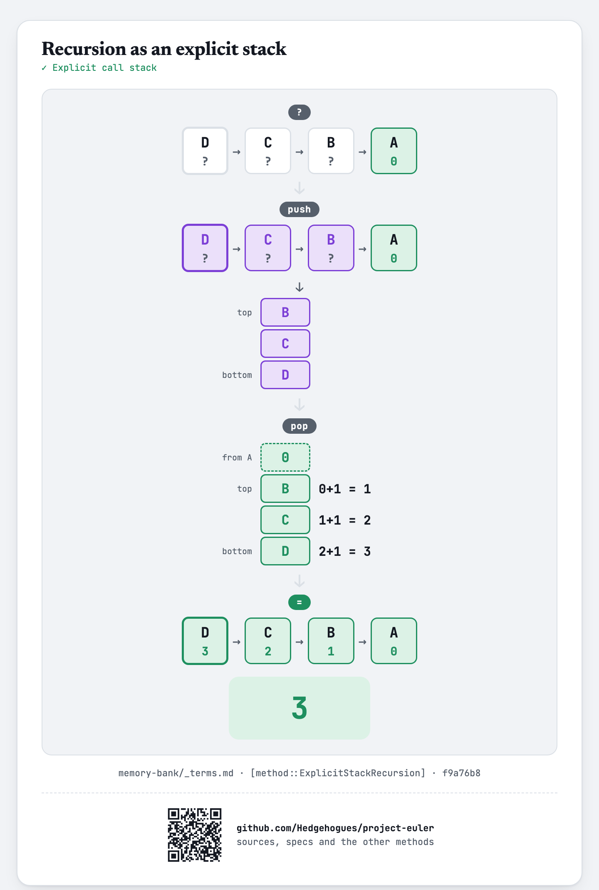

# euler014 — Longest Collatz sequence

For each of `T` given values of `N` (`1 ≤ N ≤ 5×10^6`), find the starting number below `N` that
produces the longest Collatz chain (`n → n/2` if even, `n → 3n+1` if odd, stopping at `1`).

## Approach

- Walk each starting number's chain until it reaches either `1` or a number whose chain length is
  already known, then fill in every number visited along the way — so no chain segment is ever
  walked twice.
- Track, for every threshold up to the largest queried `N`, which starting number below it has
  produced the longest chain seen so far (chain lengths only ever get confirmed as numbers are
  processed in increasing order, so this running best answers every threshold in one pass).
- Answer each query with a single array lookup.

Status: **Accepted**, 100% on HackerRank (submission 1410851736, 2026-07-12). Re-verified live on
2026-09-01: matches the official sample (`N=10→9`, `N=15→9`, `N=20→19`) and an exhaustive
brute-force cross-check (independent memoized recursion) across `N = 1..200000` — exact match on
every value.

Full requirements and acceptance criteria: [spec.md](../../memory-bank/specs/tasks/euler014.md).

## The idea(s) behind it

**Memoization** — once a chain's length is known, later chains that run into it reuse that stored
length instead of walking it again.
[`[method::Memoization]`](../../memory-bank/_terms.md#methodmemoization)

[](../../memory-bank/visualizations/build/memoization.html)

**Recursion as an explicit stack** — The descent is recorded in a stack of its own and unwound to fill in every length on the path.
[`[method::ExplicitStackRecursion]`](../../memory-bank/_terms.md#methodexplicitstackrecursion)

[](../../memory-bank/visualizations/build/explicit-stack.html)

**Prefix sum** — The best chain so far is carried along one ascending pass, with the tie-break stated.
[`[method::PrefixSum]`](../../memory-bank/_terms.md#methodprefixsum)

[](../../memory-bank/visualizations/build/prefix-sum.html)

## Build & run

```
g++ -O2 -std=c++20 -o solution solution.cpp && ./solution < input.txt
```
