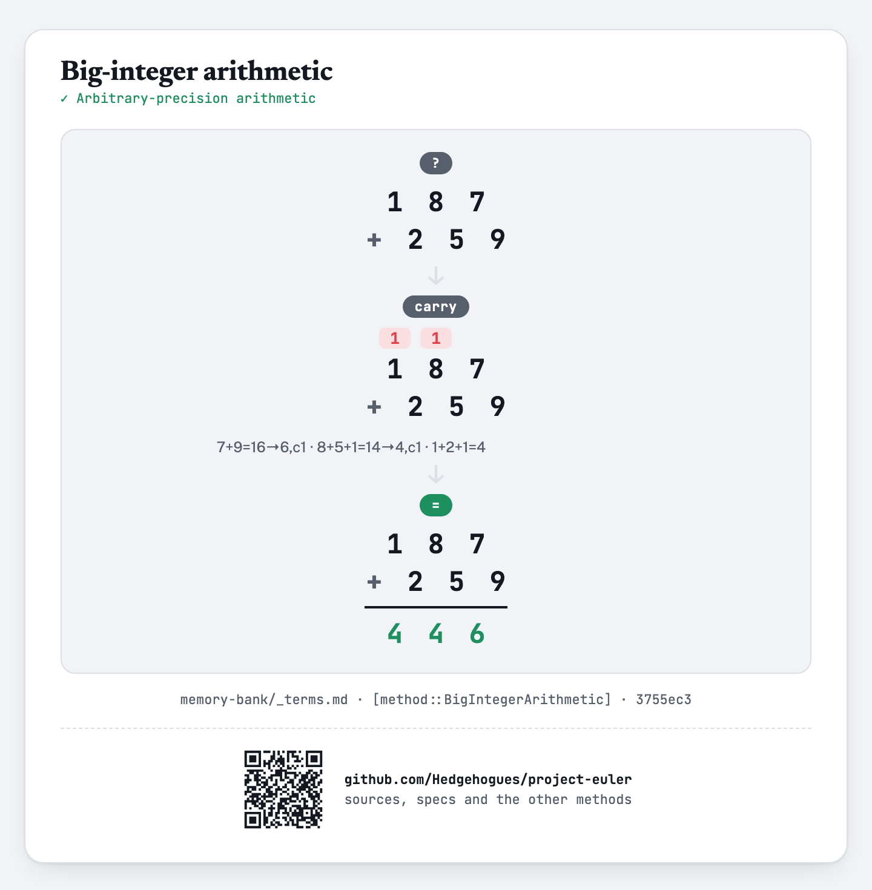
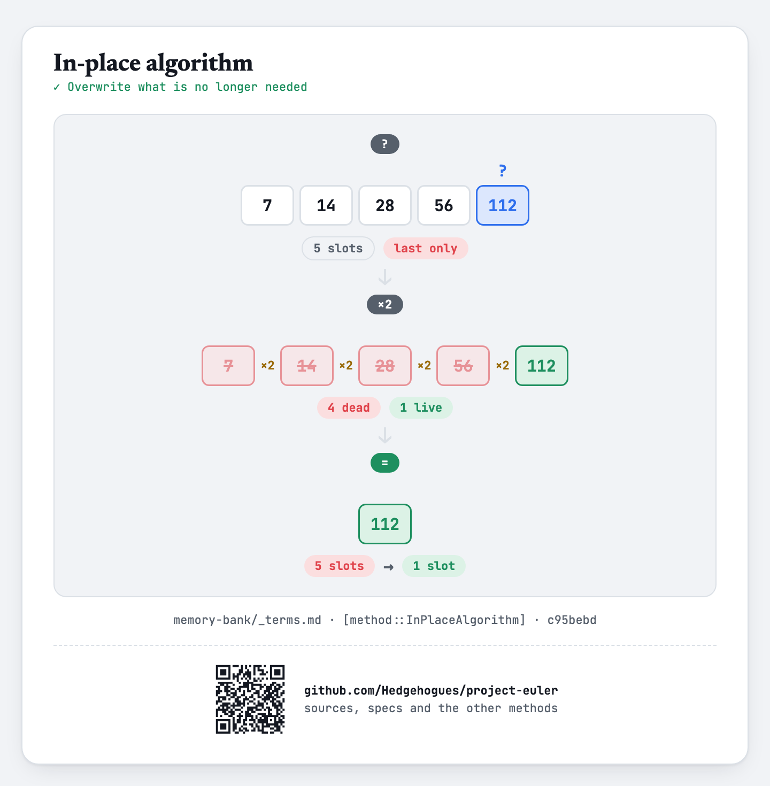

# euler016 — Power digit sum

For each of `T` given values of `N` (`1 ≤ N ≤ 10^4`), find the sum of the digits of `2^N`.

## Approach

- `2^10000` has thousands of digits — far beyond any native integer type — so it is built as a
  digit array, doubled `N` times by multiplying every digit by 2 and propagating carries, the same
  carry mechanism as digit-array addition.
- Every doubling step's digit sum is cached, so each query is a single array lookup.

Status: **Accepted**, 100% on HackerRank (submission 1410851745, 2026-07-12). Re-verified live on
2026-09-01: matches the official sample (`N=3→8`, `N=4→7`, `N=7→11`) and 275 cases (every 37th `N`
from 0 to 10000, plus the boundaries) cross-checked against an independent big-integer power —
exact match on every case.

Full requirements and acceptance criteria: [spec.md](../../memory-bank/specs/tasks/euler016.md).

## The idea(s) behind it

**Big-integer arithmetic** — `2^N` is kept as a digit array throughout; doubling it means
multiplying every digit by 2 and carrying, the same mechanism as column addition, just with a
different per-column operation.
[`[method::BigIntegerArithmetic]`](../../memory-bank/_terms.md#methodbigintegerarithmetic)

[](../../memory-bank/visualizations/build/big-integer-arithmetic.html)

Every digit sum from `2^0` up to `2^10000` is built once, not once per query — the same
[`[method::Precomputation]`](../../memory-bank/_terms.md#methodprecomputation) pattern already
catalogued.

**In-place algorithm** — The digit array is doubled over itself, since only the final power is wanted.
[`[method::InPlaceAlgorithm]`](../../memory-bank/_terms.md#methodinplacealgorithm)

[](../../memory-bank/visualizations/build/in-place-algorithm.html)

**Positional notation** — The power is held as a digit sequence and its digits are what the question asks about.
[`[method::PositionalNotation]`](../../memory-bank/_terms.md#methodpositionalnotation)

[](../../memory-bank/visualizations/build/positional-notation.html)

## Build & run

```
g++ -O2 -std=c++20 -o solution solution.cpp && ./solution < input.txt
```
