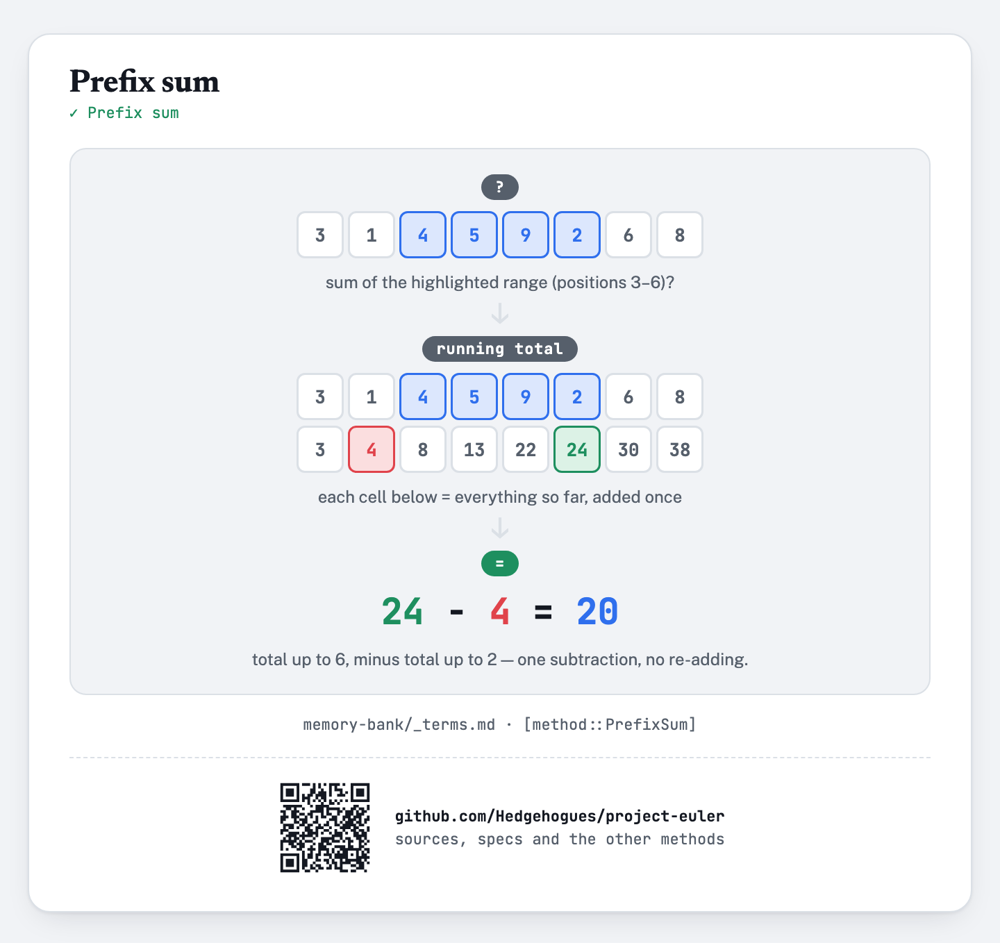

# euler021 — Amicable numbers

For each of `T` given values of `N` (`1 ≤ N ≤ 10^5`), find the sum of all amicable numbers below
`N` (numbers `a` where the sum of `a`'s proper divisors is some `b ≠ a`, and the sum of `b`'s
proper divisors is `a` again).

## Approach

- Compute the sum of proper divisors for EVERY number up to the limit at once: for each `d` from
  `1` upward, add `d` to every multiple of `d` beyond itself — the same "touch every multiple"
  mechanism as the Sieve of Eratosthenes, just accumulating a running sum per number instead of
  marking primality.
- A number `a` is amicable when its divisor sum `b` differs from `a`, is itself in range, and `b`'s
  own divisor sum comes back to `a`.
- Prefix-sum the amicable numbers once, so each query is a single lookup.

Status: **Accepted**, 100% on HackerRank (submission 1410851780, 2026-07-12). Re-verified live on
2026-09-01: matches the official sample (`N=300 → 504`) and an exhaustive brute-force cross-check
(independent trial-division divisor sum) across the ENTIRE valid range `N = 1..100000` — exact
match on every value.

Full requirements and acceptance criteria: [spec.md](../../memory-bank/specs/tasks/euler021.md).

## The idea(s) behind it

**Prefix sum** — the running total of amicable numbers turns every query into a single
subtraction-free lookup.
[`[method::PrefixSum]`](../../memory-bank/_terms.md#methodprefixsum)

[](../../memory-bank/visualizations/build/prefix-sum.html)

The divisor-sum sieve itself isn't a separate catalogued technique — no encyclopedic source was
found describing this exact "sieve, but summing instead of marking" variant on its own, only
blogs/teaching sites, so it stays a plain variant of
[`[method::SieveOfEratosthenes]`](../../memory-bank/_terms.md#methodsieveoferatosthenes)'s
"touch every multiple" mechanism, described here rather than catalogued separately.

## Build & run

```
g++ -O2 -std=c++20 -o solution solution.cpp && ./solution < input.txt
```
