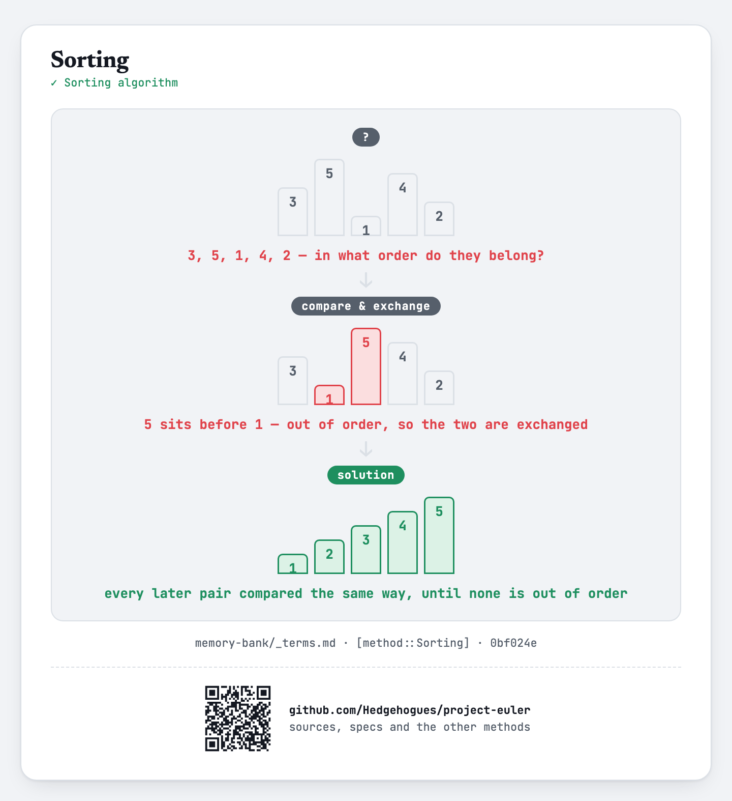

# euler022 — Names scores

Given `N` names, sort them alphabetically; each name's score is its alphabetical position times
the sum of its letters' alphabet values (`A=1`, ..., `Z=26`). For each of `Q` queried words,
report that word's score.

## Approach

- Sort the names alphabetically, then compute each name's score directly from its position and
  letter values.
- Store every name's score in a lookup table (`unordered_map`) and answer each query directly.

Status: **Accepted**, 100% on HackerRank (submission 1410851776, 2026-07-12). Re-verified live on
2026-09-01: matches the official sample (`PAMELA → 240`).

Full requirements and acceptance criteria: [spec.md](../../memory-bank/specs/tasks/euler022.md).

## The idea(s) behind it

**Sorting** — the names are rearranged into alphabetical order before anything else, since a
name's score depends on its position in that order, not on the order it was read in.
[`[method::Sorting]`](../../memory-bank/_terms.md#methodsorting)

[](../../memory-bank/visualizations/build/sorting.html)

**Lookup table** — The scores are answered from a dictionary keyed by the name itself.
[`[method::LookupTable]`](../../memory-bank/_terms.md#methodlookuptable)

[](../../memory-bank/visualizations/build/lookup-table.html)

## Build & run

```
g++ -O2 -std=c++20 -o solution solution.cpp && ./solution < input.txt
```
