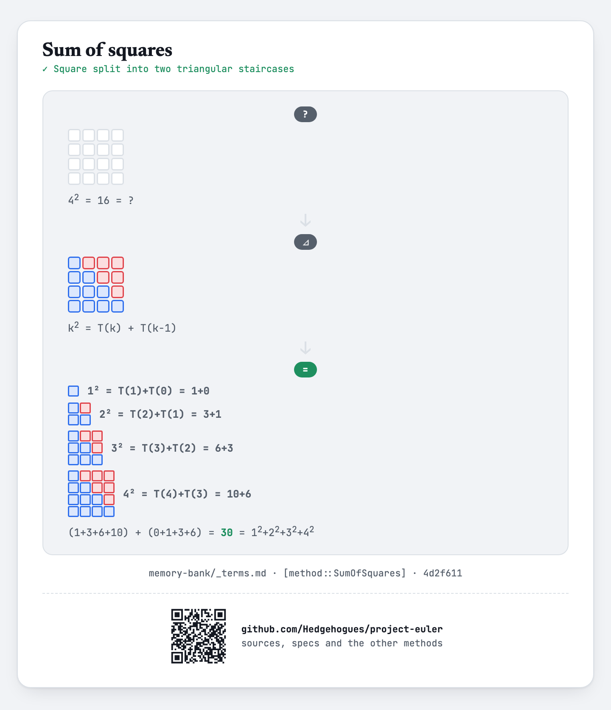

# euler028 — Number spiral diagonals

For each of `T` given odd values of `N`, find the sum of the numbers on both diagonals of the
`N×N` spiral (built by starting at 1 and spiralling outward), modulo `10^9+7`.

## Approach

- Ring `k` (counting outward from the center, `k = 1..m` where `m = (N-1)/2`) has its four corners
  at `(2k+1)² - 0·2k`, `-1·2k`, `-2·2k`, `-3·2k` — summing them gives `16k² + 4k + 4` per ring.
- Summed over all rings: `16 · Σk²` (a sum of squares) `+ 4 · Σk` (an arithmetic-progression sum)
  `+ 4m`, plus the center cell itself (`1`).
- Both sums are the closed-form formulas, not loops — the whole answer is O(1) per query, computed
  under the modulus with a precomputed modular inverse of 6.

Status: **Accepted**, 100% on HackerRank (submission 1410851942, 2026-07-12). Re-verified live on
2026-09-01: matches the official sample (`N=3→25`, `N=5→101`) and 1000 cases (every odd `N` from 1
to 1999) cross-checked against an independent direct spiral simulation — exact match on every
case.

Full requirements and acceptance criteria: [spec.md](../../memory-bank/specs/tasks/euler028.md).

## The idea(s) behind it

**Sum of squares formula** — the `16 · Σk²` term across all rings is this closed-form cubic
formula, not a loop.
[`[method::SumOfSquares]`](../../memory-bank/_terms.md#methodsumofsquares)

[](../../memory-bank/visualizations/build/sum-of-squares.html)

**Sum of an arithmetic progression** — the `4 · Σk` term is this same general formula (`k=1` step),
already catalogued.
[`[method::ArithmeticProgressionSum]`](../../memory-bank/_terms.md#methodarithmeticprogressionsum)

[](../../memory-bank/visualizations/build/gauss-pairing.html)

**Modular inverse via Fermat** and **fast exponentiation** — dividing by 6 under the modulus
reuses the same inverse-via-`p-2`-power machinery as euler015.
[`[method::ModularInverseFermat]`](../../memory-bank/_terms.md#methodmodularinversefermat) ·
[`[method::FastExponentiation]`](../../memory-bank/_terms.md#methodfastexponentiation)

## Build & run

```
g++ -O2 -std=c++20 -o solution solution.cpp && ./solution < input.txt
```
