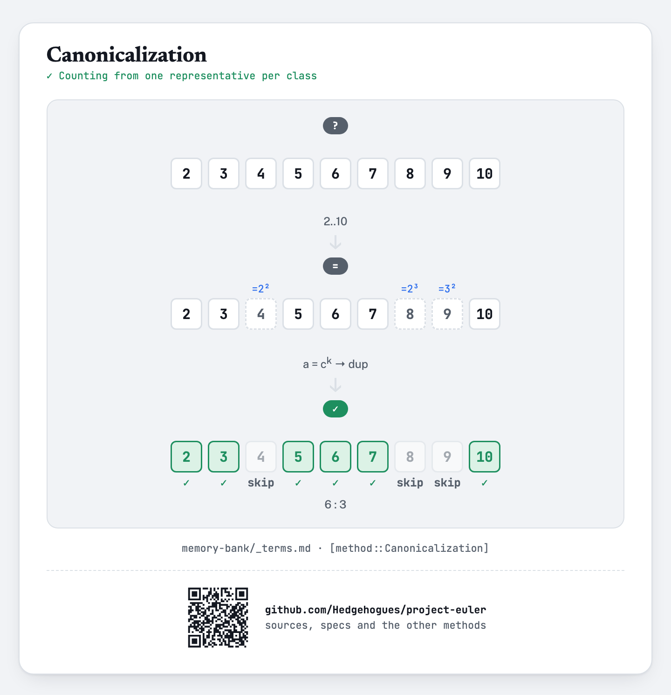
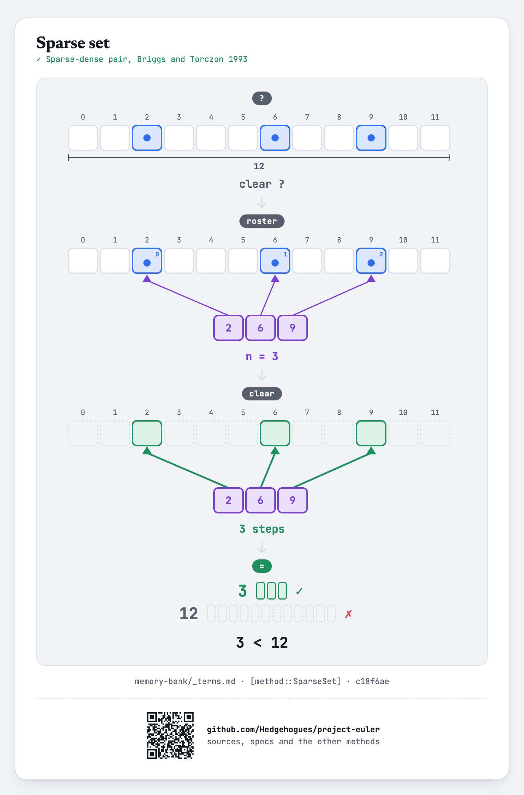

# euler029 — Distinct powers

Given `N`, count the distinct values of `aᵇ` for `2 ≤ a ≤ N` and `2 ≤ b ≤ N`.

## Approach

- `aᵇ` values as huge as `Nᴺ` rule out ever computing or storing the actual numbers — the count is
  built from exponents instead, grouped by base.
- Skip any `a` that is itself a perfect power of a smaller number already processed (`a = g^k` for
  some earlier `g`) — its whole family of powers is already covered by `g`'s family, since
  `a^b = g^(k·b)`.
- For each remaining ("primitive") base `g`, every `b` from `2..N` gives an exponent `g^1·b`; since
  `b` itself already ranges over `N-1` distinct values, those contribute `N-1` new values outright.
- For higher powers of the SAME `g` (`g², g³, ...`, each `≤ N`), an exponent `k·b` that lands at
  `N` or below is guaranteed to duplicate one already produced by the `k=1` case (since it's some
  value `b' = k·b ≤ N` too) — only exponents ABOVE `N` are genuinely new, and a small
  reusable "seen this round" array deduplicates those before adding to the count.

Status: **Accepted**, 100% on HackerRank (submission 1410851995, 2026-07-12). Re-verified live on
2026-09-01: matches the official sample (`N=5 → 15`), the classic known answer at `N=100`
(`9183`, the original Project Euler #29 answer), and 199 cases (`N=2..200`) cross-checked against
an independent brute-force set of the actual `aᵇ` values — exact match on every case.

Full requirements and acceptance criteria: [spec.md](../../memory-bank/specs/tasks/euler029.md).

## The idea(s) behind it

Skipping a base that is itself a power of a smaller, already-processed base is
[`[method::Canonicalization]`](../../memory-bank/_terms.md#methodcanonicalization): every base in
that base's equivalence class (2, 4, 8, ... all generate powers of 2) produces a set of exponent
values that is a subset of the smallest ("primitive") base's own — so only that one representative
is ever processed, and every other member is skipped outright.

[](../../memory-bank/visualizations/build/canonicalization.html)

Deduplicating exponents above `N` with a reusable seen-set (the `k=2..maxK` sweep within a single
primitive base) is a combinatorial technique specific to counting distinct powers, not a
separately catalogued general pattern.

**Sparse set** — The reuse buffer is cleared by walking the positions actually touched, not the whole array.
[`[method::SparseSet]`](../../memory-bank/_terms.md#methodsparseset)

[](../../memory-bank/visualizations/build/sparse-set.html)

## Build & run

```
g++ -O2 -std=c++20 -o solution solution.cpp && ./solution < input.txt
```
