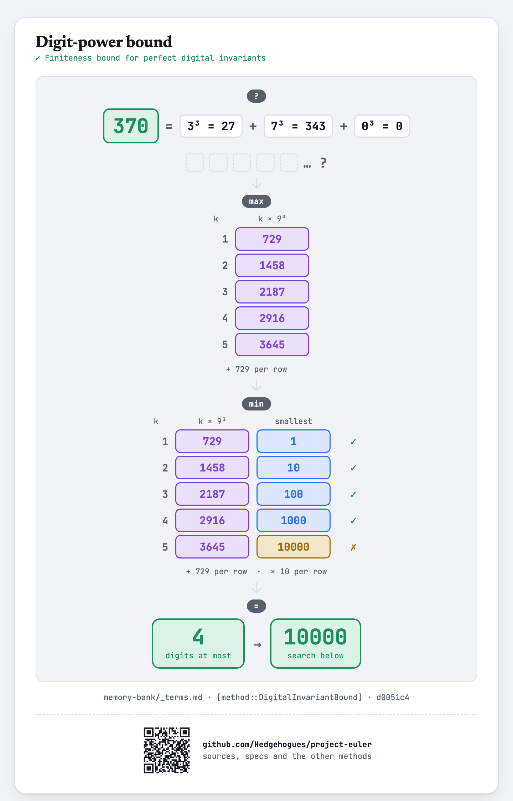
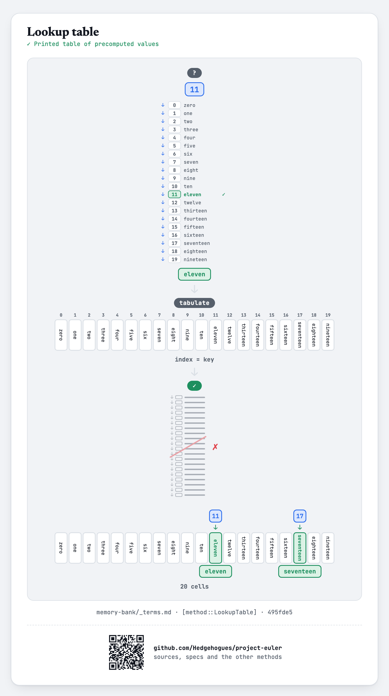

# euler030 — Digit Nth powers

Given `N` (`3 ≤ N ≤ 6`), find the sum of all numbers that equal the sum of the `N`th powers of
their own digits.

## Approach

- A `d`-digit number is at least `10^(d-1)`, but the largest possible sum of `N`th-power digits
  for a `d`-digit number is only `d · 9^N` — once `d · 9^N` falls below `10^(d-1)`, no number with
  that many digits (or more) can ever qualify, which gives a safe, provably-sufficient upper bound
  to search up to.
- Check every number up to that bound directly by summing its digits' `N`th powers.

Status: **Accepted**, 100% on HackerRank (submission 1410852010, 2026-07-12). Re-verified live on
2026-09-01: matches the official sample (`N=4 → 19316`, the classic original Project Euler #30
answer) and the full valid range `N=3..6`, cross-checked against an independent Python search over
the same derived bound — exact match on every value (`1301, 19316, 443839, 548834`).

Full requirements and acceptance criteria: [spec.md](../../memory-bank/specs/tasks/euler030.md).

## The idea(s) behind it

**Brute-force search** — the search bound is derived first (a `d`-digit number is at least `10^(d-1)`,
while its digit-power sum is at most `d · 9^N`) — at `N=6` that caps the range under `4×10^6`
candidates, so every number below it is simply checked directly.
[`[method::BruteForceSearch]`](../../memory-bank/_terms.md#methodbruteforcesearch)

[](../../memory-bank/visualizations/build/brute-force-search.html)

**Digit-power bound** — The largest reachable digit total is weighed against the smallest number of each length, which ends the search.
[`[method::DigitalInvariantBound]`](../../memory-bank/_terms.md#methoddigitalinvariantbound)

[](../../memory-bank/visualizations/build/digital-invariant-bound.html)

**Positional notation** — The candidate is taken apart into digits, which is what the condition is about.
[`[method::PositionalNotation]`](../../memory-bank/_terms.md#methodpositionalnotation)

[](../../memory-bank/visualizations/build/positional-notation.html)

**Lookup table** — Each digit own power is a ten-entry table computed once.
[`[method::LookupTable]`](../../memory-bank/_terms.md#methodlookuptable)

[](../../memory-bank/visualizations/build/lookup-table.html)

## Build & run

```
g++ -O2 -std=c++20 -o solution solution.cpp && ./solution < input.txt
```
