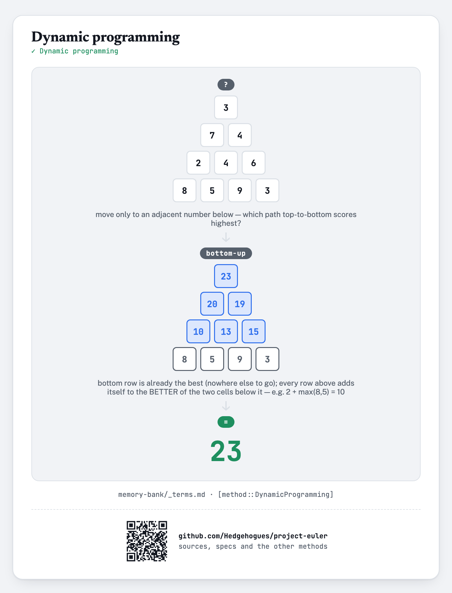
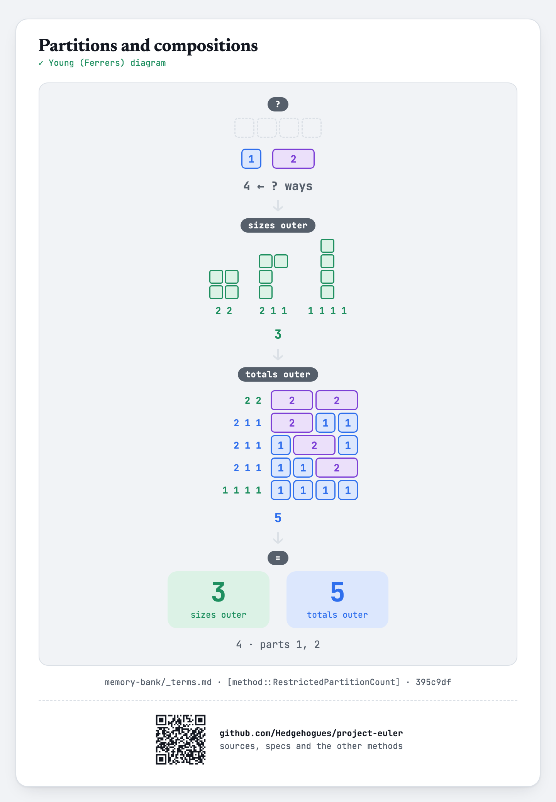

# euler031 — Coin sums

For each of `T` given values of `N` (`1 ≤ N ≤ 10^5`), find the number of ways to make `N` pence
using the eight English coins (1, 2, 5, 10, 20, 50, 100, 200), modulo `10^9+7`.

## Approach

- Build the answer for EVERY amount up to the largest queried `N` at once: for each coin value in
  turn, add its contribution to every amount that can use it, reusing amounts already built up
  with the coins considered so far.
- Each query is then a single array lookup.

Status: **Accepted**, 100% on HackerRank (submission 1410852016, 2026-07-12). Re-verified live on
2026-09-01: matches the official sample (`10→11`, `15→22`, `20→41`), the classic known answer at
`N=200` (`73682`, the original Project Euler #31 answer), and 2000 cases (`N=1..2000`)
cross-checked against an independent re-implementation of the same coin-DP — exact match on every
case.

Full requirements and acceptance criteria: [spec.md](../../memory-bank/specs/tasks/euler031.md).

## The idea(s) behind it

**Dynamic programming** — the number of ways to make each amount is built from the number of ways
to make smaller amounts, one coin denomination at a time.
[`[method::DynamicProgramming]`](../../memory-bank/_terms.md#methoddynamicprogramming)

[](../../memory-bank/visualizations/build/dynamic-programming.html)

Every amount's answer is built once, for every coin, before any query is answered — the same
[`[method::Precomputation]`](../../memory-bank/_terms.md#methodprecomputation) pattern already
catalogued.

**Partitions and compositions** — The nesting order of the two loops is what decides that arrangements are not counted apart.
[`[method::RestrictedPartitionCount]`](../../memory-bank/_terms.md#methodrestrictedpartitioncount)

[](../../memory-bank/visualizations/build/restricted-partitions.html)

## Build & run

```
g++ -O2 -std=c++20 -o solution solution.cpp && ./solution < input.txt
```
