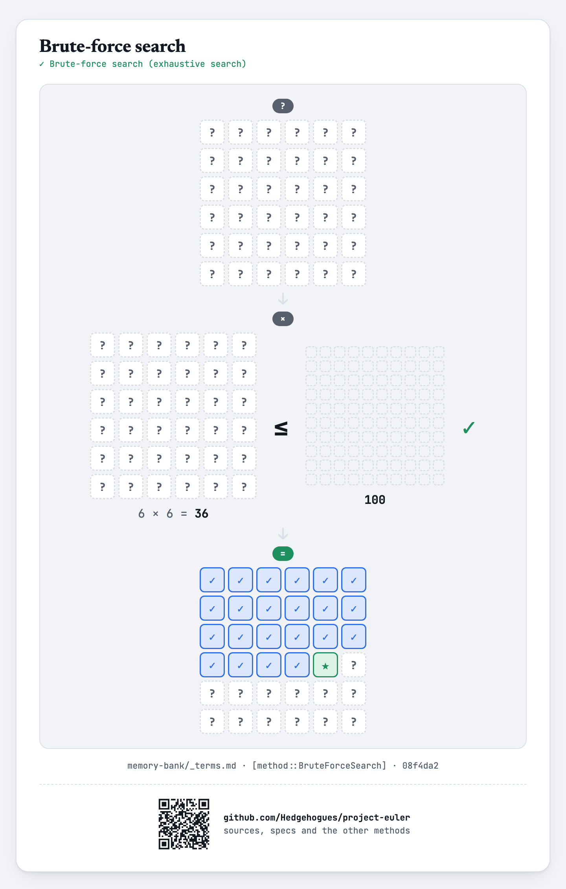
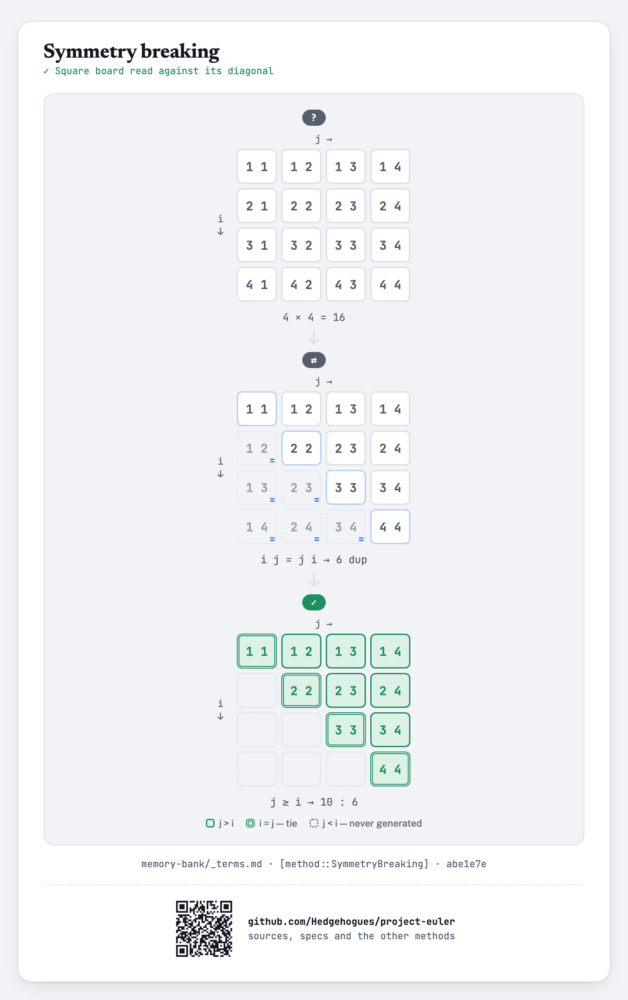
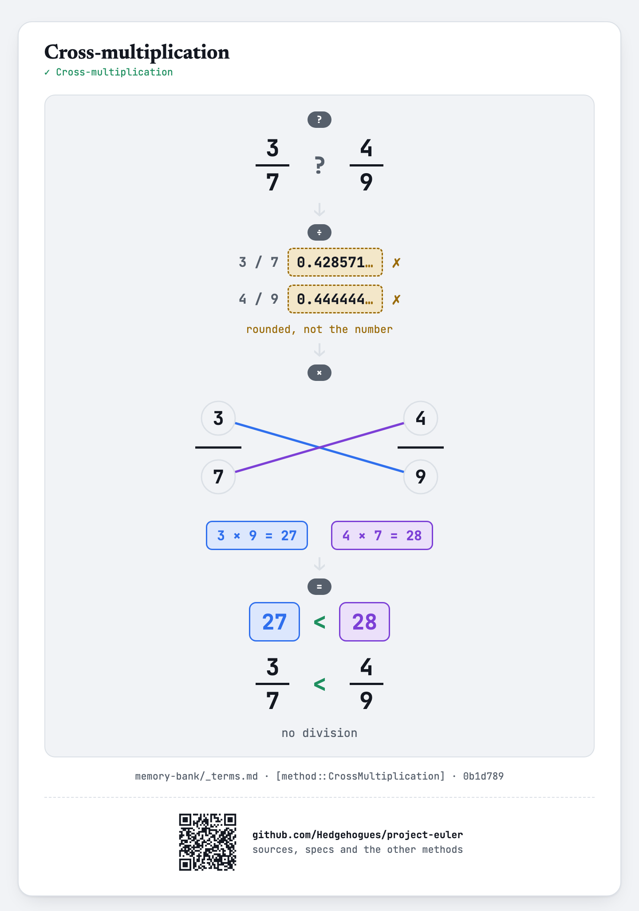
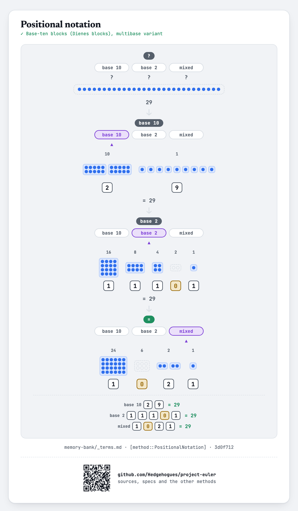

# euler033 — Digit canceling fractions

Given `N` (digit count) and `K` (how many digits to cancel), find every non-trivial `N`-digit
fraction where "incorrectly" cancelling `K` matching digits from numerator and denominator gives
the same value as the original fraction, and report the sum of the original numerators and
denominators.

## Approach

- For every `N`-digit number and every way of choosing `K` of its digit positions to "remove"
  (skipping any choice that removes a 0, which the original problem excludes as trivial), group
  numbers by the sorted multiset of removed digits and the number left behind.
- Two numbers sharing the same removed-digit multiset are a candidate numerator/denominator pair;
  check whether the original fraction equals the fraction of what's left after cancelling.
- Sum the valid pairs' numerators and denominators separately.

Status: **Accepted**, 100% on HackerRank (submission 1410852044, 2026-07-12). Re-verified live on
2026-09-01: matches the official sample (`N=2,K=1 → 110 322`, the classic four "curious fractions"
16/64, 19/95, 26/65, 49/98) and an independent brute-force cross-check at `N=2,K=1` — exact match.

Full requirements and acceptance criteria: [spec.md](../../memory-bank/specs/tasks/euler033.md).

## The idea(s) behind it

**Brute-force search** — `N ≤ 4` bounds the candidates to at most 9000 numbers times at most 6
digit-removal masks each — small enough that every number and every removal is simply checked
directly, then grouped.
[`[method::BruteForceSearch]`](../../memory-bank/_terms.md#methodbruteforcesearch)

[](../../memory-bank/visualizations/build/brute-force-search.html)

**Symmetry breaking** — Candidates are grouped by a canonical key so only members of one group are ever compared.
[`[method::SymmetryBreaking]`](../../memory-bank/_terms.md#methodsymmetrybreaking)

[](../../memory-bank/visualizations/build/symmetry-breaking.html)

**Cross-multiplication** — The two fractions are compared by multiplying across, with no division anywhere.
[`[method::CrossMultiplication]`](../../memory-bank/_terms.md#methodcrossmultiplication)

[](../../memory-bank/visualizations/build/cross-multiplication.html)

**Positional notation** — The digits are what the condition removes and compares.
[`[method::PositionalNotation]`](../../memory-bank/_terms.md#methodpositionalnotation)

[](../../memory-bank/visualizations/build/positional-notation.html)

## Build & run

```
g++ -O2 -std=c++20 -o solution solution.cpp && ./solution < input.txt
```
