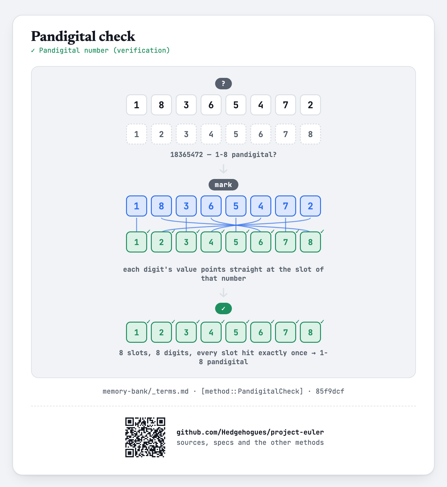

# euler038 — Pandigital multiples

Given `N` and `K` (`K` = 8 or 9), find every multiplier `m < N` such that the concatenated product
of `m` and `(1, 2, 3, ...)` — stopping as soon as the concatenation reaches length `K` — is exactly
`K`-pandigital (each digit `1..K` appears exactly once), printed in ascending order.

## Approach

- For each candidate `m` from 2 up to `N-1`, build the concatenation of `m*1`, `m*2`, `m*3`, ...
  as a string, stopping the moment its length reaches `K` (it may overshoot on the last term).
- Check the resulting string for `K`-pandigitality: exactly length `K`, and every digit `1..K`
  present exactly once.
- Collect and sort every `m` that passes.

Status: **Accepted**, 100% on HackerRank (submission 1410852091, 2026-07-12, `cpp20`). Re-verified
live on 2026-09-01: matches the official sample (`N=100, K=8` → `18, 78`) and the classic single
Project Euler #38 answer (`N=10, K=9` → `9`, whose concatenated product `918273645` is the original
problem's own pandigital number); both cases cross-checked against an independent Python
re-implementation of the same brute-force enumeration, exact match.

Full requirements and acceptance criteria: [spec.md](../../memory-bank/specs/tasks/euler038.md).

## The idea(s) behind it

**Brute-force search** — every multiplier below `N` is tried directly; `N ≤ 10^5` and each check
costs only a handful of string operations, well inside budget.
[`[method::BruteForceSearch]`](../../memory-bank/_terms.md#methodbruteforcesearch)

[](../../memory-bank/visualizations/build/brute-force-search.html)

**Pandigital check** — the built string is verified, not constructed by permutation: a presence
array indexed by digit value is marked once per scanned digit, and the string is `K`-pandigital
exactly when the scan finishes with every one of the `K` slots hit exactly once.
[`[method::PandigitalCheck]`](../../memory-bank/_terms.md#methodpandigitalcheck)

[](../../memory-bank/visualizations/build/pandigital-check.html)

## Build & run

```
g++ -O2 -std=c++20 -o solution solution.cpp && ./solution < input.txt
```
