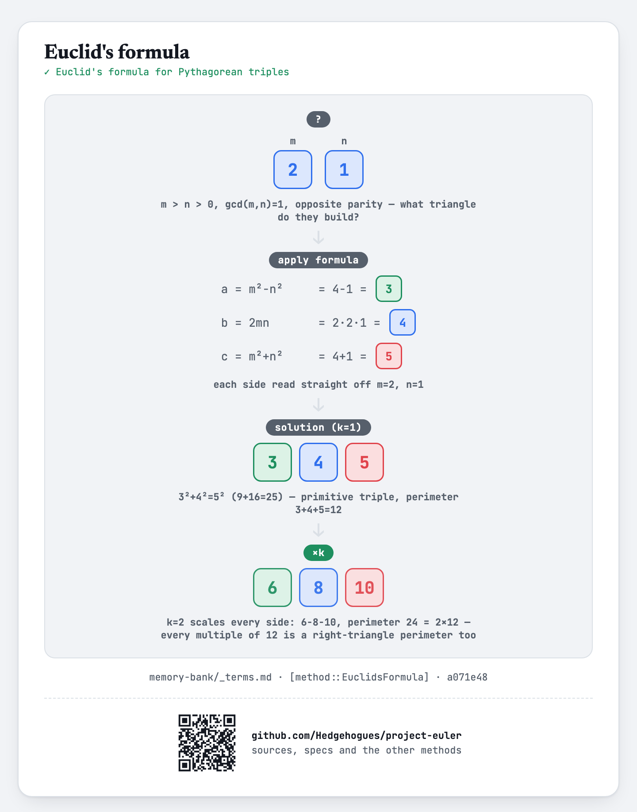

# euler039 — Integer right triangles

For each of `T` given values of `N`, find the perimeter `p <= N` of a right triangle with integer
sides for which the number of distinct such triangles sharing that perimeter is maximised — the
smallest such `p` if more than one perimeter ties for the maximum.

## Approach

- Generate every primitive Pythagorean triple with perimeter up to the global limit `5*10^6` via
  Euclid's formula: for `m > n > 0`, `gcd(m,n)=1`, `m-n` odd, the perimeter is `2m(m+n)`.
- For every multiple of that perimeter up to the limit, increment a `count[]` array — this reaches
  every (not just primitive) right triangle of that shape.
- Sweep `count[]` once, carrying the best (perimeter, count) pair seen so far into a `bestP[]`
  table — `bestP[N]` answers the query for that `N` directly, tie-broken to the smaller perimeter
  by only overwriting on a STRICTLY greater count.
- Answer each of the `T` queries with one table lookup.

Status: **Accepted**, 100% on HackerRank (submission 1410852100, 2026-07-12, `cpp20`). Re-verified
live on 2026-09-01: matches the official sample (`T=2, N=12/80` → `12, 60`) and an independent
Python brute-force (enumerate every `a<=b<LIMIT`, check `a²+b²` is a perfect square, accumulate by
perimeter) on `N=12,80,120,150,300,500` — exact match on every case, including the classic `N=120`
answer (`120`, the value from the problem's own worked example with three solutions).

Full requirements and acceptance criteria: [spec.md](../../memory-bank/specs/tasks/euler039.md).

## The idea(s) behind it

**Euclid's formula** — every integer right triangle is a multiple of a primitive one built from two
coprime, opposite-parity integers `m > n`; enumerating every valid `(m, n)` reaches every primitive
shape up to the limit.
[`[method::EuclidsFormula]`](../../memory-bank/_terms.md#methodeuclidsformula)

[](../../memory-bank/visualizations/build/euclids-formula.html)

**Sieving over multiples** — crediting every multiple of a found primitive perimeter, not just the
perimeter itself, is the same walk-the-multiples-and-mark sweep as the classic sieve, applied here
to a derived base value (a primitive perimeter) rather than to the plain integers.
[`[method::SievingOverMultiples]`](../../memory-bank/_terms.md#methodsievingovermultiples)

**Precomputation** — the whole `count[]`/`bestP[]` table is built once, up front, to the fixed
global limit `5*10^6`, independent of what `T` or the actual queried `N`s turn out to be; every
query then costs one table read.
[`[method::Precomputation]`](../../memory-bank/_terms.md#methodprecomputation)

[](../../memory-bank/visualizations/build/precomputation.html)

**Prefix sum** (running maximum instance) — `bestP[]` is a one-ascending-pass running best, exactly
the max-scan instance of the prefix-sum skeleton, with the tie-break (keep the earlier perimeter)
fixed by updating only on a strictly greater count.
[`[method::PrefixSum]`](../../memory-bank/_terms.md#methodprefixsum)

[](../../memory-bank/visualizations/build/prefix-sum.html)

## Build & run

```
g++ -O2 -std=c++20 -o solution solution.cpp && ./solution < input.txt
```
