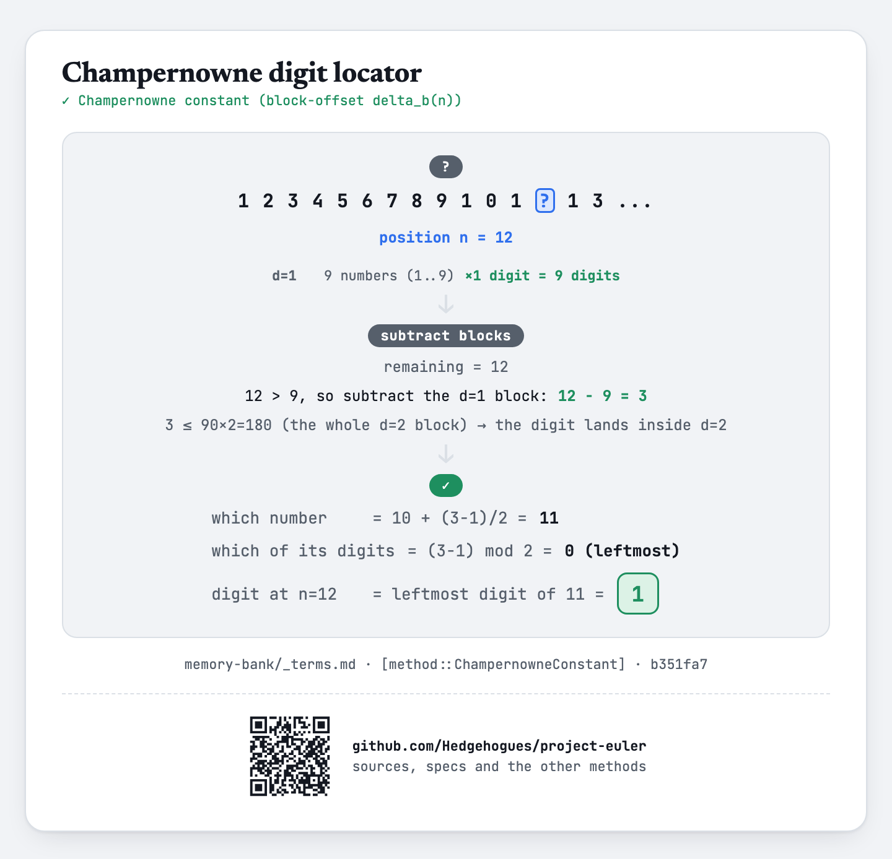

# euler040 — Champernowne's constant

Let `d_n` be the `n`-th digit of the fractional part of `0.123456789101112...` (the positive
integers concatenated in order). For each of `T` test cases, given seven indices `i_1..i_7` (each
up to `10^18`), find `d_{i_1} × d_{i_2} × ... × d_{i_7}`.

## Approach

- For a single index `n`, locate which digit-length block (`d = 1, 2, 3, ...`) it falls in by
  subtracting each block's own digit count `9·10^(d-1)·d` from `n` until what remains fits inside
  the current block — never materializing the concatenated string.
- Within that block, divide the remaining offset by `d`: the quotient gives which `d`-digit number
  (counting from `10^(d-1)`), the remainder gives which of that number's own digits (leftmost
  first).
- Every arithmetic step uses `__int128` — `n` up to `10^18` needs it to avoid overflow.
- Multiply the seven looked-up digits per test case.

Status: **Accepted**, 100% on HackerRank (submission 1410852106, 2026-07-12, `cpp20`). Re-verified
live on 2026-09-01: matches the official sample (`i=1..7` → `5040`, i.e. `7!`) and the classic
Project Euler #40 answer (`i=1,10,100,1000,10000,100000,1000000` → `210`); the underlying
`digitAt(n)` also cross-checked against an independent Python computation that builds the actual
concatenated string for `n=1..2000` — exact match on every tested `n`.

Full requirements and acceptance criteria: [spec.md](../../memory-bank/specs/tasks/euler040.md).

## The idea(s) behind it

**Champernowne constant** (digit locator) — the digit at any position of the concatenated-integers
decimal is found directly by subtracting off, one digit-length block at a time, how many digits
every shorter length already contributed.
[`[method::ChampernowneConstant]`](../../memory-bank/_terms.md#methodchampernowneconstant)

[](../../memory-bank/visualizations/build/champernowne-digit.html)

## Build & run

```
g++ -O2 -std=c++20 -o solution solution.cpp && ./solution < input.txt
```
