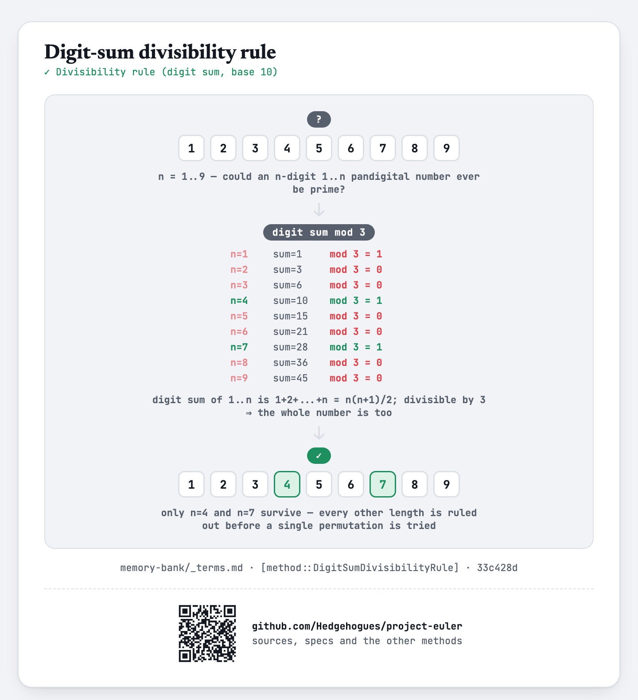

# euler041 — Pandigital prime

An `n`-digit number is pandigital if it uses every digit `1` to `n` exactly once. For each of `T`
given `N`, find the largest pandigital prime `≤ N` (any digit-length), or `-1` if none exists.

## Approach

- The digit sum of any `1..n` pandigital number is always `1+2+...+n = n(n+1)/2`; when that sum is
  divisible by 3, so is every number made from those digits, so no `n`-digit pandigital number of
  that length can ever be prime. Checking `n=1..9` this way leaves only `n=4` and `n=7` as
  possible.
- Generate every permutation of `1234` and of `1234567`, test each for primality, and keep the
  primes found.
- Sort all surviving candidates once; each query then binary-searches for the largest one `≤ N`.

Status: **Accepted**, 100% on HackerRank (submission 1410852111, 2026-07-12, `cpp20`). Re-verified
live on 2026-09-01: matches the official sample (`N=100 → -1`, `N=10000 → 4231`), reproduces the
classic Project Euler #41 answer (largest pandigital prime overall, `N=9999999999 → 7652413`), and
cross-checked at the boundary (`N=7652413 → 7652413`, `N=7652412 → 7642513`) against an independent
Python re-implementation that enumerates the same two permutation sets directly — exact match on
every case.

Full requirements and acceptance criteria: [spec.md](../../memory-bank/specs/tasks/euler041.md).

## The idea(s) behind it

**Digit-sum divisibility rule** — the digit sum of any `1..n` pandigital number is fixed at
`n(n+1)/2` regardless of which permutation it is; checking that ONE sum mod 3 rules out an entire
length `n` before generating a single candidate of it.
[`[method::DigitSumDivisibilityRule]`](../../memory-bank/_terms.md#methoddigitsumdivisibilityrule)

[](../../memory-bank/visualizations/build/digit-sum-div3.html)

**Next permutation** — every permutation of `1234` and of `1234567` is visited in order via
repeated in-place transformation.
[`[method::NextPermutation]`](../../memory-bank/_terms.md#methodnextpermutation)

[](../../memory-bank/visualizations/build/next-permutation.html)

**Trial division** — each permutation surviving as a candidate is tested for primality by trying
divisors up to its square root.
[`[method::TrialDivision]`](../../memory-bank/_terms.md#methodtrialdivision)

[](../../memory-bank/visualizations/build/ladder-method.html)

**Precomputation + Binary search** — the small, fixed set of pandigital primes (at most
`4!+7!=5064` candidates checked) is built once and sorted; each of the `T` queries then finds its
answer with one binary search instead of rescanning.
[`[method::Precomputation]`](../../memory-bank/_terms.md#methodprecomputation) ·
[`[method::BinarySearch]`](../../memory-bank/_terms.md#methodbinarysearch)

[](../../memory-bank/visualizations/build/precomputation.html)
[](../../memory-bank/visualizations/build/binary-search.html)

## Build & run

```
g++ -O2 -std=c++20 -o solution solution.cpp && ./solution < input.txt
```
