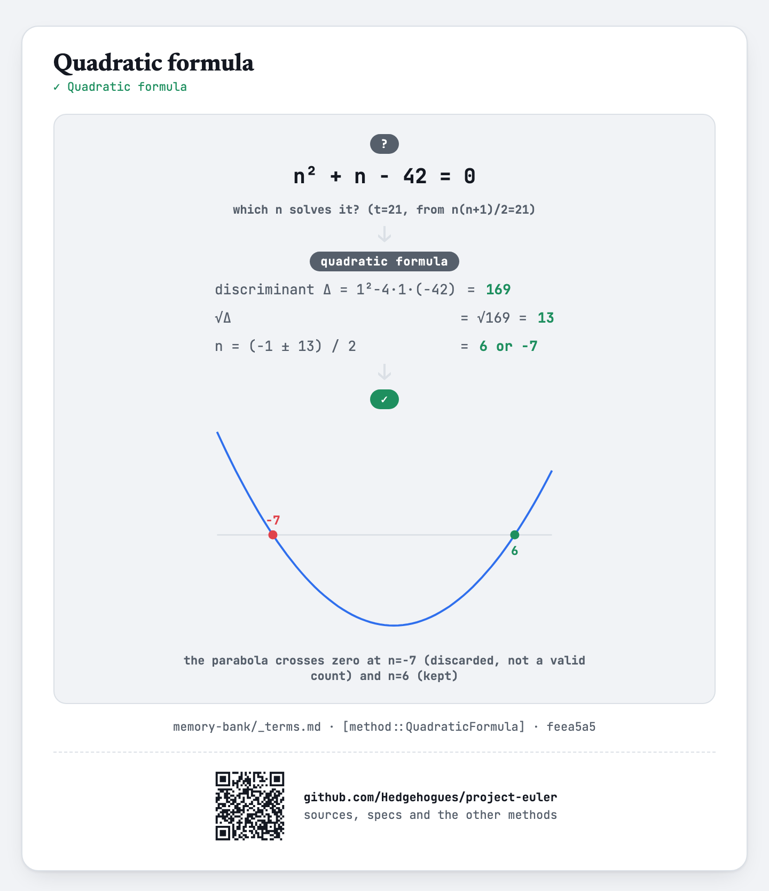

# euler044 — Pentagon numbers

Pentagonal numbers are `P_n = n(3n-1)/2`. Given `N` and `K`, find every `P_n` (`n < N`) for which
either `P_n - P_{n-K}` or `P_n + P_{n-K}` is itself pentagonal, printed sorted.

## Approach

- For each `n` from `K+1` to `N-1`, compute `P_n` and `P_{n-K}` directly from the formula.
- Test whether `P_n - P_{n-K}` or `P_n + P_{n-K}` is pentagonal by inverting the pentagonal formula:
  `x` is pentagonal exactly when `1+24x` is a perfect square `s²` and `(1+s)` is divisible by 6.
- The perfect-square check uses an integer binary search, not floating-point `sqrt`.

Status: **Accepted**, 100% on HackerRank (submission 1410853221, 2026-07-13, `cpp20`). Re-verified
live on 2026-09-01: matches the official sample (`N=10, K=2 → 70`, from the problem's own worked
example `P_7 - P_5 = 35 = P_5`) and cross-checked against an independent Python re-implementation
of the same formula-based check on `N=10,K=2` and `N=100,K=1` — exact match on both, including the
5-value result set for `N=100, K=1`.

Full requirements and acceptance criteria: [spec.md](../../memory-bank/specs/tasks/euler044.md).

## The idea(s) behind it

**Quadratic formula** — testing whether `x` is pentagonal inverts `n(3n-1)/2 = x` via its
discriminant, the same inversion technique as euler042's triangular-number check, applied to a
different closed form.
[`[method::QuadraticFormula]`](../../memory-bank/_terms.md#methodquadraticformula)

[](../../memory-bank/visualizations/build/quadratic-formula.html)

**Binary search** — the discriminant's exact integer square root is found by binary search over
the monotonic sequence of squares, not floating-point `sqrt`.
[`[method::BinarySearch]`](../../memory-bank/_terms.md#methodbinarysearch)

[](../../memory-bank/visualizations/build/binary-search.html)

**Brute-force search** — every `n < N` is tried directly; `N ≤ 10^6` keeps this inside budget.
[`[method::BruteForceSearch]`](../../memory-bank/_terms.md#methodbruteforcesearch)

[](../../memory-bank/visualizations/build/brute-force-search.html)

## Build & run

```
g++ -O2 -std=c++20 -o solution solution.cpp && ./solution < input.txt
```
