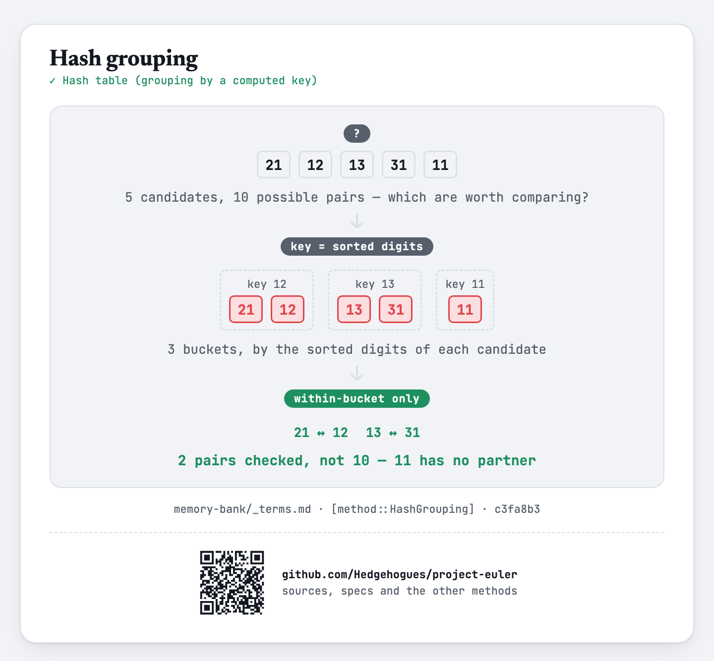

# euler049 — Prime permutations

Given `N` and `K` (`3 ≤ K ≤ 4`), find every `K`-term arithmetic progression of primes, all
digit-permutations of one another, whose first term is `< N`. Print each as the concatenation of
its `K` terms, sorted by first term then by the concatenation itself.

## Approach

- Sieve every prime up to the global limit `999999`.
- Group primes by a key combining their digit count and sorted digits — primes sharing a key are
  exactly the ones that are digit-permutations of each other.
- Within each group of size `≥ K`, try every pair as the first two terms of a candidate
  progression, extend by their common difference, and check that every one of the `K` terms is
  present in the same group.
- Collect every progression whose first term is `< N`, sort, and print each as one concatenated
  string.

Status: **Accepted**, 100% on HackerRank (submission 1410961267, 2026-07-14, `cpp20`; an earlier
submission the previous day scored 66.67% before this version fixed it). Re-verified live on
2026-09-01: matches the official sample (`N=2000, K=3 → 148748178147`, the classic Project Euler
#49 example), and `N=1000000, K=3` reproduces BOTH classic 3-term answers
(`148748178147` and `296962999629`) among its results — cross-checked against an independent
Python re-implementation of the same grouping-and-extension approach on the sample, exact match.

Full requirements and acceptance criteria: [spec.md](../../memory-bank/specs/tasks/euler049.md).

## The idea(s) behind it

**Sieve of Eratosthenes** — every prime up to the global limit is found once, up front.
[`[method::SieveOfEratosthenes]`](../../memory-bank/_terms.md#methodsieveoferatosthenes)

[](../../memory-bank/visualizations/build/sieve-of-eratosthenes.html)

**Hash grouping** — primes are bucketed by a key (sorted digits + digit count) that is exactly the
invariant "being digit-permutations of one another" depends on; only primes sharing a bucket are
ever compared, instead of checking every pair of primes for the permutation relation.
[`[method::HashGrouping]`](../../memory-bank/_terms.md#methodhashgrouping)

[](../../memory-bank/visualizations/build/hash-grouping.html)

**Brute-force search** — within each bucket, every pair of primes is tried directly as the
progression's first two terms.
[`[method::BruteForceSearch]`](../../memory-bank/_terms.md#methodbruteforcesearch)

[](../../memory-bank/visualizations/build/brute-force-search.html)

## Build & run

```
g++ -O2 -std=c++20 -o solution solution.cpp && ./solution < input.txt
```
