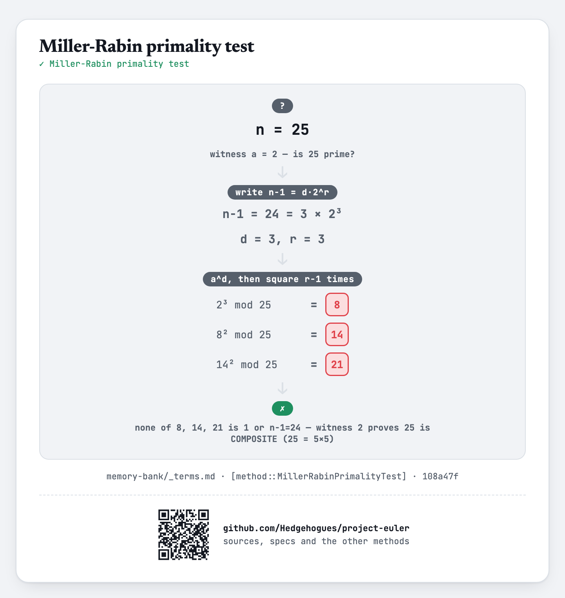

# euler050 — Consecutive prime sum

For each of `T` given `N` (up to `10^12`), find the prime `≤ N` expressible as the sum of the most
consecutive primes, printing that prime and the chain length (smallest prime if more than one
achieves the maximum length).

## Approach

- Sieve every prime up to a global limit (`6×10^6` — large enough that the sum of all primes below
  it comfortably exceeds `10^12`) and build a prefix-sum array over them.
- For each query, binary search for the longest possible chain length whose prefix sum could even
  fit under `N`.
- Starting from that upper bound and working down, slide a window of that length across the primes
  (via prefix-sum subtraction) and test each window's sum for primality with Miller-Rabin; stop at
  the first (hence longest, then smallest-sum) hit.

Status: **Accepted**, 100% on HackerRank (submission 1410961283, 2026-07-14, `cpp20`). Re-verified
live on 2026-09-01: matches the official sample (`100 → 41 6`, `1000 → 953 21`, both from the
problem's own worked examples), reproduces the classic Project Euler #50 answer
(`N=1000000 → 997651 543`), and runs well within budget at the constraint maximum
(`N=10^12`, ~0.03s).

Full requirements and acceptance criteria: [spec.md](../../memory-bank/specs/tasks/euler050.md).

## The idea(s) behind it

**Sieve of Eratosthenes** — every prime up to the global limit is found once, up front.
[`[method::SieveOfEratosthenes]`](../../memory-bank/_terms.md#methodsieveoferatosthenes)

[](../../memory-bank/visualizations/build/sieve-of-eratosthenes.html)

**Prefix sum** — the sum of any consecutive run of primes is one subtraction against a
precomputed running total, not a re-added loop per candidate window.
[`[method::PrefixSum]`](../../memory-bank/_terms.md#methodprefixsum)

[](../../memory-bank/visualizations/build/prefix-sum.html)

**Binary search** — the longest chain length that could possibly fit under `N` is found by binary
search over the (monotonically increasing) prime prefix sums, before any window is tried.
[`[method::BinarySearch]`](../../memory-bank/_terms.md#methodbinarysearch)

[](../../memory-bank/visualizations/build/binary-search.html)

**Miller-Rabin primality test** — each candidate window sum (up to `~10^12`, too large to sieve
directly) is tested for primality with the deterministic 12-witness Miller-Rabin test.
[`[method::MillerRabinPrimalityTest]`](../../memory-bank/_terms.md#methodmillerrabinprimalitytest)

[](../../memory-bank/visualizations/build/miller-rabin.html)

## Build & run

```
g++ -O2 -std=c++20 -o solution solution.cpp && ./solution < input.txt
```
