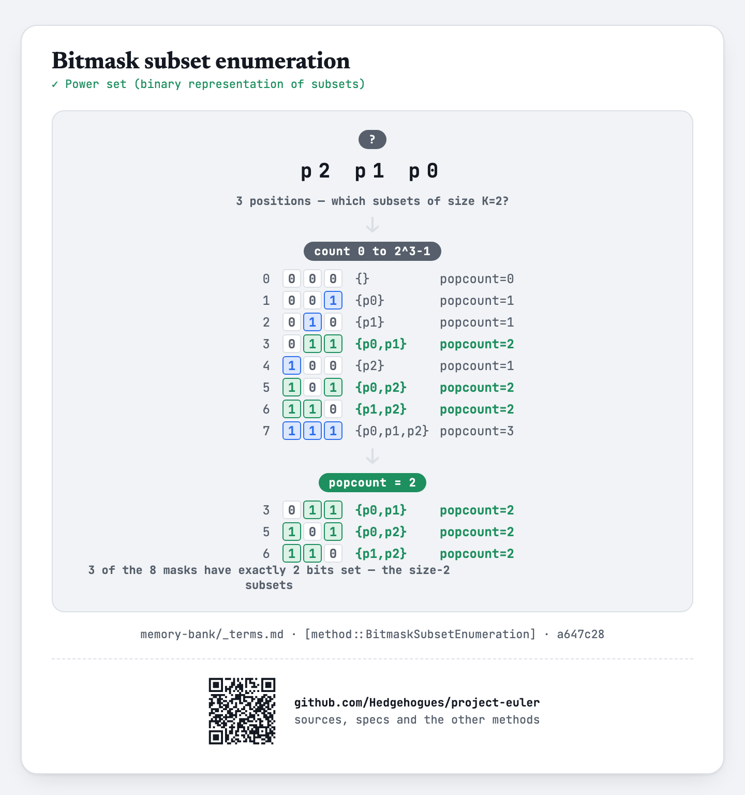

# euler051 — Prime digit replacements

Given `N`, `K`, `L`, find the smallest `N`-digit prime for which some choice of `K` digit
positions, replaced everywhere by the same digit, yields a family of at least `L` primes (no
leading zero); print the smallest `L` members of that family, ascending.

## Approach

- Sieve every `N`-digit number for primality once.
- For each candidate prime `P` (ascending), and every way of choosing `K` of its `N` digit
  positions (via bitmask enumeration, filtered by population count), check whether `P`'s digits at
  those positions already agree on one shared value.
- If they do, replace that shared digit with each of `0..9` in turn (skipping a leading zero) and
  collect every resulting prime into a family.
- Among every mask that yields a family of size `≥ L` for this `P`, keep the lexicographically
  smallest `L`-member family; stop at the first `P` that has one (a lexicographically smaller `P`
  can never be beaten by any later, larger `P`, since `P` itself is always a member of its own
  family).

Status: **Accepted**, 100% on HackerRank (submission 1410961305, 2026-07-14, `cpp20`). Re-verified
live on 2026-09-01: matches both official samples (`5 2 7 → 56003...56993`, the classic Project
Euler #51 example, and `2 1 3 → 11 13 17`) and reproduces the classic full Project Euler #51 answer
(`6 3 8 → 121313...929393`), all three cross-checked against an independent Python
re-implementation that tries every digit-position combination directly (not bitmasks) and compares
candidate families lexicographically — exact match on every case.

Full requirements and acceptance criteria: [spec.md](../../memory-bank/specs/tasks/euler051.md).

## The idea(s) behind it

**Sieve of Eratosthenes** — every `N`-digit number's primality is determined once, up front.
[`[method::SieveOfEratosthenes]`](../../memory-bank/_terms.md#methodsieveoferatosthenes)

[](../../memory-bank/visualizations/build/sieve-of-eratosthenes.html)

**Bitmask subset enumeration** — every way of choosing `K` of the `N` digit positions is generated
by sweeping all `2^N` masks and filtering by population count, rather than a separate combination
generator.
[`[method::BitmaskSubsetEnumeration]`](../../memory-bank/_terms.md#methodbitmasksubsetenumeration)

[](../../memory-bank/visualizations/build/bitmask-subsets.html)

**Brute-force search** — every candidate prime and every digit-position mask is tried directly;
`N ≤ 7` keeps both dimensions tiny.
[`[method::BruteForceSearch]`](../../memory-bank/_terms.md#methodbruteforcesearch)

[](../../memory-bank/visualizations/build/brute-force-search.html)

## Build & run

```
g++ -O2 -std=c++20 -o solution solution.cpp && ./solution < input.txt
```
